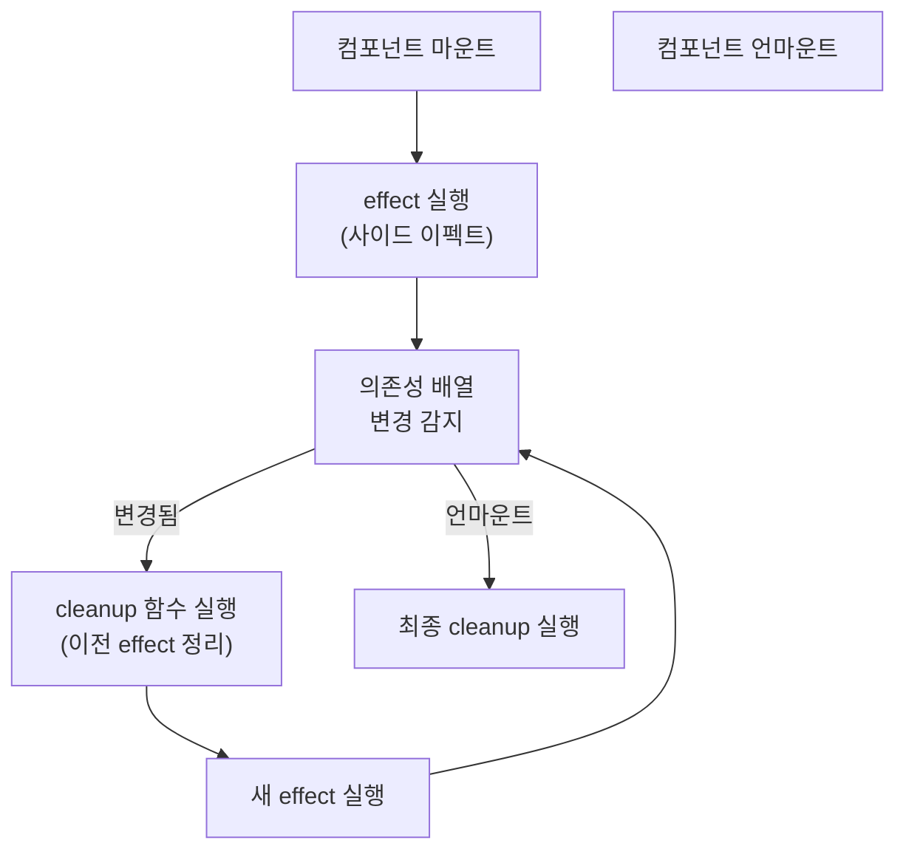

- [[생명 주기(Life Cycle)]] [[메서드(Method)]]를 하나도 묶은 것으로 훅스로 표현 가능하다.



- 의존성 배열을 이용하여 특정 값이 변경될 때만 호출하게 만들 수도 있다.
## 문법

```jsx
useEffect(()=>{

}, [의존성 배열])
```


```jsx
useEffect(() => { // 의존성 배열이 없으므로 모든 경우에서 렌더링
	console.log('렌더링이 완료되었습니다!');
	console.log({ name, nickname });
});
```


```jsx
useEffect(() => { // 처음 컴포넌트가 마운트 될 때 실행
	console.log('마운트될 때만 실행됩니다.');
}, []);
```


```jsx
useEffect(() => { // 처음과 name이 바뀔 때만 실행
	console.log(name);
}, [name]);
```

- 마운트될때 effect 로그를 찍고, name [[state]]가 업데이트 될 때마다 동작, [[컴포넌트(Component)]]가 언마운트 될 때, cleanup 로그와 업데이트되기 직전의 값을 name을 보여준다.

```jsx
useEffect(() => { // 처음과 name이 바뀔 때만 실행
	console.log('effect');
	console.log(name);
	return () => { // cleanup 작업 컴포넌트라 언마운트 될 때 실행
		console.log('cleanup');
		console.log(name);
	};
}, [name]);
```

- 언마운트될 때만 뒷정리 함수를 호출하고 싶다면 의존성 배열을 `[]`로 설정한다.

```jsx
useEffect(() => { // 처음과 name이 바뀔 때만 실행
	console.log('effect');
	return () => { // cleanup 작업 컴포넌트라 언마운트 될 때 실행
		console.log('cleanup');
	};
}, []);
```

## 클래스 컴포넌트와 비교

- useEffect를 사용할 때, 특정 값이 변경될 때만 호출하는 경우, [[클래스형 컴포넌트(Class Component)]]였다면 [[componentDidupdate()]]를 사용한다.

## async 함수와 useEffect

- `useEffect`의 콜백은 `async`로 선언할 수 없다. async 함수는 [[Promise]]를 반환하는데, useEffect는 cleanup 함수(또는 void)만 반환값으로 기대하기 때문이다.
- 대신 `useEffect` 내부에 `async` 함수를 선언하고 즉시 호출하는 패턴을 사용한다.
- [[비동기(asynchronous)]] 데이터 패칭 시 [[useState()]]와 함께 자주 사용된다.

```js
// 잘못된 방법 — useEffect 자체를 async로
useEffect(async () => {
  const data = await fetchData(); // 작동하지만 cleanup 반환 불가
}, []);

// 올바른 방법 — 내부에 async 함수 선언 후 즉시 호출
useEffect(() => {
  async function loadData() {
    const data = await fetchData();
    setData(data);
  }
  loadData();
}, []);

// 경쟁 조건(Race Condition) 방지 패턴
useEffect(() => {
  let cancelled = false;

  async function loadData() {
    const data = await fetchData(id);
    if (!cancelled) setData(data); // 이미 언마운트됐으면 상태 업데이트 건너뜀
  }

  loadData();
  return () => { cancelled = true; };
}, [id]);
```
