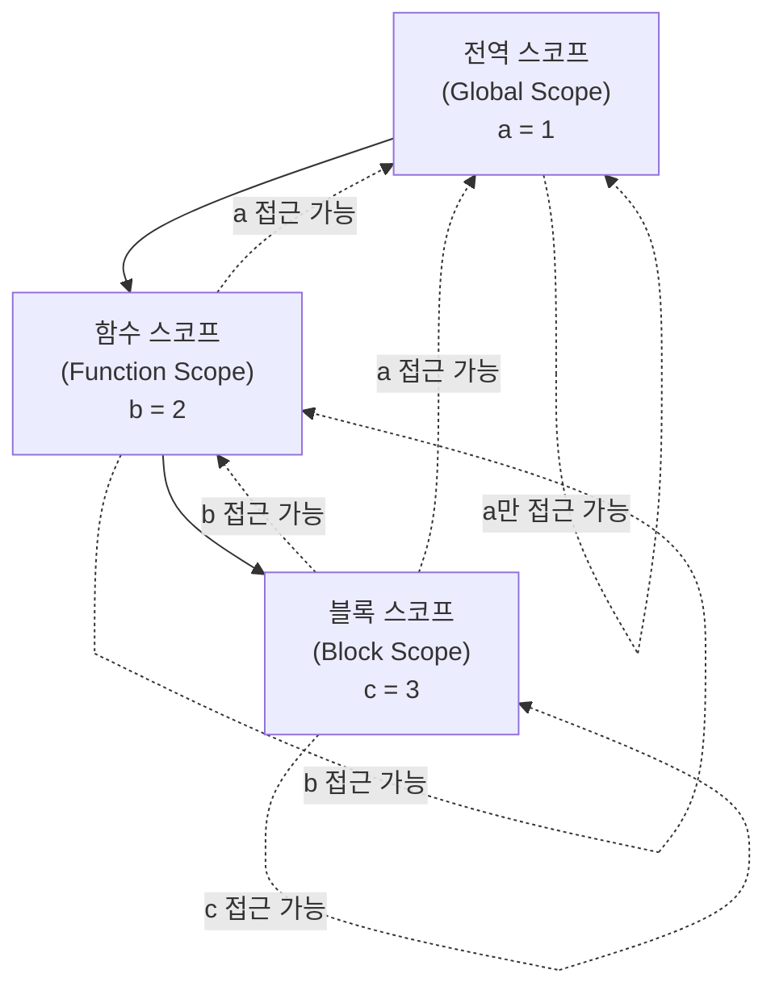

- 스코프(Scope)는 [[변수(Variable)]]와 [[함수(Function)]]가 접근 가능한 유효 범위를 정의한다.
- 스코프는 변수를 찾는 규칙이며, 안쪽 스코프에서 바깥쪽 스코프로만 접근할 수 있다(역방향 불가).
- 자바스크립트는 [[렉시컬 스코프(Lexical Scope)]]를 따르며, 함수가 **선언된 위치**를 기준으로 스코프가 결정된다(호출 위치 기준이 아님).

## 스코프의 종류

- **전역 스코프(Global Scope)**: 코드 어디서든 접근 가능한 최상위 스코프로, 전역에 선언된 [[변수(Variable)]]는 프로그램 전체에서 참조할 수 있다.
- **함수 스코프(Function Scope)**: `var` 키워드로 선언된 변수는 [[함수(Function)]] 단위로 스코프가 결정되며, 함수 내부 어디서든 접근 가능하다.
- **블록 스코프(Block Scope)**: `let`과 `const` 키워드로 선언된 변수는 `{}` 블록 단위로 스코프가 결정되며, 선언된 블록 밖에서는 접근할 수 없다.



안쪽 스코프는 바깥 스코프에 접근할 수 있지만, 바깥 스코프는 안쪽 변수에 접근할 수 없다.

## var와 함수 스코프

- var 키워드는 Scope가 함수  단위이다.

```js
function myFunction() {
	var a = "hello";
	if (true) {
		var a = "bye";
		console.log(a); // bye
	}
	console.log(a); // bye
}

myFunction()
```

## let/const와 블록 스코프

- 따라서 let 혹은 const는 스코프가 함수 단위가 아닌 블록 단위이므로, if 문 내부에서 선언한 a 값은 if 문 밖의 a 값을 변경하지 않는다.
- 추가적으로 ES6 문법에서 var를 사용할 일은 없다.

```js
function myFunction() {
	let a = 1;
	if (true) {
		let a = 2;
		
		console.log(a); // 2
	}
	console.log(a); // 1
}

myFunction()
```

- 따라서 let과 const는 밑에와 같이 중복 선언이 불가능하다.

```js
let a = 1;
let a = 2; // 오류 Uncaught SyntaxError: Identifier 'a' has already been declared

const b = 1;
b = 2; // Uncaught SyntaxError: Assignment to constant variable.
```

## 스코프 체인(Scope Chain)

- 스코프 체인은 현재 스코프에서 [[변수(Variable)]]를 찾지 못하면 바깥 스코프로 순차적으로 탐색하는 메커니즘이다.
- 전역 스코프까지 탐색해도 없으면 `ReferenceError`가 발생한다.
- 이 탐색 과정은 [[렉시컬 환경(Lexical Environment)]]이 연결된 체인 구조를 따라 이루어지며, [[호이스팅(variable hoisting)]]과도 밀접하게 연관된다.

```js
const x = 1; // 전역 스코프

function outer() {
	const y = 2; // outer 함수 스코프

	function inner() {
		const z = 3; // inner 함수 스코프
		console.log(z); // 3 — 현재 스코프에서 발견
		console.log(y); // 2 — 바깥 outer 스코프에서 발견
		console.log(x); // 1 — 전역 스코프에서 발견
	}

	inner();
}

outer();
```

## 렉시컬 스코프(Lexical Scope)

- 함수가 **선언된 시점**의 스코프를 기억한다(호출 위치 기준이 아님).
- 자바스크립트 엔진은 함수가 어디서 호출되었는지가 아니라, 어디서 정의되었는지를 기준으로 상위 스코프를 결정한다.
- 이 특성은 [[클로저(Closure)]]의 동작 원리의 근간이 되며, [[렉시컬 환경(Lexical Environment)]]을 통해 구현된다.

```js
const name = "전역";

function printName() {
	console.log(name); // 선언 시점의 전역 스코프를 참조
}

function outer() {
	const name = "outer 내부";
	printName(); // 호출 위치는 outer 내부이지만
}

outer(); // 전역 — printName은 선언된 전역 스코프의 name을 사용
```
