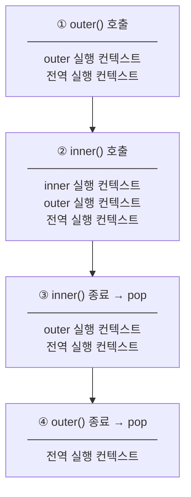

- 실행하고 있는 [[함수(Function)]]를 트래킹하기 위한 특별한 자료 구조다. 
- 현재 실행하고 있는 [[함수(Function)]] 내의 현재 [[변수(Variable)]] 상태와 [[this]]의 값 등을 저장하고 있고, 현재 실행 중인 line을 기억하고 있다. 

- 자바스크립트 엔진이 [[소스코드의 평가 과정]]을 실행하기 위해 필요한 환경을 제공하고 코드의 실행 결과를 실제로 관리하는 영역이다.
- 자바스크립트 엔진은 실행 컨텍스트를 통해 [[JavaScript/식별자(Identifier)]]와 [[스코프(Scope)]]를  관리한다.

- 그래서 nested function이 호출될 때, 이미 실행하고 있는 정보를 저장해뒀기 때문에 nested function의 실행이 끝나면 다시 돌아올 수 있는 것이다.

- 실행 컨텍스트가 소스 코드를 실행하기 위해 필요한 것들을 관리하는 내부 메커니즘이라며, 실행 컨텍스트가 [[렉시컬 환경(Lexical Environment)]]을 관리하고 있다.

- 즉 위에서 실행 컨텍스트는 실행하고 있는 함수 내의 변수 상태를 저장하고 있다고 했는데, 실행 컨텍스트가 이를 렉시컬 환경이라는 [[객체(Object)]]에 저장해두고 변경이 있을 때마다 업데이트하고 필요할 때 접근해서 갖다 쓰는 것이다.

## 실행 컨텍스트의 구성 요소

- 실행 컨텍스트는 세 가지 핵심 구성 요소로 이루어져 있다.

- **[[변수 환경(Variable Environment)]]**: `var` 키워드로 선언된 [[변수(Variable)]]와 [[함수 선언문(Function Declaration)]]을 저장한다. [[호이스팅(Hoisting)]]의 대상이 되며, [[스코프(Scope)]] 생성 시점에 초기화된다.
- **[[렉시컬 환경(Lexical Environment)]]**: `let`, `const` 키워드로 선언된 변수의 [[블록 스코프(Block Scope)]]를 관리하고, 외부 [[렉시컬 환경(Lexical Environment)]]에 대한 참조([[스코프 체인(Scope Chain)]])를 보관한다. [[클로저(Closure)]]의 동작 기반이 된다.
- **[[this]] 바인딩(this Binding)**: 현재 실행 컨텍스트에서 [[this]]가 가리키는 값을 저장한다. [[함수(Function)]]의 호출 방식(일반 호출, 메서드 호출, `new` 호출, `call`/`apply`/`bind`)에 따라 동적으로 결정된다.

## 콜 스택과 실행 컨텍스트

- 자바스크립트 엔진은 [[콜 스택(Call Stack)]]을 사용하여 실행 컨텍스트를 관리한다.
- 프로그램이 시작되면 전역 실행 컨텍스트(Global Execution Context)가 [[콜 스택(Call Stack)]]에 먼저 쌓이고, [[함수(Function)]]가 호출될 때마다 새로운 실행 컨텍스트가 스택에 push된다.
- [[함수(Function)]] 실행이 끝나면 해당 실행 컨텍스트는 스택에서 pop되어 제거되고, 이전 실행 컨텍스트로 제어가 돌아온다.

```js
function outer() {
  function inner() {}
  inner();
}
outer();
```



- 위 예시에서 `outer()`가 호출되면 outer 실행 컨텍스트가 push되고, 내부에서 `inner()`가 호출되면 inner 실행 컨텍스트가 그 위에 push된다.
- `inner()` 실행이 끝나면 inner 실행 컨텍스트가 pop되고, 이어서 `outer()`가 끝나면 outer 실행 컨텍스트도 pop된다.
- 최종적으로 [[콜 스택(Call Stack)]]에는 전역 실행 컨텍스트만 남은 상태로 돌아온다.

## 싱글 스레드와 멀티 스레드의 차이

- 멀티스레드의 경우 컨텍스트 스위치가 많이 일어나서 효율적이지 못한다.(성능 자체는 좋지않다.)
- 싱글 스레드의 경우 오래 걸리는 일을 만나면 문제가 생기지만 간단한 일이 많은 곳에는 효율적이다.

![[Pasted image 20240131041052.png]]
