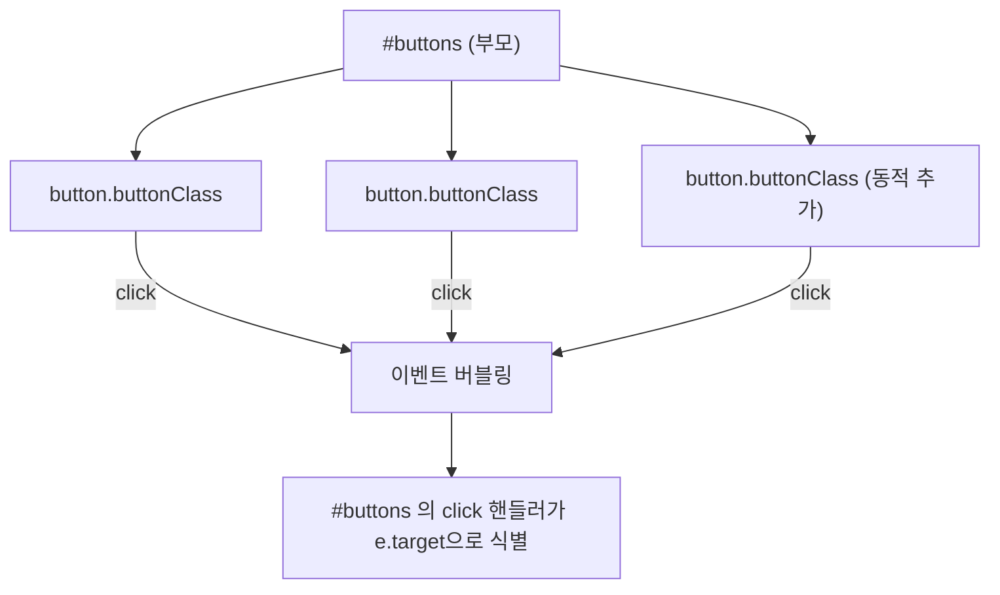

- [[이벤트 버블링(Event Bubbling)]]과 [[이벤트 캡처링(Event Capturing)]]을 통해서 [[이벤트(event)]] 위임을 할 수 있다.

- 이벤트 위임은 **개별 자식 요소마다 핸들러를 붙이지 않고**, 공통 부모(상위) 요소 하나에 핸들러를 붙여 자식들의 [[이벤트(event)]]를 한 곳에서 처리하는 패턴이다.

- 자식에서 발생한 [[이벤트(event)]]가 [[이벤트 버블링(Event Bubbling)]]을 타고 부모까지 올라오는 성질을 이용한다.

- 즉, "자식이 가져야 할 책임을 부모에게 위임한다"는 표현이며, 실제 [[addEventListener()]]는 **부모 요소**에 등록한다.


## 이벤트 위임이 좋은 이유

- 자식 요소가 많을 때 [[addEventListener()]]를 N번 호출하지 않아도 되므로 메모리 효율이 좋다.
- 위 코드 예시처럼 [[DOM(Document Object Model)]]에 **동적으로 추가되는 자식 요소**에도 별도 등록 없이 자동으로 핸들러가 적용된다.
- 핸들러 로직이 한 곳에 모이므로 유지보수가 쉽다.


## 이벤트 위임이 동작하는 흐름




## 이벤트 위임의 예시

- 아래는 이벤트 위임이 들어가 있지 **않은** 코드의 예시이다.
- 각 버튼마다 [[addEventListener()]]를 따로 등록해야 하므로, 나중에 만들어지는 버튼은 핸들러를 갖지 않는다.

```js
const buttons = document.getElementsByClassName('buttonClass');

for (const button of buttons) {
	button.addEventListener('click', () => {
		alert('clicked');
	});
}

// 아래처럼 나중에 추가된 button은 위 반복문이 끝난 뒤이므로 핸들러가 붙지 않는다.
const buttonList = document.querySelector('#buttons');
const button = document.createElement('button');

button.setAttribute('class', 'buttonClass');
button.innerText = 'Click me';
buttonList.appendChild(button);
```

- 아래는 이벤트 위임이 들어가 있는 코드이다.
- 핸들러는 **부모 `#buttons`**에 한 번만 등록되고, [[이벤트(event)]] [[객체(Object)]]의 `e.target`으로 어떤 자식이 클릭됐는지 식별한다.

```js
const buttonList = document.querySelector('#buttons');

buttonList.addEventListener('click', (e) => {
	// 클릭이 실제로 buttonClass 자식에서 발생했을 때만 처리
	if (e.target.matches('.buttonClass')) {
		alert('clicked');
	}
});

// 동적으로 추가되는 자식도 같은 핸들러가 적용된다.
const button = document.createElement('button');
button.setAttribute('class', 'buttonClass');
button.innerText = 'Click me';
buttonList.appendChild(button);
```


## 주의할 점

- [[이벤트 버블링(Event Bubbling)]]이 일어나지 않는 [[이벤트(event)]](예: `focus`, `blur`, `scroll`)에는 위임을 적용할 수 없다.
  - 이 경우 [[이벤트 캡처링(Event Capturing)]] 단계를 사용하거나(`addEventListener(type, fn, true)`), `focusin`/`focusout`처럼 버블링되는 변형 이벤트를 사용한다.
- `e.target`은 가장 안쪽에서 클릭된 실제 요소이므로, 자식 안에 또 다른 자식이 있는 구조에서는 `e.target.closest('.buttonClass')`로 가장 가까운 매칭 요소를 찾는 게 안전하다.
