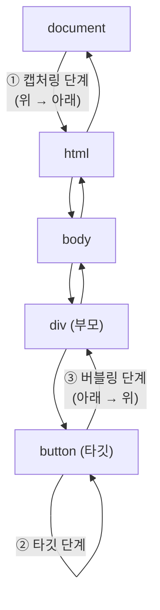

- 캡처링은 [[이벤트 버블링(Event Bubbling)]]과 반대로 최상위 태그에서 해당 태그를 찾아 내려간다.

- 캡처링은 잘 사용되지는 않는다.


## 이벤트 캡쳐링의 예시


```js
const divs = document.querySelectorAll("div");

const clickEvent = (e) => {
	console.log(e.currentTarget.className);
};

divs.forEach((div) => {
	div.addEventListener("click", clickEvent, { capture: true });
});
```


- [[addEventListener()]] 의 옵션 [[객체(Object)]]에 `{ capture: true }` 또는 `true` 를 설정해주면 캡처링을 구현할 수 있다.

- `<div class="DIV3">DIV3</div>`를 클릭한다면 위에서부터 찾아 내려오기 때문에 콘솔에는 DIV1, DIV2, DIV3이 순서대로 찍힐 것이다.


## 캡처링과 버블링 전체 흐름



- 이벤트는 document → html → body → 이벤트 발생 요소 순으로 내려가는 **캡처링** 단계를 먼저 거친다.
- 타깃 요소에 도달하면 **타깃 단계**, 이후 다시 document까지 올라오는 **[[이벤트 버블링(Event Bubbling)]]** 단계가 진행된다.
- [[addEventListener()]]의 세 번째 인수를 `true`(또는 `{ capture: true }`)로 설정하면 캡처링 단계에서 리스너가 실행된다.
- [[event.stopPropagation()]]으로 어느 단계에서든 전파를 중단할 수 있다.

```js
// 캡처링 단계에서 실행
element.addEventListener('click', handler, true);
element.addEventListener('click', handler, { capture: true });

// 버블링 단계에서 실행 (기본값)
element.addEventListener('click', handler, false);
element.addEventListener('click', handler, { capture: false });
```
