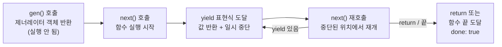

- 제너레이터(Generator)는 함수 실행을 중간에 멈추고(`yield`) 재개할 수 있는 특수한 [[함수(Function)]]다.
- `function*` 키워드로 선언하며, 호출 시 즉시 실행되지 않고 제너레이터 이터레이터 객체를 반환한다.
- 반환된 객체는 이터러블 이터레이터이므로 `for...of`, 스프레드, 구조 분해에 모두 사용 가능하다.
- 무한 시퀀스, 지연 평가(lazy evaluation), 비동기 흐름 제어에 활용된다.

## 기본 문법

```js
function* gen() {
  yield 1;
  yield 2;
  yield 3;
}

const g = gen();

console.log(g.next()); // { value: 1, done: false }
console.log(g.next()); // { value: 2, done: false }
console.log(g.next()); // { value: 3, done: false }
console.log(g.next()); // { value: undefined, done: true }

// for...of로도 순회 가능
for (const val of gen()) {
  console.log(val); // 1, 2, 3
}
```

## yield로 값 주고받기

- `yield`로 값을 내보낼 수 있고, `next(인수)`로 값을 제너레이터 안으로 보낼 수도 있다.

```js
function* calculator() {
  const x = yield '첫 번째 숫자를 입력하세요';
  const y = yield '두 번째 숫자를 입력하세요';
  return x + y;
}

const calc = calculator();
calc.next();       // { value: '첫 번째 숫자를 입력하세요', done: false }
calc.next(10);     // { value: '두 번째 숫자를 입력하세요', done: false }
calc.next(20);     // { value: 30, done: true }
```

## 무한 시퀀스(Infinite Sequence)

- 제너레이터는 `while(true)` 루프와 함께 무한 시퀀스를 메모리 효율적으로 생성할 수 있다.

```js
function* infiniteId() {
  let id = 1;
  while (true) {
    yield id++;
  }
}

const idGen = infiniteId();
console.log(idGen.next().value); // 1
console.log(idGen.next().value); // 2
console.log(idGen.next().value); // 3
// 필요할 때만 값을 꺼내므로 무한 루프 걱정 없음
```

## 제너레이터 동작 흐름



## 관련 개념

- [[함수(Function)]] — 제너레이터는 `function*`로 선언하는 특수 함수다.
- [[이터러블(Iterable)]] — 제너레이터 객체는 이터러블 이터레이터를 자동 구현한다.
- [[Promise]] — 제너레이터와 Promise를 조합하면 비동기 흐름을 동기처럼 제어할 수 있다.
- [[async await]] — `async/await`는 내부적으로 제너레이터 + Promise 패턴의 문법적 설탕이다.
- [[Symbol]] — `Symbol.iterator`를 통해 제너레이터 객체가 이터러블 프로토콜을 충족한다.
