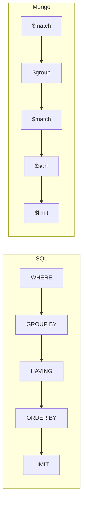

# SQL ↔ MongoDB 문법 대조표

[[SQL]]을 알면 [[MongoDB]]가 빨리 붙는다. 같은 질문을 두 문법으로 나란히 둔 표.

## 용어

| SQL | MongoDB |
|---|---|
| database | database |
| table | collection |
| row | document |
| column | field |
| index | index |
| PRIMARY KEY | `_id` |
| JOIN | `$lookup` (또는 임베드) |

## 조회

| 하려는 것 | SQL | MongoDB |
|---|---|---|
| 전체 | `SELECT * FROM blocks;` | `db.blocks.find()` |
| 열 고르기 | `SELECT block_id, name FROM blocks;` | `db.blocks.find({}, {_id:0, block_id:1, name:1})` |
| 조건 | `WHERE category = 'model'` | `find({category: "model"})` |
| AND | `WHERE a = 1 AND b = 2` | `find({a: 1, b: 2})` |
| OR | `WHERE a = 1 OR b = 2` | `find({$or: [{a:1}, {b:2}]})` |
| 비교 | `WHERE score >= 0.5` | `find({score: {$gte: 0.5}})` |
| 범위 | `WHERE score BETWEEN 0.5 AND 0.9` | `find({score: {$gte:0.5, $lte:0.9}})` |
| 목록 | `WHERE category IN ('a','b')` | `find({category: {$in: ["a","b"]}})` |
| 부정 | `WHERE category <> 'a'` | `find({category: {$ne: "a"}})` |
| NULL | `WHERE alias IS NULL` | `find({alias: null})` 또는 `{$exists:false}` |
| 패턴 | `WHERE name LIKE 'TSM%'` | `find({name: {$regex: "^TSM"}})` |
| 정렬 | `ORDER BY score DESC` | `.sort({score: -1})` |
| 개수 제한 | `LIMIT 10 OFFSET 20` | `.limit(10).skip(20)` |
| 중복 제거 | `SELECT DISTINCT category` | `db.blocks.distinct("category")` |
| 개수 | `SELECT COUNT(*)` | `db.blocks.countDocuments({})` |

> `IS NULL`과 `{alias: null}`은 **완전히 같지 않다.** Mongo에서는 "값이 null인 문서"와 "필드가 없는 문서"를 **둘 다** 잡는다. 구분하려면 `{alias: {$exists: false}}`를 쓴다. 스키마가 없어서 생기는 차이다.

## 집계

| 하려는 것 | SQL | MongoDB |
|---|---|---|
| 그룹 개수 | `SELECT category, COUNT(*) FROM blocks GROUP BY category;` | `aggregate([{$group: {_id:"$category", n:{$sum:1}}}])` |
| 그룹 평균 | `AVG(score)` | `{$avg: "$score"}` |
| 묶기 전 필터 | `WHERE` | `{$match: {...}}` (맨 앞) |
| 묶은 뒤 필터 | `HAVING COUNT(*) >= 3` | `{$match: {n: {$gte: 3}}}` ($group 뒤) |
| 정렬·제한 | `ORDER BY ... LIMIT` | `{$sort: {...}}, {$limit: n}` |
| 값 모으기 | `GROUP_CONCAT(x)` | `{$push: "$x"}` / `{$addToSet: "$x"}` |
| 조인 | `LEFT JOIN` | `{$lookup: {...}}` |
| 배열 펼치기 | (없음) | `{$unwind: "$arr"}` |

**순서가 정확히 대응한다.** Mongo는 `HAVING`이 따로 없고 `$group` 뒤의 `$match`가 그 역할을 한다.

## 쓰기

| 하려는 것 | SQL | MongoDB |
|---|---|---|
| 삽입 | `INSERT INTO t (a,b) VALUES (1,2);` | `insertOne({a:1, b:2})` |
| 여러 건 | `INSERT ... VALUES (...),(...);` | `insertMany([...])` |
| 일부 갱신 | `UPDATE t SET a=1 WHERE id=9;` | `updateOne({id:9}, {$set:{a:1}})` |
| 증가 | `SET n = n + 1` | `{$inc: {n: 1}}` |
| 전체 교체 | (없음 · 모든 열 SET) | `replaceOne(filter, doc)` |
| upsert | `INSERT ... ON DUPLICATE KEY UPDATE` | `updateOne(..., {upsert: true})` |
| 최초 1회만 | (트리거·조건 필요) | `$setOnInsert` |
| 삭제 | `DELETE FROM t WHERE ...;` | `deleteMany({...})` |
| 전체 비우기 | `TRUNCATE TABLE t;` | `deleteMany({})` / `drop()` |

## 구조

| 하려는 것 | SQL | MongoDB |
|---|---|---|
| 테이블 생성 | `CREATE TABLE ...` | (자동 생성) `createCollection` |
| 열 추가 | `ALTER TABLE ADD COLUMN` | **불필요** — 그냥 넣으면 된다 |
| 인덱스 | `CREATE INDEX idx ON t (a, b);` | `createIndex({a:1, b:1})` |
| 유니크 | `UNIQUE KEY` | `createIndex({a:1}, {unique:true})` |
| 자동 만료 | (없음 · 배치 삭제) | `{expireAfterSeconds: N}` ([[MongoDB 인덱스 실전]]) |
| 제약조건 | `NOT NULL` `FK` `CHECK` | **없음** → 코드 책임 ([[Mongo 스키마 레지스트리]]) |
| 실행 계획 | `EXPLAIN SELECT ...` | `.explain("executionStats")` |

## 근본적으로 다른 것

| | SQL | MongoDB |
|---|---|---|
| 스키마 | DB가 강제 | 없음 — 코드가 지킴 |
| 관계 | [[JOIN]]으로 질의 시점 결합 | 임베드로 미리 결합 ([[MongoDB 데이터 모델링]]) |
| 트랜잭션 | 기본 ([[트랜잭션(ACID)]]) | 지원하지만 단일 문서 원자성에 기대는 설계가 흔함 |
| 배열 | 1급 지원 없음 (정규화) | 1급 ([[MongoDB 배열 쿼리]]) |
| 표현 | 선언적 문장 | 메서드 + JSON |

**문법은 옮길 수 있지만 설계는 옮길 수 없다.** SQL 스키마를 그대로 컬렉션으로 옮기면 `$lookup` 지옥이 되고, Mongo 문서를 그대로 표로 펴면 열이 폭발한다.

## 한 줄 정리

조회·집계·쓰기 문법은 **거의 1:1로 대응**하고, 진짜 차이는 **스키마 강제와 관계 표현**에 있다.

## 관련

- [[SQL]]
- [[SELECT 문법]]
- [[GROUP BY와 집계 함수]]
- [[INSERT UPDATE DELETE]]
- [[MongoDB 셸 쿼리 문법]]
- [[MongoDB 집계 연산자]]
- [[RDBMS vs Document DB]]
- [[MongoDB 데이터 모델링]]
