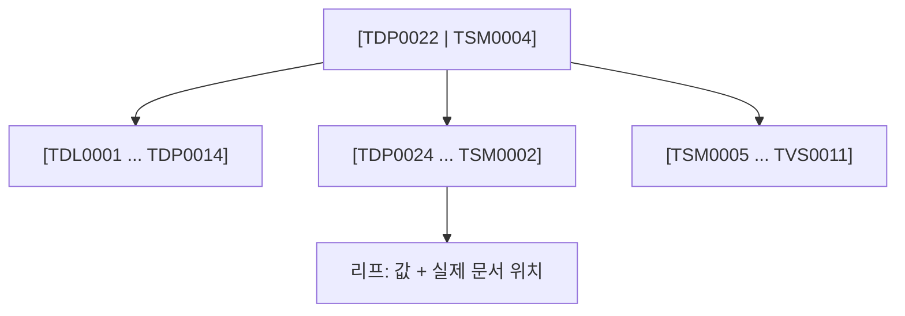

# B-tree

- B-tree는 [[인덱스(Index)]]의 기본 자료구조다. **값이 정렬된 채로 저장된 다진 트리**.
- 이진 트리와 달리 한 노드가 자식을 수십~수백 개 가진다. 디스크는 한 번에 블록 단위로 읽기 때문에, **트리를 낮고 넓게** 만들어 디스크 접근 횟수를 줄이는 게 목적이다.

## 왜 빠른가

- 1만 건에서 탐색은 **약 14번**(log₂ 1만). 실제 B-tree는 분기가 훨씬 넓어 더 적다.
- [[풀 스캔(Full Scan)]]의 1만 번과 비교하면 이게 인덱스의 전부다.

## 정렬돼 있어서 생기는 보너스

B-tree는 값이 정렬 상태라 다음 것들이 **공짜로** 빨라진다.

| 질의 | 왜 되나 |
|---|---|
| `=` 정확 매칭 | 바로 그 위치로 |
| `>`, `<`, `BETWEEN` 범위 | 시작점 찾고 옆으로 훑으면 됨 |
| `ORDER BY` 정렬 | 이미 정렬돼 있으니 추가 정렬 불필요 |
| `^TSM` 접두사 매칭 | 접두사가 같으면 물리적으로 붙어 있음 |

반대로 **중간부터 매칭하는 조건은 못 쓴다.** `%TSM%` 같은 정규식이 인덱스를 못 타는 이유가 이것이다. 시작점을 정할 수 없기 때문이다.

## 한 줄 정리

B-tree는 **낮고 넓은 정렬 트리**라서 정확 매칭·범위·정렬·접두사를 전부 빠르게 하고, 중간 매칭만 못 한다.

## 관련

- [[인덱스(Index)]]
- [[복합 인덱스]]
- [[풀 스캔(Full Scan)]]
- [[MongoDB 쿼리 연산자]]
