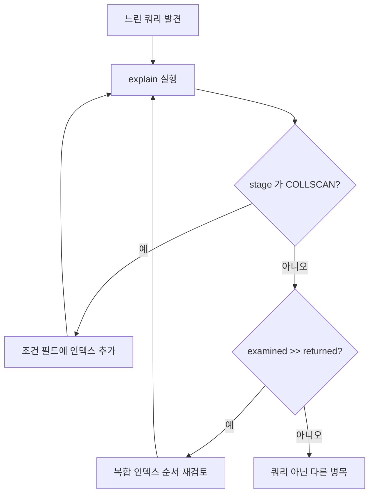

# explain과 실행 계획

- 실행 계획(execution plan)은 DB 옵티마이저가 **이 쿼리를 어떻게 처리할지 정한 결과**다.
- [[쿼리(Query)|쿼리]]는 선언형이라 "어떻게"를 내가 안 쓴다. 그래서 실제로 어떻게 처리됐는지는 explain으로만 알 수 있다.

```javascript
db.blocks.getIndexes()                                   // 뭐가 걸려 있나
db.blocks.find({ category: "visualization" }).explain("executionStats")
```

## 읽는 곳은 두 군데

**1) `winningPlan.stage`**

| 값 | 뜻 |
|---|---|
| `IXSCAN` | [[인덱스(Index)]]를 탔다 |
| `COLLSCAN` | [[풀 스캔(Full Scan)]]이다 |
| `FETCH` | 인덱스로 찾은 뒤 실제 문서를 읽었다 |
| `PROJECTION_COVERED` | 문서를 안 읽고 인덱스만으로 끝났다 (최상, [[projection]] 참고) |

**2) `executionStats`의 두 숫자**

```text
nReturned          실제로 돌려준 문서 수
totalDocsExamined  확인해 본 문서 수
```

이 둘이 **비슷할수록 좋은 쿼리**다. 10건 돌려주려고 10,000건을 봤다면 인덱스가 없거나 잘못 걸린 것이다.

## 실무 절차



## 한 줄 정리

explain은 **내가 쓴 선언이 실제로 어떻게 실행됐는지 보는 창**이고, `COLLSCAN`과 `examined ≫ returned`가 두 개의 경보다.

## 관련

- [[인덱스(Index)]]
- [[복합 인덱스]]
- [[풀 스캔(Full Scan)]]
- [[MongoDB 쿼리 연산자]]
