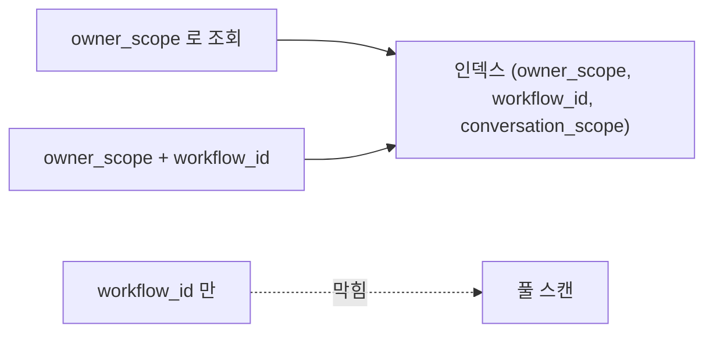

# 복합 인덱스

- 복합 인덱스는 **여러 필드를 하나로 묶어** 만든 [[인덱스(Index)]]다.
- [[B-tree]]가 그 필드들을 **선언한 순서대로** 정렬해 저장한다. 그래서 순서가 곧 성능이다.

```python
MongoIndexSpec([("owner_scope", 1), ("workflow_id", 1), ("conversation_scope", 1)])
```

## 접두사 규칙 (가장 중요)

`(A, B, C)` 인덱스가 도와주는 질의는 **왼쪽부터 이어지는 조합**뿐이다.

| 질의 조건 | 인덱스 사용 |
|---|---|
| `A` | 사용 |
| `A + B` | 사용 |
| `A + B + C` | 사용 |
| `B` 만 | **못 씀** |
| `C` 만 | **못 씀** |
| `B + C` | **못 씀** |

전화번호부가 `성 → 이름` 순으로 정렬돼 있으면 성으로는 찾지만 이름만으로는 못 찾는 것과 같다.



## 순서를 정하는 기준

1. **항상 조건에 들어가는 필드**를 맨 앞. 대화 격리 인덱스가 `owner_scope`(사용자)를 앞에 두는 이유다. 어떤 조회든 사용자로 먼저 좁힌다.
2. 그다음 **선택도가 높은**(값 종류가 많아 후보를 많이 줄이는) 필드.
3. 범위 조건(`$gte`, `$lt`)은 **뒤로**. 범위를 만나는 순간 그 뒤 필드는 정렬이 깨져 못 쓴다.

## 한 줄 정리

복합 인덱스는 **왼쪽 접두사로만 쓸 수 있다.** 필드 순서는 취향이 아니라 질의 모양이 정한다.

## 관련

- [[인덱스(Index)]]
- [[B-tree]]
- [[유니크 인덱스]]
- [[explain과 실행 계획]]
