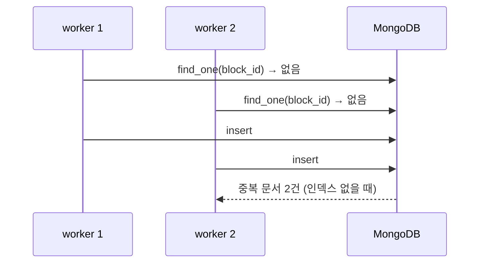

# 유니크 인덱스

- 유니크 인덱스는 **빠른 조회 + 중복 금지**를 동시에 하는 [[인덱스(Index)]]다.
- 같은 값이 두 번 들어오면 DB가 쓰기를 **거부한다**(`DuplicateKeyError`).

```python
await db.blocks.create_index("block_id", unique=True, background=True)
await db.option_keys.create_index("composite_key", unique=True, background=True)
```

## 왜 [[MongoDB]]에서 특히 중요한가

문서 DB는 스키마를 강제하지 않는다. 그래서 **DB가 지켜 주는 규칙이 사실상 유니크 인덱스뿐**이다. 나머지 계약(필드 유무, 타입)은 전부 애플리케이션 몫이다.

## 코드로 막으면 되지 않나 — 안 된다



"확인하고 넣기"는 두 워커 사이에 틈이 있다. 이 경합은 코드로 못 없앤다. 유니크 인덱스가 있으면 두 번째 insert가 실패하고, 그 실패를 잡아 정상 수렴으로 처리하면 된다. [[upsert]]가 안전한 것도 이 인덱스가 깔려 있을 때다.

## 주의

- 이미 중복이 있는 컬렉션에는 유니크 인덱스가 **안 만들어진다.** 먼저 청소해야 한다.
- 필드가 없는 문서는 `null`로 취급돼 서로 충돌한다. 필요하면 partial index를 쓴다.

## 한 줄 정리

유니크 인덱스는 **동시성 경합까지 막아 주는 유일성 계약**이고, 스키마 없는 DB에서 유일하게 DB가 지켜 주는 규칙이다.

## 관련

- [[인덱스(Index)]]
- [[upsert]]
- [[MongoDB]]
- [[RDBMS vs Document DB]]
