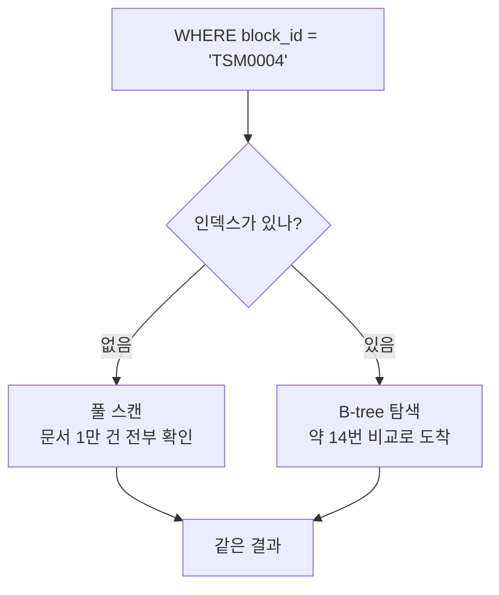

# 인덱스(Index)

- 인덱스는 **찾기 위해 따로 만들어 둔 정렬된 사본**이다. 책 뒤의 색인과 같다.
- 없으면 DB는 [[풀 스캔(Full Scan)]]을 한다. 있으면 [[B-tree]] 탐색으로 바로 간다.

결과는 같다. **걸린 시간만 다르다.** 그래서 인덱스 문제는 에러로 안 나타나고 느려짐으로만 나타난다.

## 종류

| 종류 | 노트 |
|---|---|
| 단일 필드 | 필드 하나로 조회 |
| 복합 | [[복합 인덱스]] — 순서가 전부다 |
| 유니크 | [[유니크 인덱스]] — 성능 + 중복 금지 |
| 커버링 | 필요한 필드가 전부 인덱스 안에 있어 문서를 안 읽는 경우 ([[projection]]과 짝) |
| ANN | [[HNSW]] — 이름만 같고 원리가 다르다 |

## 공짜가 아니다

- **쓰기가 느려진다.** insert/update마다 인덱스도 갱신된다.
- **디스크·메모리를 더 쓴다.**
- 그래서 "일단 다 걸자"가 답이 아니다. **실제 질의 패턴에 있는 필드만** 건다.

## `background: true`

인덱스를 만드는 동안 컬렉션을 잠그지 않는 옵션. 운영 중 컬렉션이나 시딩 경로에서 쓴다.

## 확인 방법

[[explain과 실행 계획]]으로 실제로 인덱스를 탔는지 본다. 걸어 뒀다는 것과 쓰인다는 것은 다른 얘기다.

## 한 줄 정리

인덱스는 **정렬된 사본을 미리 만들어 두고 탐색 횟수를 로그 스케일로 줄이는 것**이고, 쓰기 비용과의 거래다.

## 관련

- [[B-tree]]
- [[풀 스캔(Full Scan)]]
- [[복합 인덱스]]
- [[유니크 인덱스]]
- [[explain과 실행 계획]]
- [[HNSW]]
