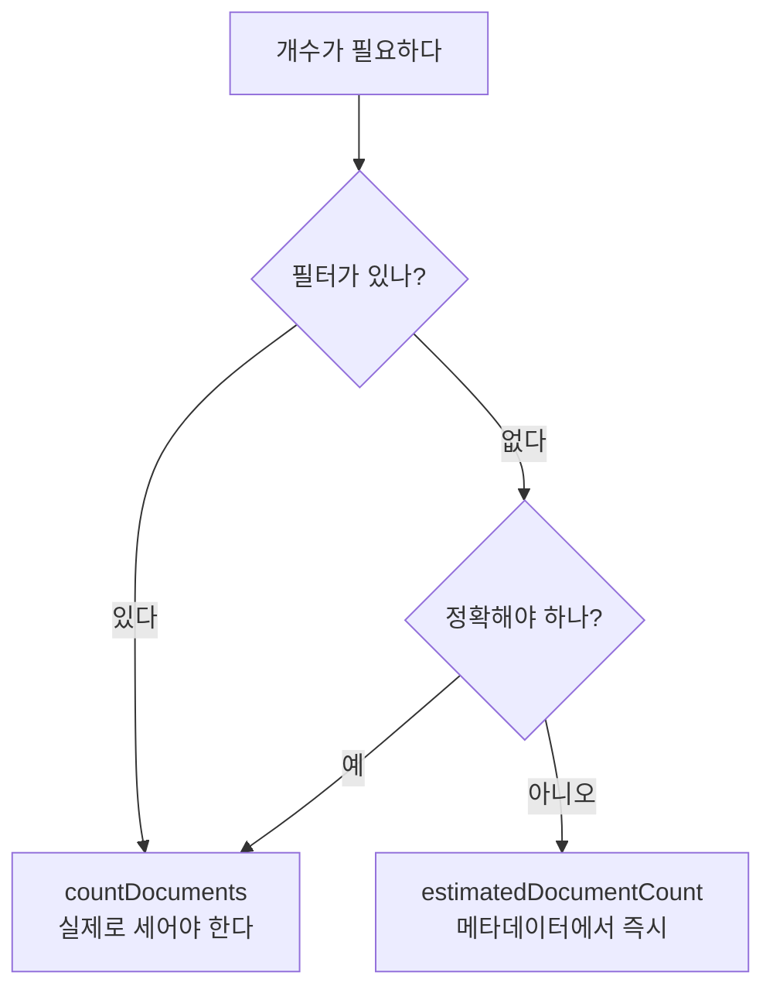

# MongoDB countDocuments()

**조건에 맞는 문서가 몇 개인지 정확히 센다.**

```javascript
db.<컬렉션>.countDocuments( <filter>, <options> )
```

```javascript
db.blocks.countDocuments({})                          // 전체
db.blocks.countDocuments({ category: "model" })
db.blocks.countDocuments({ category: "model" }, { limit: 100 })   // 100까지만 세고 멈춤
```

```python
n = await db.blocks.count_documents({"block_id": {"$in": seed_ids}})
```

## 형제와의 차이

| 메서드 | 정확도 | 속도 | 필터 |
|---|---|---|---|
| `countDocuments(filter)` | **정확** | 스캔함 | 가능 |
| `estimatedDocumentCount()` | 근사 | **즉시** | 불가 |
| `count()` | (구식) | — | 사용 금지 |



`estimatedDocumentCount()`는 컬렉션 메타데이터를 읽을 뿐이라 **크기와 무관하게 빠르다.** 대신 비정상 종료 후에는 살짝 어긋날 수 있다.

```python
if await db.agent_models.estimated_document_count() == 0:
    ...      # "비어 있나?" 확인 — 정확한 수는 필요 없다
```

## 인덱스를 타면 빠르다

`countDocuments`는 조건에 인덱스가 있으면 **문서를 안 읽고 인덱스만 세고 끝낸다**(covered count). 인덱스가 없으면 [[풀 스캔(Full Scan)]]이다.

## 실무 쓰임 — 기록이 아니라 현실을 센다

```python
present_count = await self._db[CATALOG_BLOCKS_COLLECTION].count_documents(
    {"block_id": {"$in": seed_ids}, "_seed_source_hash": source_hash}
)
```

시드 배포에서 marker가 "완료"라고 적혀 있어도 **실제 문서 수를 세어 확인**한다. 누군가 컬렉션을 지웠을 수 있기 때문이다 ([[Seed 배포와 멱등 동기화]]).

## 주의

- **페이지네이션마다 전체 개수를 세지 않는다.** 그게 병목이 된다. 총 건수가 꼭 필요한 화면에서만 쓰거나 근사치를 보여 준다.
- 삭제/갱신 전 안전 확인용으로 같은 필터를 먼저 세는 습관은 좋다 ([[mongosh 실전]]).

## 한 줄 정리

정확한 수가 판단 근거일 때만 `countDocuments`, 단순히 "비었나"는 `estimatedDocumentCount`.

## 관련

- [[MongoDB find()]]
- [[MongoDB distinct()]]
- [[인덱스(Index)]]
- [[Seed 배포와 멱등 동기화]]
- [[GROUP BY와 집계 함수]]
- [[MongoDB CRUD 메서드]]
