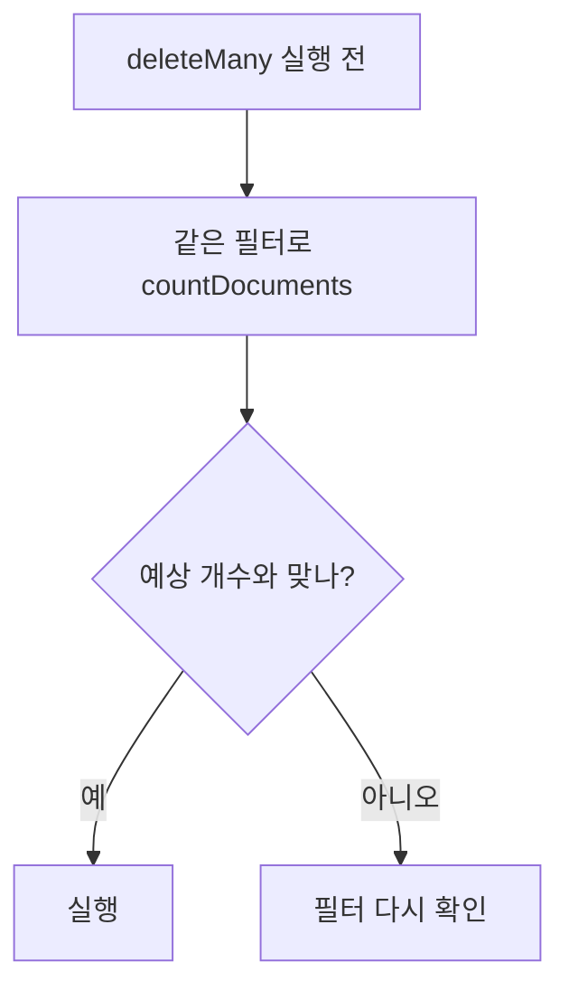

# MongoDB deleteOne() deleteMany()

**문서를 지운다.** 되돌릴 수 없다.

```javascript
db.<컬렉션>.deleteOne(  <filter> )     // 맞는 것 중 하나
db.<컬렉션>.deleteMany( <filter> )     // 맞는 것 전부
```

```python
res = await db.blocks.delete_many({"block_id": {"$in": stale_ids}})
res.deleted_count
```

## 필터가 비면 전부 지운다

```javascript
db.blocks.deleteMany({})     // 컬렉션 비우기 — 사고 1순위
```



```javascript
db.blocks.countDocuments({ _origin: "python_seed", block_id: { $nin: seedIds } })  // 먼저
db.blocks.deleteMany({ _origin: "python_seed", block_id: { $nin: seedIds } })      // 그 다음
```

## 안전하게 지우는 조건 — 출처 태그

```python
stale_filter = {CATALOG_ORIGIN_KEY: "python_seed", "block_id": {"$nin": seed_ids}}
```

시드에서 빠진 블록만 지우되, **`_origin`이 `python_seed`인 것만** 건드린다. 운영자가 admin으로 추가했거나 자가 진화로 생긴 문서는 살아남는다. **출처를 기록해 두지 않으면 안전한 삭제가 불가능하다** ([[Seed 배포와 멱등 동기화]]).

## delete vs drop vs TTL

| 방법 | 대상 | 특징 |
|---|---|---|
| `deleteMany(filter)` | 조건에 맞는 문서 | 인덱스 유지, 느림 |
| `drop()` | 컬렉션 자체 | **인덱스까지 삭제**, 매우 빠름 |
| TTL 인덱스 | 만료된 문서 | 자동·주기적 ([[MongoDB 인덱스 실전]]) |

수명이 정해진 데이터(trace, 로그)는 지우는 코드를 짜지 말고 **TTL 인덱스로 선언**하는 게 낫다.

## 소프트 삭제라는 선택지

```javascript
db.blocks.updateOne({ block_id: "TSM0004" }, { $set: { deleted_at: new Date() } })
```

지우는 대신 표시만 한다. 되돌릴 수 있고 감사 추적이 남는다. 대신 **모든 조회에 `deleted_at: null` 조건이 붙어야** 한다. 빠뜨리면 지운 데이터가 나타난다 — 그 위험까지 감수할 값어치가 있을 때만 쓴다.

## 대량 삭제는 나눠서

```python
while True:
    res = await col.delete_many({"created_at": {"$lt": cutoff}})
    if res.deleted_count == 0:
        break
```

한 번에 수백만 건을 지우면 락과 복제 지연이 커진다. 조건에 [[인덱스(Index)|인덱스]]가 없으면 [[풀 스캔(Full Scan)]]까지 겹친다.

## 한 줄 정리

지우기 전에 **같은 필터로 센다.** 수명 기반 삭제는 TTL로, 되돌릴 여지가 필요하면 소프트 삭제로.

## 관련

- [[MongoDB countDocuments()]]
- [[MongoDB updateMany()]]
- [[MongoDB 인덱스 실전]]
- [[Seed 배포와 멱등 동기화]]
- [[INSERT UPDATE DELETE]]
- [[mongosh 실전]]
- [[MongoDB CRUD 메서드]]
