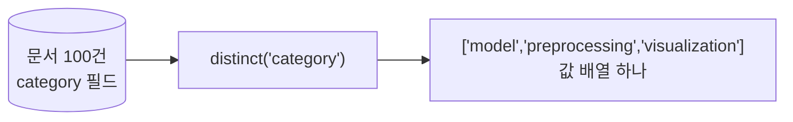

# MongoDB distinct()

**한 필드에 어떤 값들이 있는지, 중복 없이 모아 준다.** [[SELECT 문법|SQL의 `SELECT DISTINCT`]]에 해당한다.

```javascript
db.<컬렉션>.distinct( <필드>, <filter> )
```

```javascript
db.blocks.distinct("category")
// → [ "model", "preprocessing", "visualization" ]

db.blocks.distinct("category", { deprecated: false })
```

```python
categories = await db.blocks.distinct("category", {"deprecated": False})
```

## 반환은 배열 하나



문서가 아니라 **값의 목록**이 온다. 개수까지 필요하면 `distinct`가 아니라 [[MongoDB 집계 연산자|$group]]을 쓴다.

```javascript
db.blocks.aggregate([{ $group: { _id: "$category", n: { $sum: 1 } } }])
```

## 배열 필드에 쓰면 펼쳐진다

```javascript
// { keywords: ["회귀", "예측"] }, { keywords: ["회귀", "분류"] }
db.blocks.distinct("keywords")
// → [ "회귀", "예측", "분류" ]     ← 배열이 아니라 요소들이 모인다
```

"전체 태그 목록"을 뽑을 때 유용하다.

## 중첩 필드

```javascript
db.conv.distinct("summary.model")
db.conv.distinct("messages.role")     // 배열 안 문서의 필드도 된다
```

## 한계 — 16MB

결과 배열도 **BSON 문서 하나**로 돌아온다. 그래서 [[MongoDB 문서 모델과 BSON|16MB 상한]]에 걸린다. 값 종류가 아주 많은 필드(사용자 ID 등)에는 쓰면 안 된다. 그럴 땐 집계 + 페이지네이션으로 간다.

```javascript
db.logs.aggregate([
  { $group: { _id: "$user_id" } },
  { $sort:  { _id: 1 } },
  { $limit: 1000 }
])
```

## 쓰임

- **데이터 파악**: 새 컬렉션에서 "이 필드에 어떤 값이 오지?" ([[mongosh 실전]])
- **드롭다운 채우기**: 카테고리 목록처럼 값 종류가 적을 때
- **검증**: 코드의 [[Enum]]·[[Literal]] 목록과 실제 DB 값이 어긋나지 않았는지

## 한 줄 정리

`distinct`는 **값 종류를 배열로** 준다. 개수가 필요하면 `$group`, 종류가 많으면 집계로 페이지네이션.

## 관련

- [[MongoDB countDocuments()]]
- [[MongoDB 집계 연산자]]
- [[MongoDB 배열 쿼리]]
- [[Enum]]
- [[SELECT 문법]]
- [[MongoDB CRUD 메서드]]
