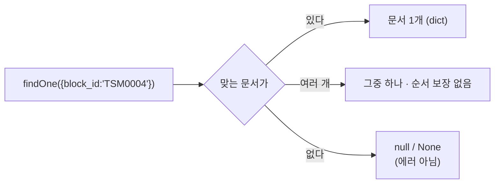

# MongoDB findOne()

**조건에 맞는 문서를 딱 한 건 가져온다. 없으면 `null`.**

```javascript
db.<컬렉션>.findOne( <filter>, <projection> )
```



## 셸

```javascript
db.blocks.findOne()                                    // 아무거나 한 건 — 구조 확인용
db.blocks.findOne({ block_id: "TSM0004" })
db.blocks.findOne({ block_id: "TSM0004" }, { _id: 0 })
```

## 파이썬

```python
doc = await db.blocks.find_one({"block_id": "TSM0004"}, {"_id": 0})
if doc is None:
    ...                     # 없음 — 예외가 아니다
```

## `find()`와의 차이

| | `findOne()` | `find()` |
|---|---|---|
| 반환 | **문서 1개** 또는 `null` | [[MongoDB 커서와 페이지네이션\|커서]] |
| await | 필요 (파이썬) | 소비할 때 |
| 내부 동작 | `limit(1)`과 같다 | 전체 조건 집합 |

## 여러 개면 어느 것이 오나

**정해져 있지 않다.** 보통 저장 순서지만 보장이 아니다. "가장 최근 것"이 필요하면 정렬을 명시한다.

```javascript
db.agent_trace.find().sort({ ts_start: -1 }).limit(1)      // 셸에서는 이렇게
```

```python
docs = await db.agent_trace.find().sort("ts_start", -1).limit(1).to_list(1)
latest = docs[0] if docs else None
```

`findOne`에는 `sort` 옵션을 줄 수 있는 드라이버도 있지만, **정렬이 필요하면 `find().sort().limit(1)`이 의도가 분명하다.**

## 실무 쓰임

```python
marker = await marker_col.find_one(
    {"seed_key": "workflow_catalog"},
    {"_id": 0, "source_hash": 1, "version": 1, "status": 1},
)
```

시드 배포 영수증처럼 **키로 딱 한 건을 집는** 자리에 쓴다 ([[Seed 배포와 멱등 동기화]]).

## 한 줄 정리

`findOne`은 **한 건 아니면 `null`**. 순서가 중요하면 `find().sort().limit(1)`을 쓴다.

## 관련

- [[MongoDB find()]]
- [[MongoDB sort() limit() skip()]]
- [[projection]]
- [[MongoDB 쿼리 연산자]]
- [[MongoDB CRUD 메서드]]
