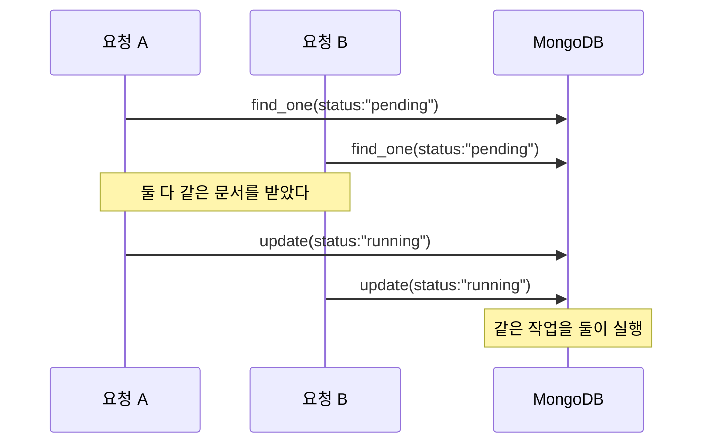

# MongoDB findOneAndUpdate()

**한 문서를 원자적으로 바꾸고, 그 문서를 돌려받는다.** "읽고 → 고치고 → 쓰기"를 한 번에 한다.

```javascript
db.<컬렉션>.findOneAndUpdate( <filter>, <update>, <options> )
```

## 왜 필요한가 — 경합



`find_one` 후 `update_one`은 **두 번의 왕복**이라 그 사이에 남이 끼어든다. `findOneAndUpdate`는 서버에서 한 번에 처리되므로 **먼저 잡은 쪽만 성공**한다.

```python
job = await db.jobs.find_one_and_update(
    {"status": "pending"},
    {"$set": {"status": "running", "started_at": now}},
    sort=[("priority", -1)],
    return_document=ReturnDocument.AFTER,
)
if job is None:
    ...        # 가져갈 작업이 없다
```

작업 큐에서 **한 건을 안전하게 집어 가는** 표준 패턴이다.

## 옵션

| 옵션 | 뜻 |
|---|---|
| `return_document` | `BEFORE`(기본) 또는 `AFTER` — **바뀌기 전/후 중 무엇을 받을지** |
| `sort` | 여러 개가 맞을 때 어느 것을 고를지 |
| `upsert` | 없으면 만들기 |
| `projection` | 받을 필드 |

```python
from pymongo import ReturnDocument
return_document=ReturnDocument.AFTER      # 갱신된 결과가 필요할 때
```

## 형제

| 메서드 | 하는 일 |
|---|---|
| `findOneAndUpdate` | 바꾸고 돌려받음 |
| `findOneAndReplace` | 통째 교체하고 돌려받음 |
| `findOneAndDelete` | 지우고 지워진 문서를 돌려받음 |

## 카운터 만들기

```python
doc = await db.counters.find_one_and_update(
    {"_id": "block_seq"},
    {"$inc": {"seq": 1}},
    upsert=True,
    return_document=ReturnDocument.AFTER,
)
next_id = doc["seq"]
```

**번호를 발급하면서 그 번호를 받아 오는** 유일하게 안전한 방법이다. `$inc` 후 `find_one`으로 읽으면 그 사이에 남이 또 올린다.

## 언제 안 써도 되나

- 값을 **돌려받을 필요가 없으면** [[MongoDB updateOne()]]로 충분하다. `$inc` 자체는 이미 원자적이다.
- 여러 문서를 원자적으로 다뤄야 하면 이걸로는 부족하다 — [[트랜잭션(ACID)|트랜잭션]] 영역이다.

## 한 줄 정리

**"읽고-고치고-쓰기" 경합을 없애고 결과까지 받는 메서드.** 작업 큐 선점과 카운터 발급이 대표 용도다.

## 관련

- [[MongoDB updateOne()]]
- [[MongoDB findOne()]]
- [[MongoDB 갱신 연산자]]
- [[유니크 인덱스]]
- [[트랜잭션(ACID)]]
- [[MongoDB CRUD 메서드]]
