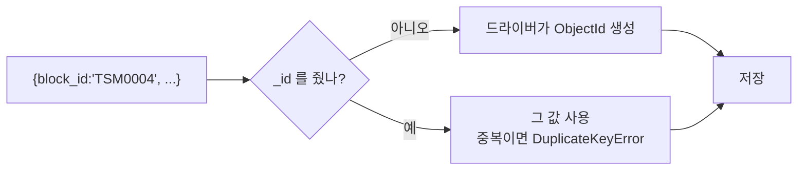

# MongoDB insertOne() insertMany()

**새 문서를 넣는다.** 이미 있으면 갱신하지 않는다 — 그건 [[MongoDB updateOne()|updateOne]]이나 [[upsert]]의 일이다.

```javascript
db.<컬렉션>.insertOne(  <문서> )
db.<컬렉션>.insertMany( [<문서>, <문서>, ...], { ordered: true|false } )
```

## 셸

```javascript
db.blocks.insertOne({ block_id: "TSM0004", name: "선형 회귀", category: "model" })

db.blocks.insertMany([
  { block_id: "TSM0004", name: "선형 회귀" },
  { block_id: "TSM0005", name: "로지스틱 회귀" }
])
```

## 파이썬

```python
res = await db.blocks.insert_one({"block_id": "TSM0004", "name": "선형 회귀"})
res.inserted_id                       # 새로 생긴 _id

res = await db.blocks.insert_many(docs, ordered=False)
res.inserted_ids                      # _id 리스트
```

## `_id`는 자동으로 붙는다



`_id`를 직접 줄 수도 있다. 의미 있는 키가 이미 있으면 그걸 `_id`로 쓰면 인덱스 하나를 아낀다 ([[MongoDB 문서 모델과 BSON]]).

## ordered — 중간에 실패하면

```python
await db.blocks.insert_many(docs, ordered=False)
```

| 옵션 | 동작 |
|---|---|
| `ordered=True` (기본) | 순서대로 넣다가 **하나 실패하면 거기서 중단.** 뒤는 안 넣음 |
| `ordered=False` | 실패한 것만 건너뛰고 **나머지는 전부 시도** |

```text
ordered=True   [ok] [ok] [FAIL] [ ] [ ]     ← 3번째에서 멈춤
ordered=False  [ok] [ok] [FAIL] [ok] [ok]   ← 계속 진행
```

로그·trace처럼 **일부가 중복이어도 나머지는 들어가야** 하는 경우 `ordered=False`가 맞다. 병렬 처리라 더 빠르기도 하다.

## 부분 실패는 예외로 온다

```python
from pymongo.errors import BulkWriteError

try:
    await db.blocks.insert_many(docs, ordered=False)
except BulkWriteError as e:
    e.details["nInserted"]     # 성공 개수
    e.details["writeErrors"]   # 실패 내역
```

**예외가 났다고 아무것도 안 들어간 게 아니다.** `ordered=False`에서는 일부가 이미 저장돼 있다 ([[MongoDB 예외 처리]]).

## 왜 우리 코드에는 insert가 거의 없나

시딩·원장은 전부 [[upsert]] 계열을 쓴다. `insert`는 **두 번 돌리면 중복**이 되어 멱등하지 않기 때문이다. `insert`가 맞는 자리는 **한 번만 일어나는 사건 기록**이다.

## 한 줄 정리

`insert`는 "새로 넣기"뿐이다. 재실행 가능성이 있으면 `upsert`를, 대량 삽입에는 `ordered=False`를 쓴다.

## 관련

- [[upsert]]
- [[MongoDB updateOne()]]
- [[MongoDB bulkWrite()]]
- [[MongoDB 쓰기 결과 객체]]
- [[MongoDB 예외 처리]]
- [[유니크 인덱스]]
- [[MongoDB CRUD 메서드]]
