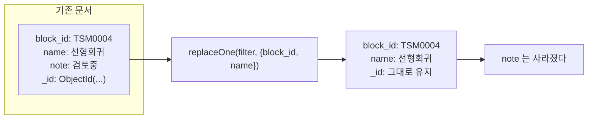

# MongoDB replaceOne()

**문서 전체를 새 문서로 갈아끼운다.** 새 문서에 없는 필드는 **사라진다.**

```javascript
db.<컬렉션>.replaceOne( <filter>, <새문서>, { upsert: true|false } )
```

두 번째 인자에는 **`$` 연산자를 쓸 수 없다.** 순수한 문서만 온다. 그게 [[MongoDB updateOne()]]과의 결정적 차이다.



`_id`만은 유지된다. 바꾸려 하면 에러다.

## 셸 · 파이썬

```javascript
db.blocks.replaceOne({ block_id: "TSM0004" }, { block_id: "TSM0004", name: "선형 회귀" }, { upsert: true })
```

```python
res = await blocks_col.replace_one({"block_id": block_id}, doc, upsert=True)
if res.upserted_id:
    upserted += 1
else:
    modified += 1
```

## 언제 replace이고 언제 update인가

| 상황 | 메서드 |
|---|---|
| 코드/시드가 **정본**이고 DB는 그 사본 | **`replaceOne`** |
| 원장에 값을 **덧쓰거나 누적** | `updateOne` + `$set`/`$inc`/`$push` |
| 필드 하나만 바꿈 | `updateOne` |

**시드에서 사라진 필드는 DB에서도 사라져야 한다.** `$set`만 쓰면 옛 필드가 영원히 남아 유령 데이터가 된다. 그래서 카탈로그 시딩은 `replaceOne`이다 ([[Seed 배포와 멱등 동기화]]).

## 멱등성

```python
await col.replace_one({"seed_key": "workflow_catalog"}, marker_doc, upsert=True)
```

같은 문서로 몇 번을 돌려도 결과가 같다. **재실행 안전**이 `replaceOne + upsert`의 값어치다 ([[upsert]]).

## 주의

- **부분 갱신 의도로 쓰면 데이터가 날아간다.** "이름만 바꾸려고" `replaceOne`을 쓰면 나머지가 지워진다.
- 새 문서를 조립할 때 **읽어서 수정 후 쓰기(read-modify-write)** 를 하면 그 사이 다른 요청의 변경을 덮어쓴다. 그럴 땐 `updateOne`이나 [[MongoDB findOneAndUpdate()]]가 안전하다.
- 결과 객체 읽는 법은 [[MongoDB 쓰기 결과 객체]].

## 한 줄 정리

`replaceOne`은 **통째 교체**다. 정본을 미는 자리에는 맞고, 부분 수정 자리에는 위험하다.

## 관련

- [[MongoDB updateOne()]]
- [[upsert]]
- [[MongoDB 쓰기 결과 객체]]
- [[Seed 배포와 멱등 동기화]]
- [[MongoDB findOneAndUpdate()]]
- [[MongoDB CRUD 메서드]]
