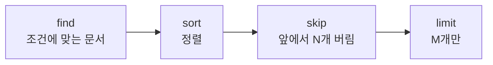

# MongoDB sort() limit() skip()

[[MongoDB find()]]가 만든 **커서에 붙이는 체인 메서드** 셋. 결과의 순서·개수·시작 위치를 정한다.

```javascript
db.blocks.find({...}).sort({ score: -1 }).skip(20).limit(10)
```

## 쓰는 순서와 실행 순서가 다르다



체인을 어떤 순서로 쓰든 서버는 **항상 sort → skip → limit**로 처리한다. `.limit(10).sort(...)`라고 써도 정렬 후 10개다.

## sort()

```javascript
.sort({ score: -1 })                      // 내림차순
.sort({ category: 1, score: -1 })         // 복합 (앞 필드가 1순위)
```

```python
.sort("score", -1)                        # 필드 하나
.sort([("category", 1), ("score", -1)])   # 복합은 리스트
```

| 값 | 뜻 |
|---|---|
| `1` | 오름차순 (작은 것부터) |
| `-1` | 내림차순 |

> **정렬에는 인덱스가 필요하다.** 없으면 메모리에서 정렬하는데 MongoDB는 **32MB 상한**을 두고, 넘으면 쿼리를 거부한다(`Sort exceeded memory limit`). 정렬 필드는 [[복합 인덱스]]에 포함시킨다.

## limit()

```javascript
.limit(10)      // 최대 10건. 그보다 적으면 있는 만큼
```

`limit(0)`은 "제한 없음"이다. 0건이 아니다.

## skip()

```javascript
.skip(20).limit(10)      // 21~30번째 = 3페이지
```

```text
skip(10000).limit(20)
└─ 서버는 10,020건을 읽고 앞의 10,000건을 버린다
```

**깊은 페이지일수록 선형으로 느려진다.** 무한 스크롤·로그 조회에는 마지막 키 기준(keyset)을 쓴다.

```javascript
db.logs.find({ _id: { $gt: lastId } }).sort({ _id: 1 }).limit(20)
```

자세한 비교는 [[MongoDB 커서와 페이지네이션]].

## 집계에서는 stage로

```javascript
db.blocks.aggregate([
  { $sort:  { score: -1 } },
  { $skip:  20 },
  { $limit: 10 }
])
```

이름만 `$`가 붙고 의미는 같다. 다만 **집계에서는 쓴 순서대로 실행**되므로 `$sort`를 뒤에 두면 정말 뒤에 정렬한다.

## 한 줄 정리

체인 순서와 무관하게 **sort → skip → limit**로 실행되고, `sort`에는 인덱스가, 깊은 `skip`에는 keyset이 필요하다.

## 관련

- [[MongoDB find()]]
- [[MongoDB 커서와 페이지네이션]]
- [[복합 인덱스]]
- [[MongoDB Aggregation Pipeline]]
- [[SELECT 문법]]
- [[MongoDB CRUD 메서드]]
