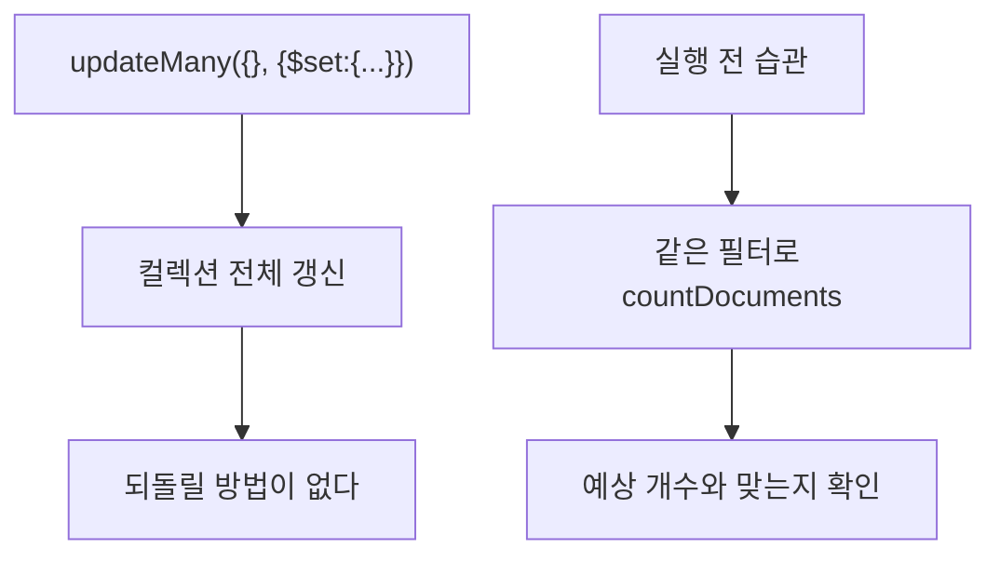

# MongoDB updateMany()

**조건에 맞는 문서를 전부 바꾼다.** 문법은 [[MongoDB updateOne()]]과 완전히 같고, 대상 범위만 다르다.

```javascript
db.<컬렉션>.updateMany( <filter>, <update>, <options> )
```

```javascript
db.blocks.updateMany({ category: "model" }, { $set: { reviewed: true } })
db.blocks.updateMany({}, { $unset: { legacy_flag: "" } })      // 전체 — 위험
```

```python
res = await db.blocks.update_many({"category": "model"}, {"$set": {"reviewed": True}})
res.matched_count, res.modified_count
```

## 필터를 빠뜨리면 전체가 바뀐다



```javascript
db.blocks.countDocuments({ category: "model" })            // 42 — 먼저 센다
db.blocks.updateMany({ category: "model" }, { $set: {...} })
```

[[MongoDB countDocuments()]]로 확인하는 습관이 [[INSERT UPDATE DELETE|SQL의 `WHERE` 없는 UPDATE]] 방어와 똑같다.

## 원자성의 범위

| 단위 | 원자적인가 |
|---|---|
| 문서 하나 | **예** |
| `updateMany` 전체 | **아니오** |

`updateMany`는 문서를 하나씩 순차로 바꾼다. 중간에 실패하면 **일부만 바뀐 상태**로 남고, 다른 요청은 그 중간 상태를 볼 수 있다. 전부 아니면 전무가 필요하면 [[트랜잭션(ACID)|트랜잭션]]이 필요하다.

## upsert와 함께 쓰면

```javascript
db.blocks.updateMany({ category: "model" }, { $set: {...} }, { upsert: true })
```

맞는 문서가 **하나도 없을 때만** 새 문서 하나가 생긴다. 여러 개가 생기지 않는다. 헷갈리기 쉬워 `updateMany` + `upsert` 조합은 잘 쓰지 않는다.

## 대량 갱신은 나눠서

수십만 건을 한 번에 바꾸면 락과 복제 지연이 커진다. 배치로 끊는다.

```python
while True:
    ids = await col.find({"migrated": {"$exists": False}}, {"_id": 1}).limit(1000).to_list(1000)
    if not ids:
        break
    await col.update_many({"_id": {"$in": [d["_id"] for d in ids]}},
                          {"$set": {"migrated": True}})
```

서로 다른 문서에 각각 **다른 값**을 넣어야 한다면 `updateMany`로는 안 된다. [[MongoDB bulkWrite()]]가 그 자리다.

## 한 줄 정리

`updateMany`는 범위만 넓어진 `updateOne`이다. **필터 확인이 전부**이고, 전체 원자성은 없다.

## 관련

- [[MongoDB updateOne()]]
- [[MongoDB countDocuments()]]
- [[MongoDB bulkWrite()]]
- [[MongoDB deleteOne() deleteMany()]]
- [[MongoDB 갱신 연산자]]
- [[트랜잭션(ACID)]]
- [[MongoDB CRUD 메서드]]
