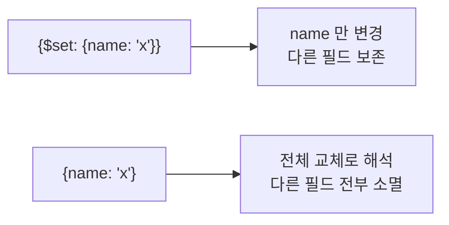

# MongoDB updateOne()

**조건에 맞는 문서 하나의 일부 필드를 바꾼다.** 나머지 필드는 그대로 둔다.

```javascript
db.<컬렉션>.updateOne( <filter>, <update>, <options> )
```

| 자리 | 내용 |
|---|---|
| `filter` | 어느 문서를 ([[MongoDB 쿼리 연산자]]) |
| `update` | 어떻게 바꿀지 — **`$` 연산자 필수** ([[MongoDB 갱신 연산자]]) |
| `options` | `upsert`, `arrayFilters` 등 |

## 셸

```javascript
db.blocks.updateOne(
  { block_id: "TSM0004" },
  { $set: { name: "선형 회귀", updated_at: new Date() },
    $inc: { revision: 1 } }
)
```

## 파이썬

```python
res = await db.workflow_conversations.update_one(
    {"session_id": sid},
    {"$set": {"updated_at": now}, "$inc": {"turn": 1}},
    upsert=True,
)
res.matched_count, res.modified_count, res.upserted_id
```

## `$`를 빠뜨리면 문서가 통째로 날아간다

```javascript
db.blocks.updateOne({ block_id: "TSM0004" }, { name: "선형 회귀" })
```



최신 서버는 이 형태를 거부하지만, **드라이버·버전에 따라 그대로 교체**된다. 의도가 교체라면 [[MongoDB replaceOne()]]을 명시적으로 쓴다.

## 여러 개가 맞으면 하나만

`updateOne`은 **조건에 맞는 첫 문서 하나만** 바꾼다. 어느 것이 "첫"인지는 보장되지 않는다. 전부 바꾸려면 [[MongoDB updateMany()]].

## upsert 옵션

```javascript
db.blocks.updateOne(
  { block_id: "TSM0004" },
  { $set: { name: "선형 회귀" }, $setOnInsert: { created_at: new Date() } },
  { upsert: true }
)
```

없으면 만든다. `$setOnInsert`는 **만들어질 때만** 적용돼 최초 시각을 보존한다 → [[upsert]]

## 원자성

한 문서에 대한 `updateOne`은 **원자적**이다. 중간 상태를 다른 요청이 볼 수 없다.

```python
{"$inc": {"turn": 1}}          # 안전 — 동시 요청에도 값이 유실되지 않는다
# 읽어서 +1 하고 다시 쓰기     # 위험 — 두 요청이 같은 값을 읽으면 하나가 사라진다
```

바꾼 결과를 **돌려받아야** 한다면 [[MongoDB findOneAndUpdate()]]를 쓴다.

## 결과 읽기

```python
res.matched_count    # 필터에 걸린 수 (0 또는 1)
res.modified_count   # 실제로 값이 바뀐 수 — 같은 값이면 0
res.upserted_id      # upsert로 새로 만들어졌으면 _id
```

`matched=1, modified=0`은 **찾았지만 내용이 이미 같았다**는 뜻이다. 실패가 아니다 → [[MongoDB 쓰기 결과 객체]]

## 한 줄 정리

`updateOne(filter, {$set: ...})`이 기본형이고, **`$`를 빠뜨리면 교체**, 여러 건은 `updateMany`, 결과를 받으려면 `findOneAndUpdate`.

## 관련

- [[MongoDB updateMany()]]
- [[MongoDB replaceOne()]]
- [[MongoDB findOneAndUpdate()]]
- [[MongoDB 갱신 연산자]]
- [[upsert]]
- [[MongoDB 쓰기 결과 객체]]
- [[MongoDB CRUD 메서드]]
