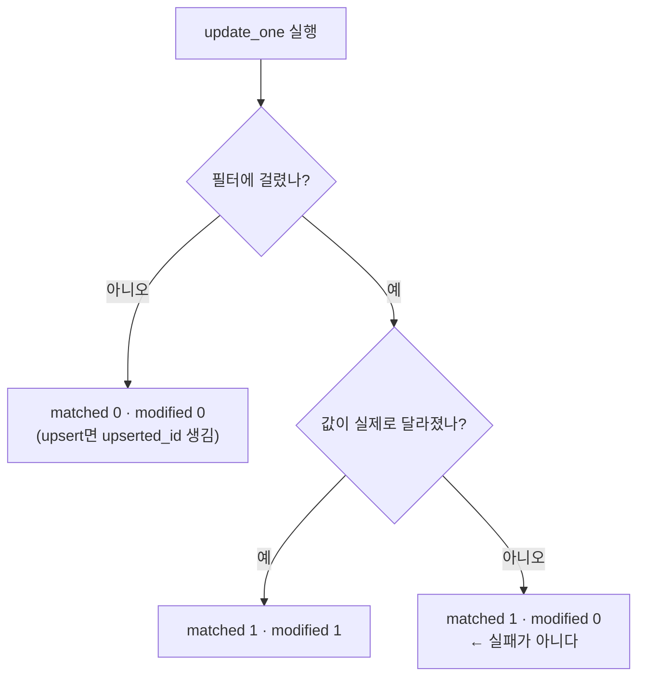

# MongoDB 쓰기 결과 객체

쓰기 메서드는 **무엇이 일어났는지 알려 주는 객체**를 돌려준다. 이걸 읽어야 "새로 만든 건지 갱신한 건지"를 안다.

## 메서드별 반환

| 메서드 | 반환 타입 | 주요 필드 |
|---|---|---|
| `insert_one` | `InsertOneResult` | `inserted_id` |
| `insert_many` | `InsertManyResult` | `inserted_ids` |
| `update_one` / `update_many` | `UpdateResult` | `matched_count` · `modified_count` · `upserted_id` |
| `replace_one` | `UpdateResult` | 위와 동일 |
| `delete_one` / `delete_many` | `DeleteResult` | `deleted_count` |
| `bulk_write` | `BulkWriteResult` | 위 값들의 합계 + `upserted_ids` |

## matched vs modified — 가장 중요한 구분



```python
res = await col.update_one({"block_id": bid}, {"$set": {"name": "선형 회귀"}})
res.matched_count    # 찾았는가
res.modified_count   # 실제로 바뀌었는가
```

**`modified_count == 0`을 실패로 처리하면 안 된다.** 같은 값을 다시 쓴 경우가 대부분이고, [[upsert|멱등]] 작업에서는 오히려 정상이다.

## upserted_id — 새로 만들었는가

```python
res = await blocks_col.replace_one({"block_id": block_id}, doc, upsert=True)
if res.upserted_id:
    upserted += 1      # 새로 생김
else:
    modified += 1      # 기존 갱신
```

시딩이 `{"upserted": N, "modified": M}` 영수증을 만드는 방식이다 ([[Seed 배포와 멱등 동기화]]). `upserted_id`는 **삽입됐을 때만** 값이 있고, 아니면 `None`이다.

## acknowledged

```python
res.acknowledged        # False면 나머지 필드가 의미 없다
```

`write_concern`을 `w=0`으로 두면 서버 응답을 안 기다린다. 그 경우 `acknowledged=False`이고 카운트가 비어 있다. 기본값은 확인 대기이므로 보통 신경 쓸 일이 없다.

## bulk_write 결과

```python
res = await col.bulk_write(ops, ordered=False)
res.inserted_count, res.matched_count, res.modified_count
res.upserted_count, res.deleted_count
res.upserted_ids        # {작업 인덱스: _id}
```

## 로그로 남길 값

```python
logger.info("MongoDB catalog upsert 완료: upserted=%d, modified=%d", upserted, modified)
```

**"몇 건이 새로 생기고 몇 건이 바뀌었는지"** 는 배포 후 확인의 1차 근거다. 아무것도 안 바뀌었는데 `upserted`가 크면 중복 키 설계가 잘못된 것이고, 매번 `modified`가 크면 무의미한 갱신이 돌고 있는 것이다.

## 한 줄 정리

`matched`는 찾았는가, `modified`는 바뀌었는가, `upserted_id`는 새로 만들었는가. **셋은 서로 다른 사실**이다.

## 관련

- [[MongoDB updateOne()]]
- [[MongoDB replaceOne()]]
- [[MongoDB bulkWrite()]]
- [[upsert]]
- [[Seed 배포와 멱등 동기화]]
- [[INSERT UPDATE DELETE]]
- [[MongoDB CRUD 메서드]]
