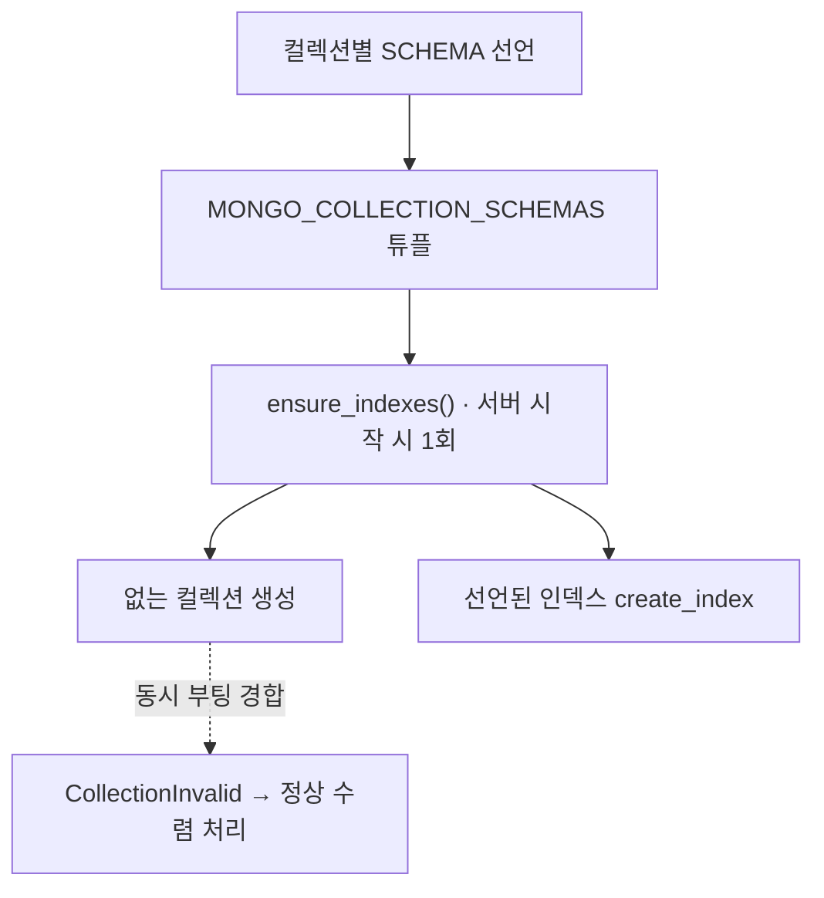

# Mongo 스키마 레지스트리

- [[MongoDB]]는 스키마를 강제하지 않는다. 그래서 **컬렉션의 필드와 인덱스 계약을 코드가 소유**하고, 부팅 때 한 번 DB에 반영한다.
- [[Registry Pattern]]의 저장소 버전이다.

## 타입 셋

```python
@dataclass(frozen=True)
class MongoFieldSpec:
    name: str
    type: str
    required: bool = False
    description: str = ""
    source: str = ""

@dataclass(frozen=True)
class MongoIndexSpec:
    keys: str | list[tuple[str, int]]      # "session_id" 또는 [("a",1),("b",1)]
    options: dict = field(default_factory=dict)

@dataclass(frozen=True)
class MongoCollectionSchema:
    name: str
    description: str
    fields: tuple[MongoFieldSpec, ...] = ()
    indexes: tuple[MongoIndexSpec, ...] = ()
```

전부 `frozen=True` [[dataclass]]다. 선언이지 상태가 아니므로 변경될 이유가 없다.

## 컬렉션 하나의 선언

```python
SCHEMA = MongoCollectionSchema(
    name=WORKFLOW_CONVERSATIONS_COLLECTION,
    description="워크플로우 채팅 세션 상태.",
    fields=(
        MongoFieldSpec("session_id", "str", True, "채팅 세션 ID", "storage.conversations"),
        MongoFieldSpec("owner_scope", "str", False, "Spring 인증 주체의 범위 식별자", ...),
        MongoFieldSpec("messages", "list[dict]", False, "대화 메시지 목록", ...),
    ),
    indexes=(
        MongoIndexSpec("session_id", {"unique": True}),
        MongoIndexSpec("workflow_id"),
        MongoIndexSpec([("owner_scope", 1), ("workflow_id", 1), ("conversation_scope", 1)]),
    ),
)
```

## 레지스트리와 부트스트랩

```python
MONGO_COLLECTION_SCHEMAS = (
    WORKFLOW_CONVERSATIONS_SCHEMA,
    ANALYSIS_PLANS_SCHEMA,
    AGENT_TRACE_SCHEMA,
    ...
)

async def ensure_indexes():
    db = get_mongo_db()
    existing = set(await db.list_collection_names())
    for schema in MONGO_COLLECTION_SCHEMAS:
        if schema.name not in existing:
            try:
                await db.create_collection(schema.name)
            except CollectionInvalid:
                # 여러 worker가 동시에 부팅하는 경합 — 먼저 만든 쪽이 있으면 정상 수렴
                logger.debug("다른 worker가 먼저 생성함: %s", schema.name)
        for index in schema.indexes:
            await db[schema.name].create_index(index.keys, **index.options)
```



## 얻는 것

| 문제 | 이 구조가 주는 답 |
|---|---|
| 필드가 뭐가 있는지 모르겠다 | 선언이 곧 문서. 코드에서 바로 읽는다 |
| 인덱스를 깜빡한다 | 부팅 때 무조건 반영. `create_index`는 멱등 |
| 운영 DB와 코드가 어긋난다 | 선언 하나만 고치면 다음 부팅에 수렴 |
| 어떤 컬렉션이 죽은 컬렉션인가 | 레지스트리에 없으면 아무도 안 쓴다는 뜻 |

**LangGraph checkpoint 컬렉션은 여기 넣지 않는다.** 외부 checkpointer가 자기 스키마를 소유하므로 중복 선언하면 두 주인이 생긴다 ([[LangGraph Checkpointer]]).

## 한 줄 정리

스키마 레지스트리는 **DB가 안 지켜 주는 계약을 코드가 선언하고 부팅 때 밀어 넣는 패턴**이다.

## 관련

- [[MongoDB]]
- [[인덱스(Index)]]
- [[유니크 인덱스]]
- [[복합 인덱스]]
- [[motor]]
- [[dataclass]]
- [[Registry Pattern]]
- [[AI Agent 컬렉션 지도]]
