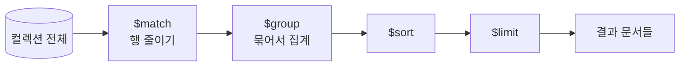

# MongoDB Aggregation Pipeline

- `find()`가 [[SQL]]의 `SELECT ... WHERE`라면, aggregate는 **`GROUP BY`와 그 이상**을 담당한다.
- 단계(stage)를 배열로 이어 붙이고, 앞 단계의 출력이 뒤 단계의 입력이 된다. 유닉스 파이프와 같다.

```javascript
db.catalog_change_proposals.aggregate([
  { $match: { status: { $ne: "archived" } } },    // WHERE
  { $group: { _id: "$status", n: { $sum: 1 } } }, // GROUP BY + COUNT
  { $sort: { n: -1 } },                           // ORDER BY
  { $limit: 10 }
])
```



## 자주 쓰는 stage

| stage | 뜻 | SQL 대응 |
|---|---|---|
| `$match` | 문서 필터 | `WHERE` |
| `$group` | `_id` 기준으로 묶고 집계 | `GROUP BY` |
| `$sort` | 정렬 | `ORDER BY` |
| `$limit` `$skip` | 자르기 | `LIMIT` / `OFFSET` |
| `$project` | 필드 고르기·계산 | `SELECT` ([[projection]]) |
| `$unwind` | 배열을 행으로 펼침 | (SQL에 직접 대응 없음) |
| `$lookup` | 다른 컬렉션 붙이기 | `LEFT JOIN` — 비싸다, 남용 금지 |

`$group`의 `_id`가 묶는 기준이다. `_id: null`이면 전체를 하나로 묶는다.

## 철칙: `$match`를 맨 앞에

```javascript
[{ $match: ... }, { $group: ... }]   // 좋음: 인덱스를 타고, 뒤 단계가 볼 문서가 적다
[{ $group: ... }, { $match: ... }]   // 나쁨: 전부 집계한 뒤에 버린다
```

`$match`가 첫 stage일 때만 [[인덱스(Index)|인덱스]]를 쓸 수 있다. `$group`을 한 번 거치면 그건 이미 인덱스가 없는 중간 결과다.

## 한 줄 정리

Aggregation Pipeline은 **stage를 이어 붙인 집계 질의**이고, `$match`를 맨 앞에 두는 게 성능의 전부다.

## 관련

- [[MongoDB]]
- [[SQL 실행 순서]]
- [[projection]]
- [[인덱스(Index)]]
