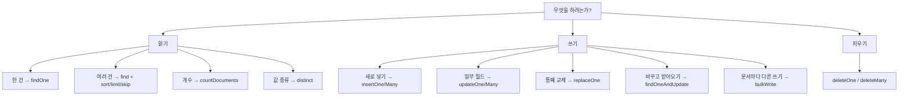

# MongoDB CRUD 메서드

메서드 하나당 노트 하나로 쪼개 뒀다. 이 노트는 **어느 것을 쓸지 고르는 지도**다.

## 읽기

| 메서드 | 한 줄 |
|---|---|
| [[MongoDB find()]] | 여러 건 — **커서**를 돌려준다 |
| [[MongoDB findOne()]] | 한 건 또는 `null` |
| [[MongoDB sort() limit() skip()]] | 커서에 붙이는 체인 |
| [[MongoDB countDocuments()]] | 정확한 개수 (근사는 `estimatedDocumentCount`) |
| [[MongoDB distinct()]] | 값 종류를 배열로 |

## 쓰기

| 메서드 | 한 줄 |
|---|---|
| [[MongoDB insertOne() insertMany()]] | 새로 넣기. 재실행하면 중복 |
| [[MongoDB updateOne()]] | 일부 필드만. **`$` 필수** |
| [[MongoDB updateMany()]] | 범위만 넓어진 updateOne |
| [[MongoDB replaceOne()]] | 통째 교체. 없는 필드는 사라짐 |
| [[MongoDB findOneAndUpdate()]] | 원자적으로 바꾸고 돌려받기 |
| [[MongoDB bulkWrite()]] | 서로 다른 쓰기를 한 왕복에 |
| [[MongoDB deleteOne() deleteMany()]] | 삭제 |
| [[MongoDB 쓰기 결과 객체]] | matched · modified · upserted_id 읽기 |

## 선택 기준 요약

| 고민 | 답 |
|---|---|
| 있으면 갱신, 없으면 삽입 | `updateOne`/`replaceOne` + `upsert=True` ([[upsert]]) |
| 최초 생성 시각만 보존 | `$setOnInsert` ([[MongoDB 갱신 연산자]]) |
| 시드처럼 정본을 밀 때 | `replaceOne` — 사라진 필드도 사라져야 한다 |
| 원장에 값을 누적 | `updateOne` + `$inc`/`$push` |
| 문서마다 다른 값 | `bulkWrite` |
| 경합 없이 하나 집어가기 | `findOneAndUpdate` |
| 지우기 전 | `countDocuments`로 먼저 센다 |

## 셸 ↔ 파이썬 이름

| 셸 (JS) | [[motor]] (Python) |
|---|---|
| `findOne` `insertOne` `updateOne` | `find_one` `insert_one` `update_one` |
| `replaceOne` `deleteMany` | `replace_one` `delete_many` |
| `countDocuments` `bulkWrite` | `count_documents` `bulk_write` |
| `createIndex` `getIndexes` | `create_index` `list_indexes` |

셸 문법 전체는 [[MongoDB 셸 쿼리 문법]], SQL 대응은 [[SQL ↔ MongoDB 문법 대조표]].

## 관련

- [[MongoDB MOC]]
- [[MongoDB 쿼리 연산자]]
- [[MongoDB 갱신 연산자]]
- [[MongoDB 커서와 페이지네이션]]
- [[MongoDB Aggregation Pipeline]]
- [[motor]]
