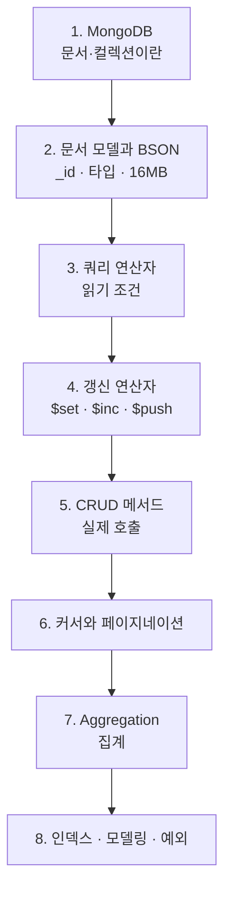

# MongoDB MOC

BigZAMi AI Agent의 **원장 저장소**. 대화·계획·mutation·trace·카탈로그 projection이 전부 여기 있다. 지금 가장 많이 만지는 DB이므로 문법과 메서드를 나눠서 정리한다.

## 읽는 순서

## 1) 기초

- [[MongoDB]] — 문서·컬렉션·스키마 없음
- [[MongoDB 문서 모델과 BSON]] — `_id`, ObjectId, 타입, 16MB 제한
- [[RDBMS vs Document DB]] — SQL과의 대조

## 1.5) 셸 문법 한 장

- [[MongoDB 셸 쿼리 문법]] — `db.컬렉션.메서드(필터, 옵션)` 전체 문법
- [[SQL ↔ MongoDB 문법 대조표]] — SQL을 아는 상태에서 가장 빠른 길

## 2) 읽기

- [[MongoDB 쿼리 연산자]] — `$eq` `$in` `$gte` `$regex` `$or`
- [[MongoDB 배열 쿼리]] — dot notation, `$elemMatch`, `$all`, `$size`
- [[projection]] — 필요한 필드만
- [[MongoDB 커서와 페이지네이션]] — `sort` · `limit` · `to_list` · async for

## 3) 쓰기

- [[MongoDB 갱신 연산자]] — `$set` `$inc` `$push` `$setOnInsert`
- [[upsert]] — 재실행 안전성

## 3.5) 메서드 낱개 (`Methods/`)

메서드 하나당 노트 하나. 지도는 [[MongoDB CRUD 메서드]].

**읽기** — [[MongoDB find()]] · [[MongoDB findOne()]] · [[MongoDB sort() limit() skip()]] · [[MongoDB countDocuments()]] · [[MongoDB distinct()]]
**쓰기** — [[MongoDB insertOne() insertMany()]] · [[MongoDB updateOne()]] · [[MongoDB updateMany()]] · [[MongoDB replaceOne()]] · [[MongoDB findOneAndUpdate()]] · [[MongoDB bulkWrite()]] · [[MongoDB deleteOne() deleteMany()]]
**결과 읽기** — [[MongoDB 쓰기 결과 객체]]

## 4) 집계

- [[MongoDB Aggregation Pipeline]] — stage를 이어 붙이기
- [[MongoDB 집계 연산자]] — `$group` 누산기, `$project` 표현식, `$lookup`

## 5) 인덱스와 모델링

- [[MongoDB 인덱스 실전]] — unique · TTL · partial · ESR 규칙
- [[MongoDB 데이터 모델링]] — 임베드 vs 참조
- [[Mongo 스키마 레지스트리]] — 계약을 코드가 소유

## 6) 운영

- [[motor]] — 비동기 드라이버
- [[MongoDB 예외 처리]] — DuplicateKey · ServerSelectionTimeout
- [[mongosh 실전]] — 셸에서 직접 확인하기
- [[AI Agent 컬렉션 지도]] — 우리 컬렉션 전체 목록

## 일반 인덱스 원리

B-tree·복합 인덱스 접두사 규칙 같은 **DB 공통 개념**은 `Database/Index/`가 소유한다.

- [[인덱스(Index)]] · [[B-tree]] · [[복합 인덱스]] · [[유니크 인덱스]] · [[풀 스캔(Full Scan)]] · [[explain과 실행 계획]]
