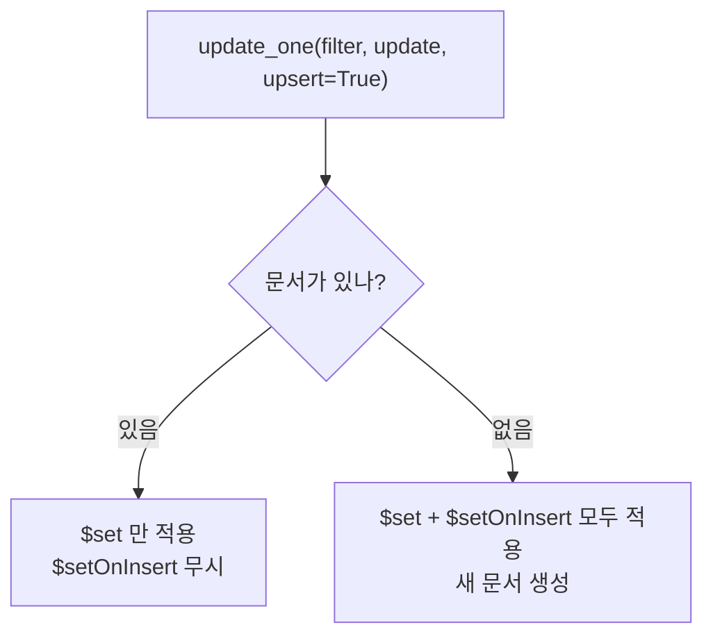

# MongoDB 갱신 연산자

- [[MongoDB 쿼리 연산자]]가 **찾는** 조건이라면, 갱신 연산자는 **바꾸는** 방법이다. 전부 `$`로 시작하고 `update_one`/`update_many`의 두 번째 인자에 들어간다.

```python
await db.workflow_conversations.update_one(
    {"session_id": sid},                       # 필터 (쿼리 연산자)
    {"$set": {"updated_at": now},              # 갱신 (갱신 연산자)
     "$inc": {"turn": 1}},
    upsert=True,
)
```

> 갱신 문서에 `$`가 하나도 없으면 **전체 교체**로 해석된다. `{"turn": 1}`을 그냥 넘기면 다른 필드가 전부 날아간다. 이게 가장 흔한 사고다.

## 필드 갱신

| 연산자 | 하는 일 | 예 |
|---|---|---|
| `$set` | 값 지정 (없으면 생성) | `{"$set": {"status": "synced"}}` |
| `$unset` | 필드 제거 | `{"$unset": {"legacy_field": ""}}` |
| `$inc` | 숫자 증감 (음수로 감소) | `{"$inc": {"turn": 1}}` |
| `$min` / `$max` | 더 작을/클 때만 갱신 | `{"$min": {"first_seen": now}}` |
| `$mul` | 곱하기 | `{"$mul": {"score": 0.9}}` |
| `$rename` | 필드 이름 변경 | `{"$rename": {"old": "new"}}` |
| `$currentDate` | 서버 시각으로 설정 | `{"$currentDate": {"updated_at": true}}` |

**`$inc`는 원자적이다.** 읽어서 +1 하고 쓰면 동시 요청에서 값이 유실되지만, `$inc`는 DB가 한 번에 처리한다.

## `$setOnInsert` — upsert의 짝

우리 코드에서 가장 많이 보이는 연산자다.

```python
await col.update_one(
    {"model_key": key},
    {
        "$set": {"updated_at": now},           # 있든 없든 항상 갱신
        "$setOnInsert": {                      # 처음 만들어질 때만
            "created_at": now,
            "value": value,
        },
    },
    upsert=True,
)
```



**"최초 생성 시각은 보존하고 갱신 시각만 바꾸기"** 가 이 조합이다. `$set`에 `created_at`을 넣으면 재실행 때마다 최초 시각이 덮여 [[upsert|멱등성]]이 깨진다.

같은 필드를 `$set`과 `$setOnInsert`에 동시에 쓰면 충돌 에러가 난다.

## 배열 갱신

| 연산자 | 하는 일 |
|---|---|
| `$push` | 배열 끝에 추가 (중복 허용) |
| `$addToSet` | 없을 때만 추가 (집합) |
| `$pull` | 조건에 맞는 요소 제거 |
| `$pop` | `1`=마지막, `-1`=첫 요소 제거 |
| `$each` | 여러 개를 한 번에 |

```python
await col.update_one(
    {"session_id": sid},
    {"$push": {"messages": {"$each": new_msgs, "$slice": -200}}},
)
```

`$slice: -200`이 중요하다. **최근 200개만 남기고 앞을 버린다.** 배열이 무한히 자라 [[MongoDB 문서 모델과 BSON|16MB]]를 넘는 걸 DB 차원에서 막는 방법이다.

```python
{"$addToSet": {"tags": "reviewed"}}      # 이미 있으면 아무 일 없음 (멱등)
{"$pull": {"blocks": {"$in": stale_ids}}}
```

## `update_one` vs `replace_one`

```python
update_one(filter, {"$set": {...}})   # 지정한 필드만 변경, 나머지 보존
replace_one(filter, doc)              # 문서 전체를 doc 으로 교체
```

| 상황 | 선택 |
|---|---|
| 시드처럼 **전체가 정본** | `replace_one` |
| 원장처럼 **일부만 갱신·누적** | `update_one` + `$set`/`$inc`/`$push` |

우리 시딩이 `replace_one`을 쓰는 이유가 여기 있다. 시드에서 사라진 필드는 DB에서도 사라져야 한다.

## 한 줄 정리

`$`가 없으면 전체 교체다. 갱신은 `$set`, 누적은 `$inc`/`$push`, **최초 1회만은 `$setOnInsert`** 가 기본 셋이다.

## 관련

- [[MongoDB 쿼리 연산자]]
- [[upsert]]
- [[MongoDB CRUD 메서드]]
- [[MongoDB 배열 쿼리]]
- [[MongoDB 문서 모델과 BSON]]
- [[Seed 배포와 멱등 동기화]]
- [[MongoDB MOC]]
