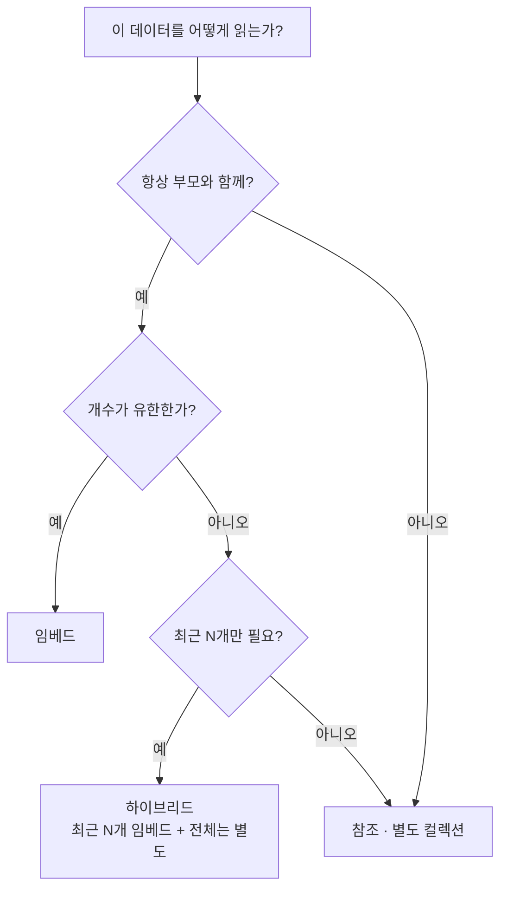

# MongoDB 데이터 모델링

- 관계형은 **정규화**가 기본이다. 중복을 없애고 [[JOIN]]으로 합친다.
- [[MongoDB]]는 반대다. **같이 읽는 것은 같이 저장한다.** 질의 모양이 스키마를 정한다.

## 임베드 vs 참조

```javascript
// 임베드 — 한 문서 안에
{ "session_id": "s-1",
  "messages": [ {...}, {...} ] }

// 참조 — 별도 컬렉션 + 키
{ "session_id": "s-1" }
{ "session_id": "s-1", "seq": 1, "content": "..." }   // messages 컬렉션
```

| 기준 | 임베드 | 참조 |
|---|---|---|
| 항상 같이 읽나 | **예 → 임베드** | 아니오 |
| 개수가 무한히 느나 | 아니오 | **예 → 참조** |
| 따로 갱신·조회하나 | 아니오 | **예 → 참조** |
| 다른 문서도 공유하나 | 아니오 | **예 → 참조** |
| 문서가 16MB에 근접하나 | — | **예 → 참조** |



## 우리 컬렉션이 내린 판단

| 컬렉션 | 선택 | 이유 |
|---|---|---|
| `workflow_conversations` | 메시지 **임베드** | 세션은 항상 통째로 읽는다. 대신 요약으로 접어 크기를 관리 |
| `blocks` / `option_keys` | **참조 분리** | 옵션 키를 블록과 독립적으로 조회·검증한다 |
| `agent_trace` | **완전 분리** + [[MongoDB 인덱스 실전\|TTL]] | 수명이 다르다. 워크플로우는 남고 trace는 30일 뒤 사라진다 |
| `analysis_plans` | 계획 스냅샷 **통째 저장** | 그 시점 판단의 증거다. 나중에 조립하면 재현이 안 된다 |

**수명이 다르면 컬렉션을 나눈다.** 이게 [[AI Agent 컬렉션 지도]]의 분리 원칙이다.

## 안티패턴 넷

**1) 무한히 자라는 배열**
16MB 상한에 걸리고, 그 전에 이미 느려진다. 갱신할 때마다 문서 전체를 다시 쓰기 때문이다. → `$push` + `$slice`로 상한을 두거나 별도 컬렉션.

**2) `$lookup` 남발**
[[MongoDB 집계 연산자|$lookup]]으로 매 조회마다 합치고 있다면, 그건 **임베드했어야 할 데이터**다. Mongo에서 조인을 반복하면 관계형보다 느리다.

**3) 배열 안에서 정확한 요소를 찾기 어려움**
[[MongoDB 배열 쿼리|$elemMatch]]와 positional 연산자로 겨우 되는 구조라면, 그 배열은 컬렉션이어야 한다.

**4) 필드 이름에 데이터 넣기**
```javascript
{ "2026-08-01": 12, "2026-08-02": 15 }   // 나쁨 — 인덱스를 못 건다
{ "stats": [ {"d": "2026-08-01", "n": 12} ] }   // 좋음
```

## 스키마가 없다 ≠ 설계가 없다

DB가 안 막아 주므로 **설계는 코드가 지킨다.**

- 필드·타입 계약 → [[Mongo 스키마 레지스트리]]
- 유일성 → [[유니크 인덱스]]
- 출처 태그(`_origin`) → 시드가 사람 손을 안 지우게 ([[Seed 배포와 멱등 동기화]])

## 한 줄 정리

**질의 모양이 스키마를 정한다.** 같이 읽으면 임베드, 따로 자라면 참조, 수명이 다르면 컬렉션을 나눈다.

## 관련

- [[MongoDB]]
- [[RDBMS vs Document DB]]
- [[MongoDB 문서 모델과 BSON]]
- [[MongoDB 배열 쿼리]]
- [[MongoDB 인덱스 실전]]
- [[AI Agent 컬렉션 지도]]
- [[MongoDB MOC]]
