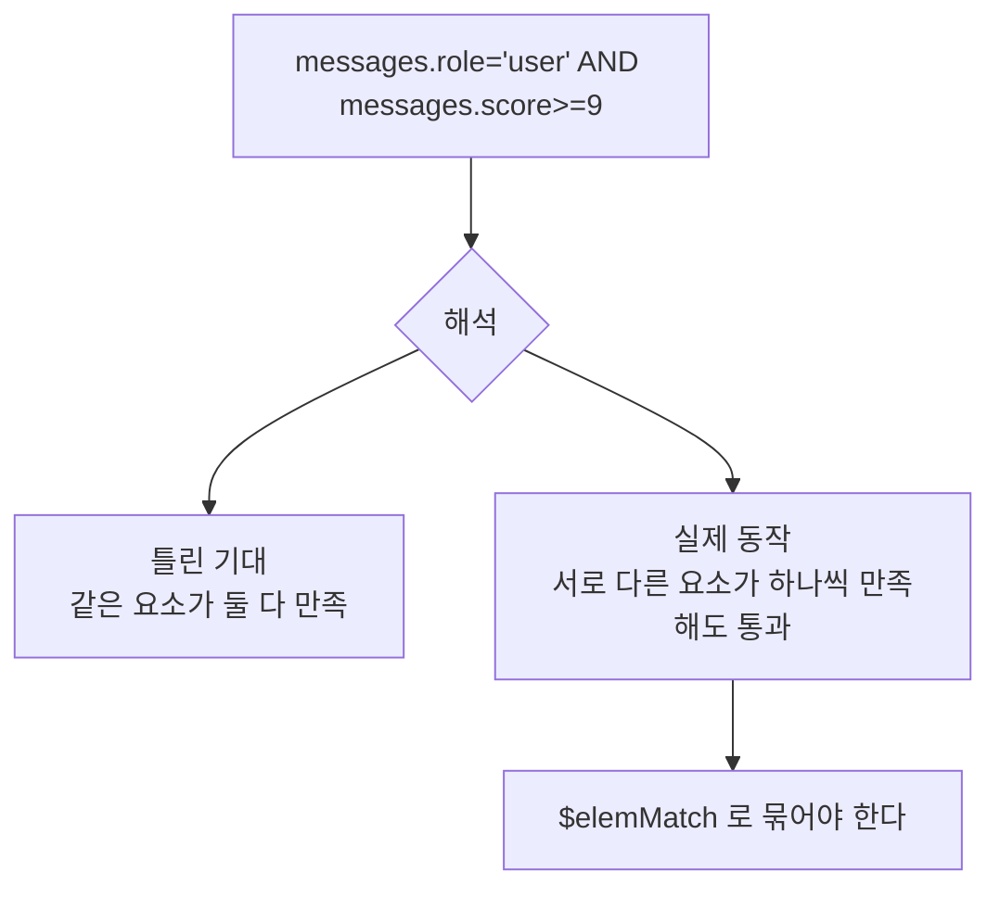

# MongoDB 배열 쿼리

- [[MongoDB]]의 가장 강력하고 **가장 헷갈리는** 부분. 배열과 중첩 문서를 [[JOIN]] 없이 다루는 문법이다.

## dot notation — 중첩 안으로 들어가기

```javascript
{ "session_id": "s-1",
  "summary": { "text": "...", "turns": 12 },
  "messages": [ {"role": "user", "score": 3}, {"role": "assistant", "score": 9} ] }
```

```javascript
db.conv.find({ "summary.turns": { $gte: 10 } })      // 중첩 문서
db.conv.find({ "messages.role": "user" })            // 배열 안 문서의 필드
db.conv.find({ "messages.0.role": "user" })          // 배열 첫 번째 요소
```

**핵심 규칙**: 배열에 dot notation을 쓰면 **요소 중 하나라도 맞으면** 문서가 걸린다. 조건이 자동으로 "any"가 된다.

## 배열의 함정 — 조건이 흩어진다

```javascript
db.conv.find({ "messages.role": "user", "messages.score": { $gte: 9 } })
```

이건 **"role이 user인 요소가 있고, score≥9인 요소가 있다"** 는 뜻이다. 둘이 **같은 요소일 필요가 없다.** 위 데이터는 `user`(score 3)와 `assistant`(score 9)로 조건이 갈라져도 매칭된다.



## `$elemMatch` — 한 요소가 전부 만족

```javascript
db.conv.find({
  messages: { $elemMatch: { role: "user", score: { $gte: 9 } } }
})
```

**조건 두 개 이상을 한 요소에 걸 때는 항상 `$elemMatch`.** 조건이 하나뿐이면 필요 없다.

## 그 밖의 배열 연산자

| 연산자 | 뜻 | 예 |
|---|---|---|
| `$all` | 나열한 값을 **전부 포함** | `{tags: {$all: ["model", "reviewed"]}}` |
| `$size` | 배열 길이가 정확히 N | `{blocks: {$size: 3}}` |
| `$in` | 배열 요소 중 하나라도 목록에 있음 | `{tags: {$in: ["model"]}}` |
| `$exists` | 필드 존재 | `{"summary.text": {$exists: true}}` |

`$size`는 **범위를 못 준다.** "3개 이상"은 안 된다. 그런 조회가 필요하면 **길이를 필드로 따로 저장**한다(`turn_count`). 이건 [[MongoDB 데이터 모델링|모델링]] 문제다.

## projection으로 배열 자르기

```javascript
db.conv.find({}, { messages: { $slice: -5 } })              // 마지막 5개만
db.conv.find({}, { messages: { $elemMatch: { role: "user" } } })  // 맞는 첫 요소만
```

대화 문서 전체를 받지 않고 **최근 몇 개만** 받는 방법이다. 문서가 클수록 효과가 크다 ([[projection]]).

## 배열 인덱스 — multikey

배열 필드에 [[인덱스(Index)|인덱스]]를 걸면 **multikey index**가 된다. 요소마다 인덱스 항목이 하나씩 생긴다.

- 요소 100개짜리 배열 → 인덱스 항목 100개. **쓰기 비용이 배열 길이에 비례**한다.
- 배열 필드 **두 개를 복합 인덱스로 묶을 수 없다.** 조합 폭발 때문에 MongoDB가 막는다.
- 그래서 배열은 짧게 유지하는 게 좋다 ([[MongoDB 갱신 연산자|$slice]]).

## 한 줄 정리

배열 조회는 기본이 "요소 중 하나라도"다. **조건이 둘 이상이면 반드시 `$elemMatch`**, 길이 범위 조회가 필요하면 개수를 필드로 뺀다.

## 관련

- [[MongoDB 쿼리 연산자]]
- [[MongoDB 갱신 연산자]]
- [[MongoDB 문서 모델과 BSON]]
- [[MongoDB 데이터 모델링]]
- [[projection]]
- [[MongoDB MOC]]
