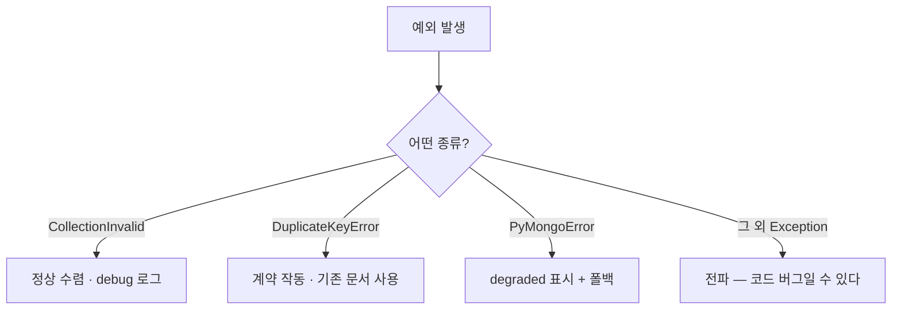

# MongoDB 예외 처리

- pymongo/[[motor]] 예외는 **전부 `PyMongoError`를 상속**한다. 그래서 넓게 잡을 수도, 좁게 잡을 수도 있다.
- 중요한 건 **어떤 예외가 정상 수렴이고 어떤 게 진짜 실패인지** 구분하는 것이다.

```text
PyMongoError
├─ ConnectionFailure
│  └─ ServerSelectionTimeoutError      서버를 못 찾음 (죽었거나 네트워크)
├─ OperationFailure
│  ├─ DuplicateKeyError                유니크 인덱스 위반
│  └─ WriteError / WriteConcernError
├─ CollectionInvalid                   이미 있는 컬렉션 생성
└─ InvalidOperation / ConfigurationError
```

## 1. `CollectionInvalid` — 정상 수렴

```python
if schema.name not in existing_collections:
    try:
        await db.create_collection(schema.name)
    except CollectionInvalid:
        # 여러 worker가 동시에 부팅하는 분산 경합이라 사전 검증으로 없앨 수 없다.
        # 먼저 만든 쪽이 있다는 사실은 정상 수렴이지만, 어떤 컬렉션이 그랬는지는
        # 남겨 부팅 순서를 추적할 수 있게 한다.
        logger.debug("컬렉션을 다른 worker가 먼저 생성함(정상 수렴): %s", schema.name)
```

**"확인하고 만들기"에는 항상 틈이 있다.** 워커 둘이 동시에 부팅하면 둘 다 "없다"를 보고 둘 다 만든다. 이건 버그가 아니라 분산 시스템의 성질이다. 예외를 잡아 **정상 수렴으로 처리**하되, 조용히 삼키지 않고 debug 로그를 남긴다.

## 2. `DuplicateKeyError` — 계약이 작동한 것

```python
try:
    await col.insert_one(doc)
except DuplicateKeyError:
    # 유니크 인덱스가 중복을 막았다 — 이미 있다는 뜻
    existing = await col.find_one({"seed_key": key})
```

[[유니크 인덱스]]가 있으면 경합에서 두 번째 쓰기가 여기로 온다. **실패가 아니라 규칙이 지켜진 것**이다. 대부분 [[upsert]]로 애초에 안 만나게 하는 게 낫다.

## 3. `ServerSelectionTimeoutError` — 진짜 장애

```python
_client = AsyncIOMotorClient(
    settings.mongodb_uri,
    serverSelectionTimeoutMS=5000,     # 기본 30초 → 5초
    connectTimeoutMS=5000,
)
```

> 짧은 timeout: MongoDB가 죽었을 때 기본 30s가 아니라 ~5s 안에 실패해야 호출부의 fail-soft가 빠르게 작동한다.

**타임아웃을 줄이는 것이 fail-soft 설계의 일부**다. 30초를 기다리면 그 위의 폴백이 의미를 잃는다 ([[Degraded와 fail-soft 저장소]]).

## 4. 넓게 잡아 폴백하기

```python
try:
    docs = await get_catalog_store().list_all_blocks()
    if docs:
        result = {d["block_id"]: d for d in docs if d.get("block_id")}
except PyMongoError as exc:
    logger.debug("CatalogReadRepository MongoDB fallback: %s", exc)

if not result:
    result = canonical_seed()      # 명시적 폴백
    source = "canonical_seed_fallback"
```

여기서는 예외 **종류를 구분하지 않는다.** 연결이 죽었든 쿼리가 실패했든 결론이 같기 때문이다 — seed로 간다. 대신 `Exception`이 아니라 **`PyMongoError`로 범위를 좁힌다.** 코드 버그(`KeyError`, `TypeError`)까지 삼키면 안 된다.



## 원칙 셋

1. **범위를 좁게.** `except Exception`은 코드 버그를 숨긴다. `PyMongoError`까지만.
2. **조용히 삼키지 않는다.** 폴백했으면 `degraded`를 로그와 상태에 남긴다.
3. **예외를 상태로 바꾼다.** 호출부가 판단하도록 `source="canonical_seed_fallback"` 같은 값으로 돌려준다 ([[Repository 패턴과 Port]]).

## 한 줄 정리

`CollectionInvalid`·`DuplicateKeyError`는 **정상 수렴**, `PyMongoError`는 **폴백 신호**, 그 밖의 예외는 전파한다.

## 관련

- [[motor]]
- [[유니크 인덱스]]
- [[upsert]]
- [[Degraded와 fail-soft 저장소]]
- [[Fail-soft]]
- [[Repository 패턴과 Port]]
- [[MongoDB MOC]]
