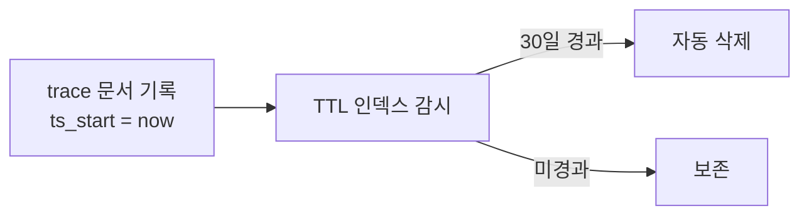

# MongoDB 인덱스 실전

[[인덱스(Index)]]·[[B-tree]]·[[복합 인덱스]]의 일반 원리는 `Database/Index/`가 소유한다. 여기는 **MongoDB에만 있는 옵션과 종류**다.

## 생성

```python
await db.blocks.create_index("block_id", unique=True, background=True)
await db.workflow_conversations.create_index(
    [("owner_scope", 1), ("workflow_id", 1), ("conversation_scope", 1)]
)
```

- 필드 하나면 문자열, 복합이면 `[(필드, 방향)]` 리스트.
- `create_index`는 **멱등**이다. 이미 있으면 아무 일도 안 한다 → 부팅 때마다 호출해도 안전 ([[Mongo 스키마 레지스트리]]).
- 같은 키에 **다른 옵션**으로 다시 만들면 에러다. 옵션을 바꾸려면 drop 후 재생성해야 한다.

## 인덱스 종류

| 종류 | 선언 | 쓰임 |
|---|---|---|
| 단일 | `create_index("workflow_id")` | 필드 하나 |
| 복합 | `[("a",1),("b",-1)]` | [[복합 인덱스]] — 접두사 규칙 |
| **유니크** | `unique=True` | [[유니크 인덱스]] — 중복 금지까지 |
| **TTL** | `expireAfterSeconds=N` | N초 뒤 문서 자동 삭제 |
| **부분** | `partialFilterExpression={...}` | 조건에 맞는 문서만 색인 |
| 희소 | `sparse=True` | 필드가 있는 문서만 색인 |
| multikey | (배열 필드에 자동) | [[MongoDB 배열 쿼리]] |
| 텍스트 | `[("name","text")]` | 단순 전문 검색 — 우리는 [[BM25]]를 쓴다 |

## TTL 인덱스 — 로그의 수명

```python
MongoIndexSpec("ts_start", {"expireAfterSeconds": 60 * 60 * 24 * 30})   # 30일
```

`agent_trace` 같은 **관측 원장**에 건다. 배경 프로세스가 주기적으로 만료 문서를 지운다.



- 대상 필드는 **날짜 타입**이어야 한다. 문자열이면 아무 일도 안 일어난다 ([[MongoDB 문서 모델과 BSON]]).
- 삭제는 **정확히 그 순간이 아니다.** 청소 작업이 약 60초 주기로 돈다.
- 보존 기간을 코드가 선언하니, "로그가 왜 없어졌지"의 답이 스키마 파일에 있다.

## 부분 인덱스 — 필요한 것만 색인

```python
await col.create_index(
    "session_id",
    unique=True,
    partialFilterExpression={"status": "active"},
)
```

- 인덱스 크기와 쓰기 비용이 줄어든다.
- **유니크 제약을 일부에만** 걸 수 있다. "활성 상태에서만 세션 ID 유일" 같은 규칙이 가능해진다.
- 단, 쿼리가 그 조건을 **포함해야** 인덱스를 탄다.

`sparse=True`는 "필드가 없는 문서는 색인 안 함"이다. 유니크 인덱스에서 `null` 문서들이 서로 충돌하는 문제를 피할 때 쓴다.

## ESR 규칙 — 복합 인덱스 필드 순서

MongoDB에서 통용되는 순서 지침이다.

```text
E quality  정확 일치 조건        먼저
S ort      정렬 필드            다음
R ange     범위 조건 ($gte 등)   마지막
```

```python
# 질의: owner_scope == X, created_at 내림차순, ts >= since
[("owner_scope", 1), ("created_at", -1), ("ts", 1)]
```

범위 조건을 만나는 순간 그 뒤 필드는 정렬이 깨져 못 쓴다. 그래서 범위를 맨 뒤로 민다.

## 정렬 방향도 의미가 있다

```python
[("a", 1), ("b", -1)]
```

이 인덱스는 `a↑ b↓` 정렬과 그 **완전 역순**(`a↓ b↑`)을 지원한다. `a↑ b↑`는 못 쓴다. 복합 정렬이 있으면 방향까지 맞춰야 한다.

## 확인

```javascript
db.blocks.getIndexes()
db.blocks.find({...}).explain("executionStats")     // [[explain과 실행 계획]]
db.blocks.dropIndex("block_id_1")
```

`db.collection.stats()`로 인덱스가 차지하는 크기도 볼 수 있다. **인덱스가 데이터보다 큰** 컬렉션은 설계를 다시 봐야 한다.

## 한 줄 정리

Mongo 고유는 **TTL(수명)·partial(부분)·multikey(배열)** 셋이고, 복합 인덱스 순서는 **ESR**을 따른다.

## 관련

- [[인덱스(Index)]]
- [[복합 인덱스]]
- [[유니크 인덱스]]
- [[explain과 실행 계획]]
- [[Mongo 스키마 레지스트리]]
- [[MongoDB 배열 쿼리]]
- [[MongoDB MOC]]
