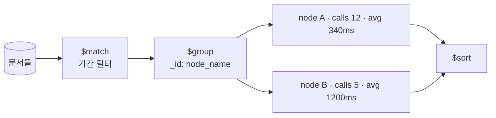

# MongoDB 집계 연산자

- [[MongoDB Aggregation Pipeline]]이 **stage의 나열**이라면, 이 노트는 그 stage 안에서 쓰는 **표현식과 누산기**다.
- 규칙 하나만 알면 된다: **`"$필드명"` 은 "그 필드의 값"** 이라는 뜻이다.

```javascript
{ $group: { _id: "$status", n: { $sum: 1 } } }
//              ↑ status 필드의 값으로 묶어라
```

## `$group` 누산기

```javascript
db.agent_trace.aggregate([
  { $match: { ts_start: { $gte: since } } },
  { $group: {
      _id: "$node_name",                    // 묶는 기준
      calls:    { $sum: 1 },                // 개수
      total_ms: { $sum: "$duration_ms" },    // 합계
      avg_ms:   { $avg: "$duration_ms" },    // 평균
      max_ms:   { $max: "$duration_ms" },
      first_ts: { $first: "$ts_start" },     // 정렬된 상태에서의 첫 값
      models:   { $addToSet: "$model" }      // 중복 없는 목록
  }},
  { $sort: { total_ms: -1 } }
])
```

| 누산기 | 뜻 |
|---|---|
| `$sum: 1` | 개수 세기 (SQL `COUNT(*)`) |
| `$sum: "$필드"` | 합계 |
| `$avg` `$min` `$max` | 평균·최소·최대 |
| `$push` | 값을 배열로 모두 모음 |
| `$addToSet` | 중복 없이 모음 |
| `$first` `$last` | 그룹의 첫/마지막 값 (**`$sort` 후에 의미가 생긴다**) |

`_id: null`이면 전체를 하나로 묶는다.



## `$project` — 필드를 계산해서 만들기

```javascript
{ $project: {
    _id: 0,
    block_id: 1,
    name: 1,
    keyword_count: { $size: { $ifNull: ["$keywords", []] } },
    is_model: { $eq: ["$category", "model"] },
    label: { $concat: ["$block_id", " · ", "$name"] }
}}
```

| 표현식 | 뜻 |
|---|---|
| `$ifNull: ["$a", 기본값]` | 필드가 없을 때 대체 — **스키마 없는 DB에서 필수** |
| `$size` | 배열 길이 |
| `$concat` `$toUpper` `$substr` | 문자열 |
| `$eq` `$gt` `$and` | 비교·논리 (결과가 boolean 값) |
| `$cond: [조건, 참값, 거짓값]` | 삼항 연산 |
| `$dateToString` | 날짜 포맷 |

`$addFields`는 기존 필드를 유지한 채 **더하기만** 한다. `$project`는 나열한 것만 남긴다.

## `$unwind` — 배열을 행으로 펼치기

```javascript
db.blocks.aggregate([
  { $unwind: "$keywords" },                       // 배열 요소마다 문서 하나
  { $group: { _id: "$keywords", n: { $sum: 1 } } },
  { $sort: { n: -1 } },
  { $limit: 20 }
])
```

블록 3개가 각각 키워드 5개면 → 15개 문서가 된다. **"가장 많이 쓰인 키워드"** 같은 집계가 이렇게 나온다.

빈 배열이면 문서가 사라진다. 남기려면 `{ $unwind: { path: "$keywords", preserveNullAndEmptyArrays: true } }`.

## `$lookup` — 다른 컬렉션 붙이기

```javascript
{ $lookup: {
    from: "option_keys",
    localField: "block_id",
    foreignField: "block_id",
    as: "options"          // 결과가 배열로 들어온다
}}
```

[[JOIN|LEFT JOIN]]에 해당하지만 **비싸다.** 대상 컬렉션의 조인 필드에 인덱스가 없으면 문서마다 [[풀 스캔(Full Scan)]]이다. 자주 같이 읽는 데이터라면 애초에 [[MongoDB 데이터 모델링|임베드]]하는 게 맞다.

## `$facet` — 한 번에 여러 집계

```javascript
{ $facet: {
    by_status: [ { $group: { _id: "$status", n: { $sum: 1 } } } ],
    recent:    [ { $sort: { created_at: -1 } }, { $limit: 5 } ],
    total:     [ { $count: "n" } ]
}}
```

대시보드처럼 **같은 데이터로 여러 통계를 낼 때** 왕복을 한 번으로 줄인다.

## 순서가 성능의 전부다

```javascript
[{ $match: ... }, { $project: ... }, { $group: ... }]   // 좋음
[{ $group: ... }, { $match: ... }]                       // 나쁨
```

- `$match`·`$sort`는 **맨 앞**에 있어야 [[인덱스(Index)|인덱스]]를 쓴다.
- `$group`·`$unwind`를 지나면 그건 인덱스가 없는 중간 결과다.
- `$project`로 **필요 없는 필드를 일찍 버리면** 뒤 stage가 다룰 데이터가 줄어든다.

## 한 줄 정리

`"$필드"`는 값 참조, `$group`은 묶어 누적, `$project`는 계산해 만들기. **`$match`를 맨 앞에 두는 것이 성능의 전부**다.

## 관련

- [[MongoDB Aggregation Pipeline]]
- [[MongoDB 쿼리 연산자]]
- [[MongoDB 배열 쿼리]]
- [[MongoDB 데이터 모델링]]
- [[인덱스(Index)]]
- [[SQL 실행 순서]]
- [[MongoDB MOC]]
