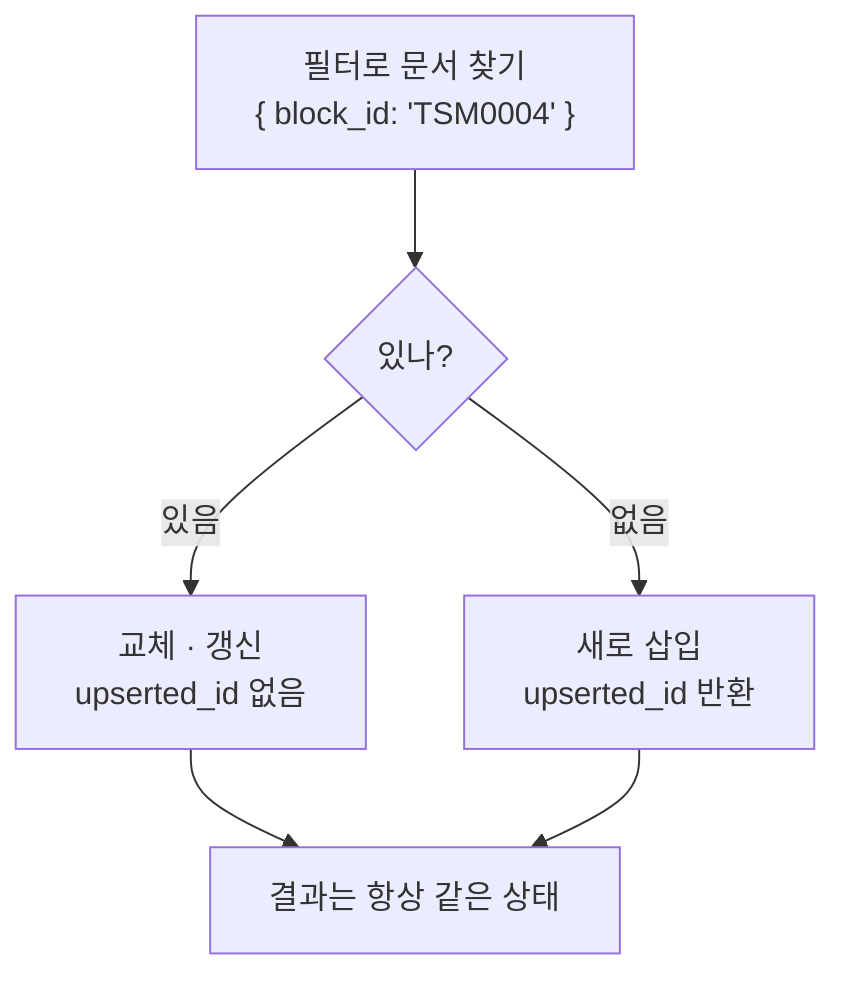

# upsert

- upsert = **update + insert**. 있으면 갱신, 없으면 삽입.
- 핵심 가치는 성능이 아니라 **멱등성(idempotent)** 이다. 같은 작업을 몇 번 돌려도 결과가 같다.

```javascript
db.blocks.replaceOne({ block_id: "TSM0004" }, doc, { upsert: true })
```



## 왜 시딩이 전부 upsert인가

시드를 두 번 돌려도, 배포 중간에 죽었다 다시 돌려도 같은 상태로 수렴해야 한다. `insert`면 두 번 돌릴 때 중복이 생기고, `update`면 첫 실행에서 아무것도 안 된다.

- 필터로 쓰는 키에는 [[유니크 인덱스]]가 있어야 한다. 없으면 경합 상황에서 중복 문서가 생긴다.
- 결과의 `upserted_id`가 있으면 새로 생긴 것, 없으면 기존 갱신이다. 이걸로 `{upserted: N, modified: M}` 집계를 남긴다.

## 벡터 쪽 대응

[[Qdrant]] 인덱스 재빌드도 같은 원리를 쓴다. 내용 해시로 만든 **결정적 point ID**로 upsert하면 재시도가 안전하다. 자세히는 [[Qdrant 인덱스 재빌드 전략]].

## 한 줄 정리

upsert는 **재실행해도 같은 결과가 되게 만드는 쓰기**이고, 그래서 시딩·재빌드의 기본기다.

## 관련

- [[MongoDB]]
- [[유니크 인덱스]]
- [[트랜잭션(ACID)]]
- [[Qdrant 인덱스 재빌드 전략]]
