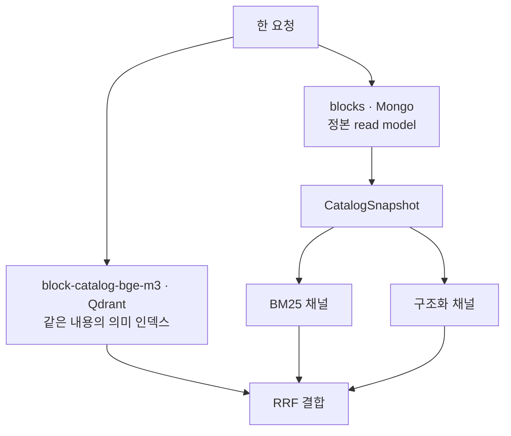

# AI Agent 컬렉션 지도

BigZAMi AI Agent가 실제로 쓰는 저장 단위 전체 목록. **어느 컬렉션이 무슨 질문에 답하는지**를 한 장으로 본다.

## MongoDB — 원장과 read model

### 워크플로우 lineage

| 컬렉션 | 담는 것 |
|---|---|
| `workflow_conversations` | 채팅 세션 상태, 메시지, 요약 |
| `workflow_context_snapshots` | 캔버스·데이터 맥락 스냅샷 |
| `workflow_mutations` | 캔버스 변경 제안과 ACK |
| `workflow_revisions` | 워크플로우 리비전 |
| `analysis_plans` | AnalysisPlan LLM 결과 |
| `analysis_directions` | 사용자가 고른 분석 방향 |

### 관측 (Observability)

| 컬렉션 | 담는 것 |
|---|---|
| `agent_trace` | 실행 trace ([[Observability]]) |
| `agent_trajectory` | 노드·툴 호출 원장 ([[Trajectory]]) |
| `agent_reflection_reviews` | [[Reflection]] 결과 |
| `agent_planning_judgment_reviews` | 계획 판단 감사 |
| `agent_capture_candidates` | 회귀 캡처 후보 |

### Catalog (블록 지식)

| 컬렉션 | 담는 것 |
|---|---|
| `blocks` | 블록 카탈로그 projection — **BM25·구조화 채널의 원본** |
| `option_keys` | 블록 옵션 키 (`composite_key` 유니크) |
| `catalog_change_proposals` | 카탈로그 변경 제안 |
| `catalog_seed_deployments` | 시드 배포 영수증 ([[Seed 배포와 멱등 동기화]]) |
| `agent_seed_versions` | 시드 버전 원장 |

### 운영 설정

| 컬렉션 | 담는 것 |
|---|---|
| `agent_config` | Agent 설정 |
| `agent_models` / `agent_llm_connections` / `agent_llm_policy` | 모델·연결·정책 ([[LLM Routing]]) |
| `agent_prompts` / `agent_prompt_active` / `agent_prompt_deployments` | 프롬프트 원장·활성본·배포 ([[System Prompt]]) |

LangGraph checkpoint 컬렉션은 [[LangGraph Checkpointer]]가 따로 소유한다.

## Qdrant — 의미 벡터

전부 [[BGE-M3]] 1024차원 · cosine이라 이름에 `-bge-m3`가 붙는다 ([[Qdrant Point와 Payload]]).

| 컬렉션 | 무엇을 의미 검색하나 |
|---|---|
| `block-catalog-bge-m3` | 블록 카탈로그 — 메인 검색 |
| `block-option-semantics-bge-m3` | 블록 옵션의 의미 규칙 |
| `block-r-physical-bge-m3` | 블록의 R 물리 계약 |
| `pipeline-history-bge-m3` | 과거 파이프라인 이력 |
| `error-patterns-bge-m3` | 오류 패턴 → 복구 근거 |
| `prompt-rules-bge-m3` | 프롬프트 규칙 |
| `intent-examples-bge-m3` | 의도 분류 예시 ([[Intent Classification]]) |
| `workflow-gold-examples-bge-m3` | 골드 예시 |
| `rag-bge-m3` | 일반 채팅 RAG |

인덱스 스키마 버전은 `CATALOG_RAG_INDEX_SCHEMA_VERSION = "v4"`로 따로 관리한다. 문서 조립 방식이 바뀌면 이 값을 올려 재빌드를 강제한다.

## 왜 이렇게 쪼개나

- **같은 지식을 두 저장소가 다른 형태로** 갖는다. Mongo는 정확 조회·필터용, Qdrant는 의미 유사도용.
- 도메인별로 Qdrant 컬렉션을 나누면 채팅 RAG와 카탈로그 RAG가 섞이지 않는다.
- 컬렉션 경계 = **bounded context 경계**다. 대화, 관측, 카탈로그, 설정을 한 컬렉션에 몰면 서로 다른 수명주기가 엉킨다.

## 한 줄 정리

Mongo는 **원장과 정확 조회**, Qdrant는 **같은 지식의 의미 인덱스**이고, 컬렉션 경계가 곧 도메인 경계다.

## 관련

- [[Mongo 스키마 레지스트리]]
- [[MongoDB]]
- [[Qdrant]]
- [[Qdrant Point와 Payload]]
- [[Hybrid RAG Search]]
- [[Seed 배포와 멱등 동기화]]
- [[데이터베이스 MOC]]
