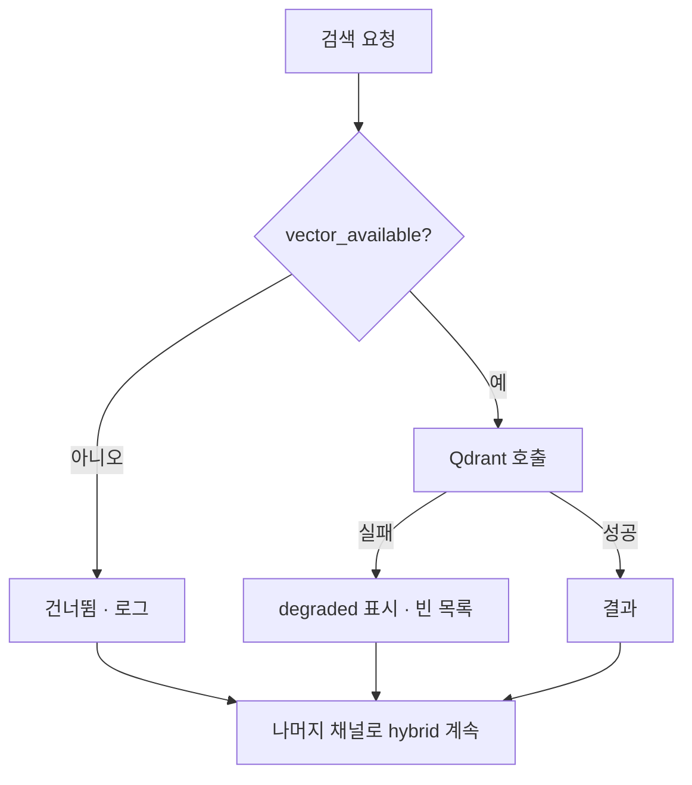

# Degraded와 fail-soft 저장소

- DB가 죽었을 때 **전체를 죽일 것인가, 품질을 낮춰 계속할 것인가**의 문제다. 검색은 후자가 맞다. 근거가 조금 부족해도 답을 주는 게 낫다.
- 이게 [[Fail-soft]]의 저장소 버전이다.

## 세 가지 실패와 대응

| 무엇이 죽나 | 대응 | 결과 |
|---|---|---|
| MongoDB | canonical seed로 [[Fallback|폴백]] | 카탈로그 정본으로 계속 검색 |
| Qdrant | 벡터 채널만 건너뜀 | BM25 + 구조화 채널로 계속 |
| 둘 다 | 완화 → core block set | 최소 후보라도 제공 |

```python
try:
    docs = await get_catalog_store().list_all_blocks()
    if docs:
        result = {d["block_id"]: d for d in docs if d.get("block_id")}
except PyMongoError as exc:
    logger.debug("CatalogReadRepository MongoDB fallback: %s", exc)

if not result:
    from ai_agent.workflow.data.catalog.block_data import BLOCK_CATALOG
    result = {...}
    source = "canonical_seed_fallback"
```

## 제일 중요한 규칙 — 조용히 숨기지 않는다

```text
vector               Qdrant 의미 검색
mongo_snapshot       Mongo projection 조회 또는 seed fallback
bm25_lexical         정확 어휘 검색
category_structured  category 규칙 검색
```

각 채널의 상태를 **정상 / 빈 결과 / degraded**로 나눠 남긴다. `mongo_snapshot=degraded`와 실제 결과 개수를 함께 기록한다.

> 폴백이 성공했다고 정상인 척하면, 운영에서 **몇 주 동안 seed로만 돌고 있었다**는 걸 아무도 모른다. **조용한 성공이 조용한 0건보다 위험하다.**

## 채널-로컬 저하 플래그

```python
def _vector_search_available(service) -> bool:
    return bool(getattr(service, "vector_available", True))

def retrieve_vector_block_ids(service, user_prompt, *, k, score_threshold):
    if not _vector_search_available(service):
        logger.info("[catalog_rag] Qdrant degraded 상태라 vector 검색을 건너뜁니다.")
        return []
    try:
        results = store.similarity_search_with_score(user_prompt, k=k)
    except Exception as search_error:
        _mark_vector_degraded(service, search_error)     # 이 채널만 저하로 표시
        return []
```

- 저하 상태는 **프로세스 로컬**이다. 죽은 Qdrant에 매 요청 붙어 타임아웃을 반복하지 않는다.
- 실패가 **채널 밖으로 안 나간다.** 벡터가 죽어도 hybrid 검색 전체는 계속 돈다.
- 짧은 timeout([[motor]] 5초)이 전제다. 30초를 기다리면 fail-soft가 의미를 잃는다.



## 한 줄 정리

fail-soft는 **품질을 낮춰 계속하되, 낮췄다는 사실을 반드시 남기는 것**이다.

## 관련

- [[Fail-soft]]
- [[Fallback]]
- [[Repository 패턴과 Port]]
- [[Snapshot 캐시와 무효화]]
- [[motor]]
- [[Observability]]
- [[Hybrid RAG Search]]
