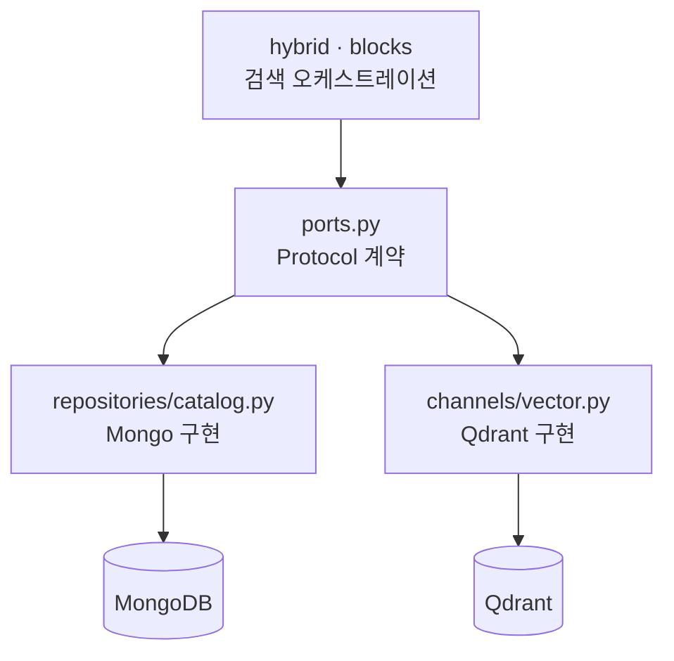

# Repository 패턴과 Port

- Repository는 **저장소 접근을 한 곳에 가두는 객체**다. 검색·계획 로직이 [[MongoDB]]나 [[Qdrant]] 클라이언트를 직접 import하지 않게 만든다.
- Port는 그 Repository가 만족해야 할 **최소 계약**이다. 파이썬에서는 [[Protocol]]로 쓴다.

## 계약 먼저

```python
CatalogSnapshotSource = Literal["mongodb", "canonical_seed_fallback"]

@dataclass(frozen=True)
class CatalogSnapshot:
    """한 번의 검색에서 BM25와 구조화 채널이 공유하는 동일 Catalog view."""
    blocks: dict[str, dict]
    source: CatalogSnapshotSource

class CatalogReadPort(Protocol):
    async def load_snapshot(self) -> CatalogSnapshot: ...

class VectorBlockSearchPort(Protocol):
    def retrieve_relevant_blocks(self, user_prompt: str, k: int) -> list[str]: ...
    def vector_health(self) -> dict[str, str]: ...
```

- `Protocol`은 **구조적 타이핑**이라 구현체가 상속할 필요가 없다. 메서드 모양만 맞으면 된다.
- 계약에 `pymongo`, `qdrant_client` 타입이 하나도 안 나온다. 이게 포인트다.

## 계층 대응



| 역할 | Spring으로 치면 |
|---|---|
| `blocks.py`, `hybrid.py` | Controller / Service |
| `ports.py` | Repository interface |
| `repositories/catalog.py` | Repository 구현 |
| `channels/vector.py` | 외부 API adapter |
| `fusion.py`, `channels/lexical.py` | 순수 domain 계산 |

## 규칙 두 개

**1) 의존 방향은 안쪽으로만.** 검색 로직 → port → 구현. 반대로 구현이 검색 로직을 import하면 순환이 생긴다.

**2) Repository는 선택하지 않는다.** 아래 코드가 그 예다. 출처가 Mongo든 seed fallback이든 **같은 자료형으로 돌려주고, 어디서 왔는지만 표시**한다. 판단은 호출자가 한다.

```python
if not result:
    from ai_agent.workflow.data.catalog.block_data import BLOCK_CATALOG
    result = {bid: {"block_id": bid, **e} for bid, e in BLOCK_CATALOG.items()}
    source = "canonical_seed_fallback"

return CatalogSnapshot(blocks=result, source=source)
```

## 무엇이 좋아지나

- 저장소를 바꿔도 검색 로직이 안 바뀐다.
- 테스트에서 가짜 Repository를 넣기 쉽다. DB 없이 [[BM25]]·[[Reciprocal Rank Fusion|RRF]] 로직을 검증할 수 있다.
- "Planner가 Mongo client를 직접 import했다"가 **구조 위반으로 명확히 판정**된다.

## 한 줄 정리

Port는 계약, Repository는 구현이다. **도메인 코드가 DB 라이브러리를 모르게 하는 것**이 목적이다.

## 관련

- [[Protocol]]
- [[Snapshot 캐시와 무효화]]
- [[Degraded와 fail-soft 저장소]]
- [[MongoDB]]
- [[Qdrant]]
- [[Registry Pattern]]
- [[dataclass]]
