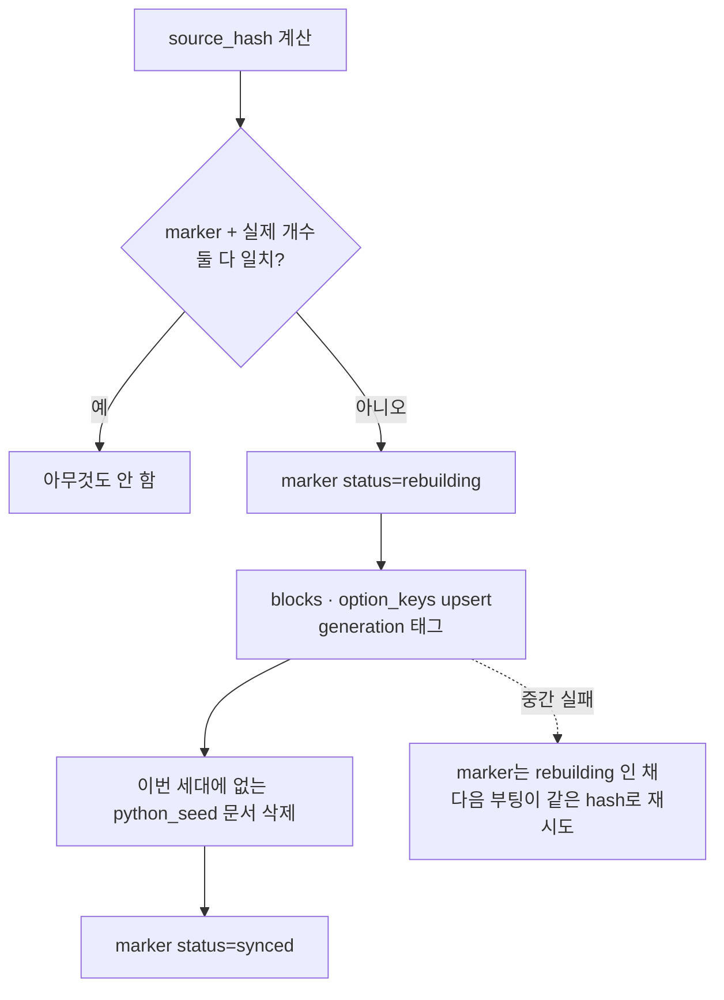

# Seed 배포와 멱등 동기화

- 시드(seed)는 **코드가 소유한 정본 데이터**를 DB에 밀어 넣는 것이다. 블록 카탈로그, 프롬프트 규칙, 의도 예시가 여기 해당한다.
- 서버가 뜰 때마다 실행되므로 **몇 번 돌려도 같은 결과**여야 한다. [[upsert]] 하나로는 부족하고, 절차 전체가 멱등해야 한다.

## 배포 영수증 (marker)

```python
marker_col = self._db[CATALOG_SEED_DEPLOYMENTS_COLLECTION]
await marker_col.create_index("seed_key", unique=True, background=True)
marker = await marker_col.find_one(
    {"seed_key": "workflow_catalog"},
    {"_id": 0, "source_hash": 1, "version": 1, "status": 1,
     "block_count": 1, "option_count": 1, "generation": 1},
)
```

`source_hash`는 시드 원본 전체의 해시다. **내용이 그대로면 아무 일도 안 한다.**

## 건너뛰기 조건 — 영수증만 믿지 않는다

```python
present_count = await self._db[CATALOG_BLOCKS_COLLECTION].count_documents(
    {"block_id": {"$in": seed_ids}, "_seed_source_hash": source_hash}
)

if (not force and marker
        and marker.get("status") == "synced"
        and marker.get("source_hash") == source_hash
        and marker.get("version") == version
        and int(marker.get("block_count") or 0) == len(seed_ids)
        and present_count == len(seed_ids)):
    return {"synced": False, "upserted": 0, "modified": 0, ...}
```

marker가 "완료"라고 적혀 있어도 **실제 문서 수를 세어 확인**한다. 누군가 컬렉션을 지웠거나 부분 실패했으면 marker와 현실이 다르다. **기록이 아니라 현실을 신뢰한다.**

## 진행 중 상태를 먼저 쓴다

```python
generation = uuid4().hex
await marker_col.replace_one(
    {"seed_key": "workflow_catalog"},
    {"seed_key": "workflow_catalog", "status": "rebuilding",
     "source_hash": source_hash, "generation": generation,
     "rebuild_started_at": started_at, ...},
    upsert=True,
)
result = await self.upsert_block_catalog(block_catalog, seed_source_hash=source_hash,
                                         seed_generation=generation)
```



**중간에 죽으면 marker가 `rebuilding`으로 남는다.** 다음 부팅이 건너뛰기 조건을 만족하지 못하므로 자동으로 다시 시도한다. 실패가 침묵하지 않는 구조다.

## stale 정리

```python
stale_filter = {CATALOG_ORIGIN_KEY: "python_seed", "block_id": {"$nin": seed_ids}}
```

시드에서 **빠진** 블록을 지운다. `_origin`이 `python_seed`인 것만 건드리므로, 운영자가 admin으로 추가했거나 자가 진화로 생긴 문서는 살아남는다. **출처 태그가 있어야 안전한 삭제가 가능하다.**

## 원칙 정리

| 원칙 | 이유 |
|---|---|
| 내용 해시로 변경 판단 | 버전 번호는 사람이 안 올릴 수 있다 |
| marker + 실제 개수 이중 확인 | 기록과 현실은 어긋난다 |
| 진행 중 상태를 먼저 기록 | 중간 실패가 다음 부팅에서 복구된다 |
| generation 태그 | 어느 세대 문서인지 구별해야 stale을 지운다 |
| 출처(`_origin`) 태그 | 시드가 사람 손을 지우면 안 된다 |

같은 원리의 벡터 버전이 [[Qdrant 인덱스 재빌드 전략]]이다.

## 한 줄 정리

시드 동기화는 **해시로 변경을 판단하고, 현실을 세어 확인하고, 세대 태그로 안전하게 지우는** 멱등 절차다.

## 관련

- [[upsert]]
- [[유니크 인덱스]]
- [[MongoDB CRUD 메서드]]
- [[Qdrant 인덱스 재빌드 전략]]
- [[AI Agent 컬렉션 지도]]
- [[Mongo 스키마 레지스트리]]
