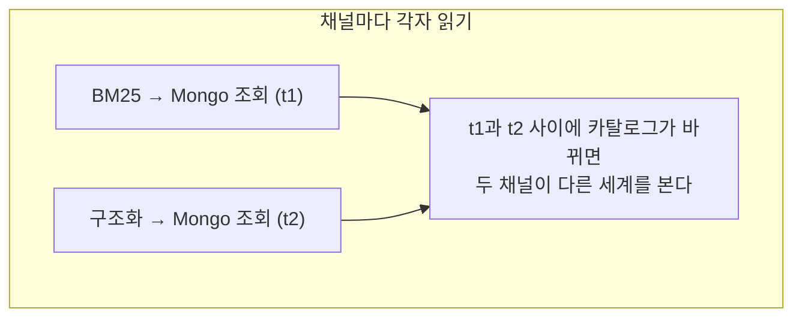
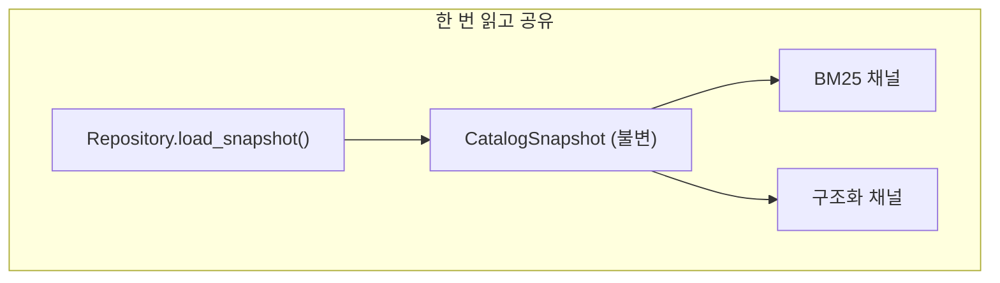

# Snapshot 캐시와 무효화

- 한 요청에서 **같은 데이터를 여러 채널이 필요로 할 때**, 각자 DB를 읽으면 두 문제가 생긴다. 느리고, **서로 다른 시점의 데이터를 본다.**
- 해법은 한 번 읽어 [[Repository 패턴과 Port|snapshot]]으로 고정하고 모두가 그걸 공유하는 것이다.

## 문제





## 구현

```python
class CatalogReadRepository:
    def __init__(self) -> None:
        self._snapshot_cache: CatalogSnapshot | None = None
        self._lock = Lock()

    async def load_snapshot(self) -> CatalogSnapshot:
        if self._snapshot_cache is not None:
            return self._snapshot_cache
        ...                                   # Mongo 조회 또는 seed fallback
        with self._lock:
            self._snapshot_cache = CatalogSnapshot(blocks=result, source=source)
        return self._snapshot_cache

    def invalidate_cache(self) -> None:
        """admin CRUD 후 호출 — 다음 read 가 MongoDB 재조회."""
```

- **TTL이 없다.** 시간으로 만료시키지 않고, 바꾼 사람이 무효화한다.
- `CatalogSnapshot`은 `frozen=True` [[dataclass]]라 공유해도 누가 몰래 못 바꾼다.
- [[threading.RLock|Lock]]은 캐시 채우기 경합만 막는다. 두 스레드가 동시에 채워도 값이 같으므로 치명적이지 않지만, 참조를 한 번에 바꾸려고 잠근다.

## 무효화 전략 셋

| 전략 | 언제 |
|---|---|
| **TTL** (n초 뒤 만료) | 최신성이 대충 맞으면 되는 데이터 |
| **명시적 무효화** (우리 방식) | 변경 지점이 명확할 때 — admin CRUD API |
| **identity 캐시** | 원본이 바뀌었는지 해시로 판별. BM25 인덱스가 이 방식이다 |

세 번째가 [[BM25]] 인덱스에 쓰인다. 스냅샷의 identity가 그대로면 인덱스를 재사용하고, 바뀌면 자동으로 다시 만든다. **"언제 다시 만들지"를 사람이 안 정해도 된다.**

## 주의

캐시는 프로세스 안에만 있다. 워커가 여러 개면 **각자 자기 캐시를 갖는다.** 그래서 admin이 카탈로그를 바꾸면 모든 워커에 무효화가 전파돼야 한다. 이게 안 되면 워커마다 다른 답을 준다.

## 한 줄 정리

한 요청에 한 번만 읽어 **모든 채널이 같은 세계를 보게** 하고, 무효화는 시간이 아니라 변경 시점이 정한다.

## 관련

- [[Repository 패턴과 Port]]
- [[Degraded와 fail-soft 저장소]]
- [[BM25]]
- [[dataclass]]
- [[threading.RLock]]
- [[Lazy Initialization]]
