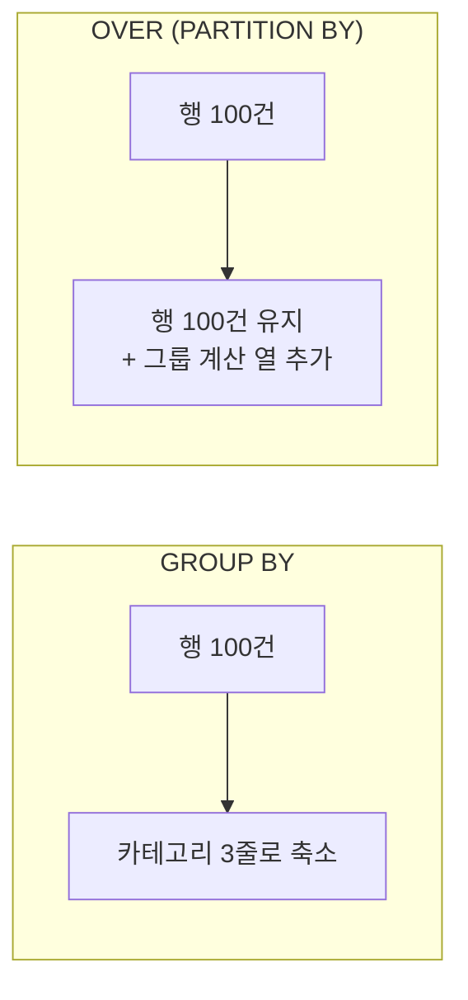

# CTE와 윈도우 함수

SQL을 "읽을 수 있게" 만들고, [[GROUP BY와 집계 함수|GROUP BY]]로는 못 하는 계산을 하게 해 주는 두 문법. MariaDB 10.2+ / MySQL 8+에서 쓸 수 있다.

## CTE — `WITH`로 이름 붙이기

```sql
WITH opt_cnt AS (
    SELECT block_id, COUNT(*) AS n
    FROM   option_keys
    GROUP BY block_id
),
big AS (
    SELECT * FROM opt_cnt WHERE n >= 3        -- 앞 CTE를 참조할 수 있다
)
SELECT b.block_id, b.name, big.n
FROM   blocks b
JOIN   big ON big.block_id = b.block_id
ORDER BY big.n DESC;
```

- **위에서 아래로 읽힌다.** 중첩 [[서브쿼리]]가 안쪽부터 읽히는 것과 반대다.
- 같은 CTE를 여러 번 참조할 수 있다.
- 실행 성능은 대체로 파생 테이블과 같다. **가독성이 주된 이득**이다.

## 재귀 CTE — 계층 따라가기

```sql
WITH RECURSIVE chain AS (
    SELECT block_id, depends_on, 1 AS depth       -- 시작점 (앵커)
    FROM   block_deps WHERE block_id = 'TSM0004'

    UNION ALL

    SELECT d.block_id, d.depends_on, c.depth + 1  -- 반복 부분
    FROM   block_deps d
    JOIN   chain c ON d.block_id = c.depends_on
    WHERE  c.depth < 10                            -- 안전장치: 순환 방지
)
SELECT * FROM chain;
```

블록 의존성처럼 **깊이를 모르는 관계**를 SQL만으로 따라간다. 종료 조건이 없으면 무한 반복이 되므로 `depth` 상한을 둔다.

## 윈도우 함수 — 줄이지 않고 계산하기

`GROUP BY`는 행을 **줄인다.** 윈도우 함수는 행을 **유지한 채** 그룹 계산을 옆에 붙인다.

```sql
SELECT
    block_id,
    category,
    score,
    RANK()       OVER (PARTITION BY category ORDER BY score DESC) AS rnk,
    AVG(score)   OVER (PARTITION BY category)                     AS cat_avg,
    score - AVG(score) OVER (PARTITION BY category)               AS diff
FROM blocks;
```



### `OVER` 절 구조

```sql
함수() OVER (
    PARTITION BY 그룹기준     -- 없으면 전체가 한 그룹
    ORDER BY 정렬기준          -- 순위·누적에 필요
    ROWS BETWEEN ... AND ...   -- 프레임 (이동 평균 등)
)
```

### 자주 쓰는 함수

| 함수 | 하는 일 |
|---|---|
| `ROW_NUMBER()` | 1,2,3… 동점도 다른 번호 |
| `RANK()` | 동점은 같은 등수, 다음이 건너뜀 (1,1,3) |
| `DENSE_RANK()` | 동점 같은 등수, 안 건너뜀 (1,1,2) |
| `LAG(열, 1)` / `LEAD(열, 1)` | 이전/다음 행의 값 |
| `SUM() OVER (ORDER BY ...)` | 누적 합계 |
| `NTILE(4)` | 4분위로 나누기 |

## 실전 패턴: 그룹별 상위 N

`GROUP BY`로는 못 하는 대표 문제다.

```sql
WITH ranked AS (
    SELECT block_id, category, score,
           ROW_NUMBER() OVER (PARTITION BY category ORDER BY score DESC) AS rn
    FROM blocks
)
SELECT * FROM ranked WHERE rn <= 3;      -- 카테고리별 상위 3개
```

윈도우 함수는 `WHERE`에서 쓸 수 없다. `SELECT` 이후에 계산되기 때문이다 ([[SQL 실행 순서]]). 그래서 **CTE로 감싸고 바깥에서 거른다.** 이 조합이 CTE + 윈도우의 가장 흔한 사용법이다.

## 실전 패턴: 이전 값과 비교

```sql
SELECT ts,
       calls,
       LAG(calls) OVER (ORDER BY ts)            AS prev_calls,
       calls - LAG(calls) OVER (ORDER BY ts)    AS delta
FROM daily_stats;
```

## 한 줄 정리

CTE는 **쿼리를 위에서 아래로 읽게** 만들고, 윈도우 함수는 **행을 줄이지 않고 그룹 계산을 붙인다.** 둘을 합치면 "그룹별 상위 N"이 풀린다.

## 관련

- [[서브쿼리]]
- [[GROUP BY와 집계 함수]]
- [[SQL 실행 순서]]
- [[SELECT 문법]]
- [[JOIN]]
- [[MongoDB 집계 연산자]]
