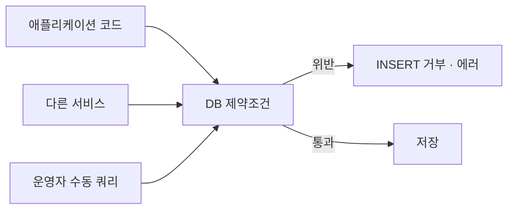

# DDL과 제약조건

- DDL(Data Definition Language)은 **구조를 만드는 문장**이다. `CREATE` / `ALTER` / `DROP`.
- 여기서 선언한 제약조건이 곧 **DB가 대신 지켜 주는 규칙**이다. [[MongoDB]]에 없는 것이 대부분 여기 있다.

## CREATE TABLE

```sql
CREATE TABLE blocks (
    id          BIGINT       NOT NULL AUTO_INCREMENT,
    block_id    VARCHAR(20)  NOT NULL,
    name        VARCHAR(200) NOT NULL,
    category    VARCHAR(50)  NOT NULL DEFAULT 'etc',
    score       DECIMAL(5,3) NULL,
    deprecated  TINYINT(1)   NOT NULL DEFAULT 0,
    created_at  DATETIME     NOT NULL DEFAULT CURRENT_TIMESTAMP,
    updated_at  DATETIME     NOT NULL DEFAULT CURRENT_TIMESTAMP
                             ON UPDATE CURRENT_TIMESTAMP,

    PRIMARY KEY (id),
    UNIQUE  KEY uk_block_id (block_id),
    KEY     idx_category_score (category, score),
    CONSTRAINT chk_score CHECK (score IS NULL OR (score >= 0 AND score <= 1))
) ENGINE=InnoDB DEFAULT CHARSET=utf8mb4 COLLATE=utf8mb4_unicode_ci;
```

## 제약조건 여섯

| 제약 | 뜻 | Mongo에서는 |
|---|---|---|
| `NOT NULL` | 값이 반드시 있어야 | 코드가 검사 ([[Mongo 스키마 레지스트리]]) |
| `DEFAULT` | 안 주면 이 값 | 코드가 채움 |
| `PRIMARY KEY` | 유일 + NOT NULL, 클러스터 키 | `_id` ([[MongoDB 문서 모델과 BSON]]) |
| `UNIQUE` | 중복 금지 (NULL은 여럿 허용) | [[유니크 인덱스]] |
| `FOREIGN KEY` | 다른 표의 값만 허용 | **없음** — 코드 책임 |
| `CHECK` | 값 범위·조건 | 코드 / JSON Schema validator |

**이게 관계형을 쓰는 큰 이유다.** 잘못된 데이터가 애초에 못 들어온다.



여러 경로에서 쓰기가 들어와도 **한 곳에서 규칙이 지켜진다.** Mongo는 이 방어선이 유니크 인덱스뿐이라 나머지를 코드가 진다.

## FOREIGN KEY

```sql
CONSTRAINT fk_opt_block FOREIGN KEY (block_id)
    REFERENCES blocks (block_id)
    ON DELETE CASCADE      -- 부모가 지워지면 자식도 삭제
    ON UPDATE RESTRICT     -- 참조 중이면 부모 변경 거부
```

| 옵션 | 부모 삭제 시 |
|---|---|
| `RESTRICT` / `NO ACTION` | 거부 (기본) |
| `CASCADE` | 자식도 함께 삭제 |
| `SET NULL` | 자식의 FK 열을 NULL로 |

`CASCADE`는 편하지만 위험하다. 부모 한 행 삭제가 수만 행 삭제로 번질 수 있다.

## ALTER TABLE

```sql
ALTER TABLE blocks ADD COLUMN owner VARCHAR(50) NULL AFTER name;
ALTER TABLE blocks MODIFY COLUMN name VARCHAR(300) NOT NULL;
ALTER TABLE blocks DROP COLUMN legacy_flag;
ALTER TABLE blocks ADD UNIQUE KEY uk_block_id (block_id);
ALTER TABLE blocks DROP INDEX idx_category_score;
ALTER TABLE blocks RENAME TO block_catalog;
```

> **운영 테이블에 `ALTER`는 위험하다.** 큰 테이블에서는 잠금·복제 지연이 발생한다. 온라인 DDL 지원 여부를 확인하고, 배포 창을 잡거나 도구(gh-ost, pt-online-schema-change)를 쓴다.
> 컬럼 추가는 **NULL 허용 + DEFAULT**로 시작하는 게 안전하다. `NOT NULL`을 바로 걸면 기존 행 때문에 실패한다.

## 인덱스 DDL

```sql
CREATE INDEX idx_created ON blocks (created_at);
CREATE UNIQUE INDEX uk_code ON blocks (code);
CREATE INDEX idx_cat_score ON blocks (category, score DESC);
DROP INDEX idx_created ON blocks;
SHOW INDEX FROM blocks;
```

필드 순서 원칙은 [[복합 인덱스]]와 같다. 확인은 [[MySQL EXPLAIN 읽기]].

## 타입 선택

| 종류 | 쓸 것 | 피할 것 |
|---|---|---|
| 문자열 | `VARCHAR(n)`, 긴 글은 `TEXT` | `CHAR` 남용 |
| 정수 | `INT`, 큰 값은 `BIGINT` | — |
| 실수 | 금액은 **`DECIMAL(p,s)`** | `FLOAT`/`DOUBLE`로 돈 계산 (오차) |
| 참·거짓 | `TINYINT(1)` | — |
| 시각 | `DATETIME` (또는 `TIMESTAMP`) | 문자열로 저장 |
| JSON | `JSON` 타입 | 필요하면 문서 DB를 쓴다 |

문자셋은 `utf8mb4`를 쓴다. MySQL의 옛 `utf8`은 3바이트라 **이모지가 안 들어간다.**

## 한 줄 정리

DDL은 **DB가 지켜 줄 규칙을 선언하는 것**이고, `NOT NULL`·`UNIQUE`·`FK`·`CHECK`가 관계형을 쓰는 값어치의 핵심이다.

## 관련

- [[SQL]]
- [[INSERT UPDATE DELETE]]
- [[NULL과 3값 논리]]
- [[유니크 인덱스]]
- [[복합 인덱스]]
- [[트랜잭션(ACID)]]
- [[RDBMS vs Document DB]]
- [[Mongo 스키마 레지스트리]]
