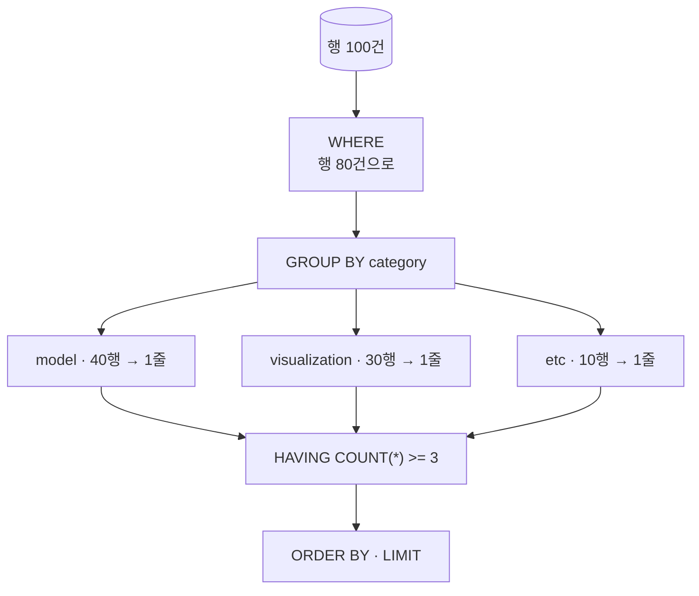

# GROUP BY와 집계 함수

- `GROUP BY`는 **행을 묶어 그룹당 한 줄로 줄인다.** [[MongoDB Aggregation Pipeline|Mongo의 `$group`]]과 같은 자리다.

```sql
SELECT   category, COUNT(*) AS n, AVG(score) AS avg_score
FROM     blocks
WHERE    deprecated = 0          -- 묶기 전 필터
GROUP BY category
HAVING   COUNT(*) >= 3           -- 묶은 뒤 필터
ORDER BY n DESC;
```



## 집계 함수

| 함수 | 뜻 | NULL |
|---|---|---|
| `COUNT(*)` | 행 개수 | 포함 |
| `COUNT(열)` | 그 열이 NULL 아닌 개수 | **제외** |
| `COUNT(DISTINCT 열)` | 중복 없는 개수 | 제외 |
| `SUM` `AVG` | 합·평균 | 제외 ([[NULL과 3값 논리]]) |
| `MIN` `MAX` | 최소·최대 | 제외 |
| `GROUP_CONCAT(열)` | 값을 문자열로 이어 붙임 (MySQL/MariaDB) | 제외 |

```sql
SELECT category, GROUP_CONCAT(block_id ORDER BY block_id SEPARATOR ', ') AS ids
FROM blocks GROUP BY category;
```

`GROUP_CONCAT`은 Mongo의 `$push`/`$addToSet`에 해당한다.

## WHERE vs HAVING — 실행 순서가 답이다

```sql
WHERE  deprecated = 0        -- 개별 행 조건, GROUP BY '전'
HAVING COUNT(*) >= 3         -- 그룹 조건, GROUP BY '후'
```

`WHERE`에 `COUNT(*)`를 쓰면 에러다. 그 시점에는 그룹이 아직 없다 ([[SQL 실행 순서]]).

**성능**: 가능한 조건은 전부 `WHERE`로 내린다. 먼저 걸러야 묶을 행이 줄고 [[인덱스(Index)|인덱스]]도 탄다. `HAVING`은 집계 결과로만 판단할 수 있는 조건에만 쓴다.

## 규칙: SELECT에는 그룹 기준이나 집계만

```sql
-- 틀림: name 은 그룹당 값이 하나가 아니다
SELECT category, name, COUNT(*) FROM blocks GROUP BY category;

-- 맞음
SELECT category, COUNT(*) FROM blocks GROUP BY category;
SELECT category, MAX(name), COUNT(*) FROM blocks GROUP BY category;
```

> MySQL/MariaDB는 `ONLY_FULL_GROUP_BY` 모드가 꺼져 있으면 이걸 **허용해 버린다.** 임의의 행 값이 나와 결과가 조용히 틀린다. 이 모드는 켜 두는 게 맞다.

## 조건부 집계 — 한 번의 스캔으로 여러 지표

```sql
SELECT
    category,
    COUNT(*)                                          AS total,
    SUM(CASE WHEN deprecated = 1 THEN 1 ELSE 0 END)   AS deprecated_cnt,
    AVG(CASE WHEN score > 0 THEN score END)           AS avg_positive
FROM blocks
GROUP BY category;
```

`ELSE`를 생략하면 NULL이 되고, `AVG`는 NULL을 무시하므로 **조건을 만족하는 것들의 평균**이 된다. 매우 자주 쓰는 관용구다.

## 여러 기준으로 묶기

```sql
GROUP BY category, deprecated               -- 조합마다 한 줄
GROUP BY category WITH ROLLUP               -- 소계·총계 행 추가 (MySQL/MariaDB)
GROUP BY DATE_FORMAT(created_at, '%Y-%m')   -- 월별 집계
```

## 한 줄 정리

`WHERE`는 묶기 전, `HAVING`은 묶은 뒤. `COUNT(*)`와 `COUNT(열)`은 **NULL 때문에 다르고**, 조건부 집계가 주력 관용구다.

## 관련

- [[SQL 실행 순서]]
- [[SELECT 문법]]
- [[NULL과 3값 논리]]
- [[서브쿼리]]
- [[CTE와 윈도우 함수]]
- [[MongoDB 집계 연산자]]
- [[SQL ↔ MongoDB 문법 대조표]]
