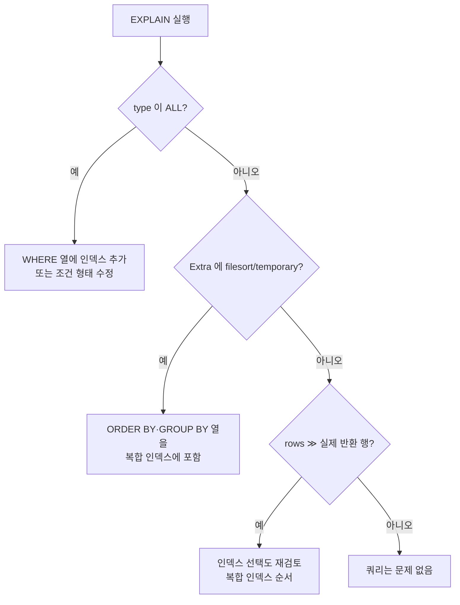

# MySQL EXPLAIN 읽기

- [[explain과 실행 계획]]의 MySQL/MariaDB 판. 쿼리 앞에 `EXPLAIN`만 붙이면 된다.

```sql
EXPLAIN SELECT block_id, name FROM blocks WHERE category = 'model' ORDER BY score DESC;
EXPLAIN ANALYZE SELECT ...;    -- 실제로 실행하고 걸린 시간까지 (MariaDB 10.1+/MySQL 8.0.18+)
EXPLAIN FORMAT=JSON SELECT ...;
```

## 출력 열 중 실제로 보는 것

| 열 | 뜻 |
|---|---|
| `type` | **접근 방식.** 가장 중요 |
| `key` | 실제로 쓴 인덱스. `NULL`이면 안 썼다는 뜻 |
| `possible_keys` | 쓸 수 있었던 인덱스 후보 |
| `rows` | 읽을 것으로 **추정**한 행 수 |
| `filtered` | 그중 조건을 통과할 비율(%) |
| `Extra` | 부가 정보. 여기 경고가 뜬다 |

## `type` — 좋은 순서

```text
system > const > eq_ref > ref > range > index > ALL
좋음 ←──────────────────────────────────────→ 나쁨
```

| type | 뜻 |
|---|---|
| `const` | PK/유니크로 딱 1행 |
| `eq_ref` | 조인에서 상대 행이 1건씩 |
| `ref` | 인덱스로 여러 행 (일반적인 좋은 상태) |
| `range` | 인덱스 범위 스캔 (`BETWEEN`, `>`, `IN`) |
| `index` | **인덱스 전체**를 훑음 — 풀 스캔보다 조금 나은 정도 |
| `ALL` | **[[풀 스캔(Full Scan)]]** — 경보 |

`type=ALL` + `rows`가 크면 인덱스를 추가하거나 조건을 바꿔야 한다.

## `Extra`에서 봐야 할 문구

| 문구 | 뜻 | 판정 |
|---|---|---|
| `Using index` | **커버링 인덱스** — 테이블을 안 읽음 | 최상 |
| `Using where` | 읽은 뒤 조건으로 걸러냄 | 보통 |
| `Using index condition` | 인덱스 단계에서 조건 적용(ICP) | 좋음 |
| `Using filesort` | 별도 정렬 수행 | 정렬용 인덱스 검토 |
| `Using temporary` | 임시 테이블 생성 | `GROUP BY`/`DISTINCT` 비용 |

`Using filesort` + `Using temporary`가 같이 뜨면 대개 `GROUP BY`와 `ORDER BY` 조합이 인덱스를 못 타는 상태다.



## 인덱스를 못 쓰게 만드는 대표 패턴

```sql
WHERE YEAR(created_at) = 2026        -- 열에 함수 → 인덱스 무효
WHERE name LIKE '%회귀%'              -- 앞이 와일드카드
WHERE user_id = '42'                  -- 숫자 열에 문자열 (암묵 형변환)
ORDER BY a ASC, b DESC                -- 인덱스가 (a,b) 같은 방향일 때
```

전부 [[WHERE와 조건식]]에서 다룬 원칙의 결과다 — **열은 그대로 두고 값 쪽을 바꾼다.**

## 통계와 추정

`rows`는 **추정치**다. 통계가 낡으면 옵티마이저가 엉뚱한 인덱스를 고른다.

```sql
ANALYZE TABLE blocks;                    -- 통계 갱신
SELECT * FROM blocks USE INDEX (idx_cat) WHERE ...;    -- 힌트 (최후 수단)
SHOW INDEX FROM blocks;                  -- 카디널리티 확인
```

힌트는 마지막 수단이다. 데이터 분포가 바뀌면 힌트가 오히려 족쇄가 된다.

## 한 줄 정리

`type`이 `ALL`인지, `Extra`에 `filesort`/`temporary`가 있는지, `rows`가 실제 결과보다 훨씬 큰지 — **이 셋만 봐도 대부분 진단된다.**

## 관련

- [[explain과 실행 계획]]
- [[인덱스(Index)]]
- [[복합 인덱스]]
- [[풀 스캔(Full Scan)]]
- [[WHERE와 조건식]]
- [[DDL과 제약조건]]
- [[B-tree]]
