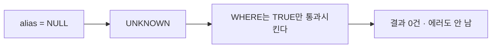

# NULL과 3값 논리

- SQL의 `NULL`은 "0"도 "빈 문자열"도 아니다. **"값이 없다 / 모른다"** 는 상태다.
- 그래서 SQL의 논리는 참·거짓이 아니라 **참 / 거짓 / UNKNOWN 세 가지**다.

## 왜 `= NULL`이 안 되나

```sql
WHERE alias = NULL     -- UNKNOWN → 행이 하나도 안 남는다
WHERE alias IS NULL    -- 올바름
```

"모르는 값이 모르는 값과 같은가?" → **모른다.** UNKNOWN은 참이 아니므로 `WHERE`가 그 행을 버린다.



**에러가 안 나는 게 가장 위험하다.** 조용히 빈 결과가 나온다.

## 진리표

| A | B | `A AND B` | `A OR B` |
|---|---|---|---|
| TRUE | UNKNOWN | UNKNOWN | **TRUE** |
| FALSE | UNKNOWN | **FALSE** | UNKNOWN |
| UNKNOWN | UNKNOWN | UNKNOWN | UNKNOWN |

`NOT UNKNOWN` = UNKNOWN. 부정해도 참이 되지 않는다.

## 연산에서의 NULL

```sql
SELECT 1 + NULL;             -- NULL (전염된다)
SELECT CONCAT('a', NULL);    -- MySQL/MariaDB: NULL
SELECT NULL = NULL;          -- NULL (UNKNOWN)
SELECT NULL <=> NULL;        -- 1 (MySQL 전용 NULL-safe 비교)
```

**계산에 NULL이 하나라도 끼면 결과가 NULL이다.** 합계에 NULL 컬럼이 섞이면 전부 NULL이 되는 사고가 여기서 나온다.

## 집계 함수는 NULL을 무시한다

```sql
-- score: [10, 20, NULL]
SELECT COUNT(*),      -- 3   ← 행 개수
       COUNT(score),  -- 2   ← NULL 아닌 값의 개수
       SUM(score),    -- 30
       AVG(score);    -- 15  ← 30/2 이지 30/3 이 아니다
```

`AVG`의 분모가 달라진다. **"평균이 이상한데?"의 8할이 NULL 때문**이다. 0으로 세고 싶으면 명시적으로 바꾼다.

```sql
SELECT AVG(COALESCE(score, 0)) FROM blocks;   -- 10
```

## NULL 처리 함수

```sql
COALESCE(alias, name, '이름없음')   -- 앞에서부터 NULL 아닌 첫 값 (표준)
IFNULL(alias, name)                 -- 인자 2개 버전 (MySQL/MariaDB)
NULLIF(a, b)                        -- a = b 면 NULL, 아니면 a
```

`NULLIF`는 0으로 나누기를 막는 데 쓴다.

```sql
SELECT total / NULLIF(cnt, 0) FROM stats;   -- cnt가 0이면 에러 대신 NULL
```

## 정렬과 그룹에서

```sql
ORDER BY score;         -- MySQL/MariaDB: NULL이 맨 앞 (가장 작게 취급)
ORDER BY score DESC;    -- NULL이 맨 뒤
GROUP BY category;      -- NULL도 하나의 그룹으로 묶인다
SELECT DISTINCT alias;  -- NULL도 하나의 값으로 취급
```

정렬에서만 "가장 작은 값"처럼 굴고, 비교에서는 UNKNOWN이다. **일관성이 없어 보이는 게 맞다.** 규칙으로 외우는 편이 빠르다.

## 제약조건과 유니크

```sql
CREATE TABLE t (
  code VARCHAR(50) UNIQUE     -- NULL은 여러 개 들어갈 수 있다
);
```

표준 SQL에서 **NULL끼리는 중복으로 보지 않는다.** "값이 없는 행"은 여러 개여도 유니크 위반이 아니다. 반대로 [[MongoDB]]의 유니크 인덱스는 `null`을 하나의 값으로 취급해 충돌한다 — 그래서 `sparse`/`partial` 옵션이 필요하다 ([[MongoDB 인덱스 실전]]).

## 설계 지침

- **NOT NULL을 기본으로 둔다.** 정말 "모를 수 있는" 열에만 NULL을 허용한다 ([[DDL과 제약조건]]).
- "없음"을 뜻하는 값이 이미 있으면(빈 문자열, 0) 어느 쪽을 쓸지 **팀에서 하나로 정한다.** 섞이면 조회 조건이 두 배가 된다.

## 한 줄 정리

`NULL`은 "모른다"이고, 비교하면 UNKNOWN, 계산하면 전염, 집계에서는 무시된다. **`IS NULL`과 `COALESCE`가 방어 도구**다.

## 관련

- [[WHERE와 조건식]]
- [[GROUP BY와 집계 함수]]
- [[DDL과 제약조건]]
- [[SELECT 문법]]
- [[유니크 인덱스]]
- [[MongoDB 쿼리 연산자]]
