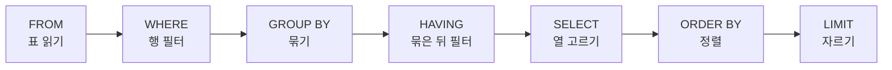

# SQL 실행 순서

- [[SQL]]은 **쓰는 순서와 실행되는 순서가 다르다.**
- 초보가 겪는 에러 대부분이 이 순서 때문이다.

## 순서

```text
FROM → WHERE → GROUP BY → HAVING → SELECT → ORDER BY → LIMIT
```



## 여기서 나오는 규칙들

| 헷갈리는 것 | 이유 |
|---|---|
| `WHERE`에 `COUNT(*)`를 못 쓴다 | `WHERE`가 `GROUP BY`보다 **먼저** 실행된다. 아직 집계가 없다 |
| 그럴 땐 `HAVING`을 쓴다 | `HAVING`은 `GROUP BY` **뒤** |
| `SELECT`의 별칭(alias)을 `WHERE`에서 못 쓴다 | `SELECT`가 더 나중이라 그 이름이 아직 없다 |
| 별칭을 `ORDER BY`에서는 쓸 수 있다 | `ORDER BY`가 `SELECT`보다 뒤라서 |

## 한 줄 정리

`FROM → WHERE → GROUP BY → HAVING → SELECT → ORDER BY → LIMIT`. **필터가 집계보다 먼저, SELECT는 거의 마지막**이다.

## 관련

- [[SQL]]
- [[MongoDB Aggregation Pipeline]]
- [[인덱스(Index)]]
