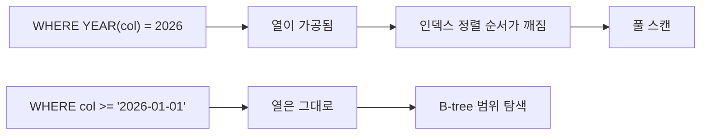

# WHERE와 조건식

`WHERE`는 **행 하나하나에 대해 참/거짓을 판정**해 남길지 정한다. [[MongoDB 쿼리 연산자]]의 필터 JSON과 같은 자리다.

## 비교 연산자

```sql
WHERE category = 'model'
WHERE score >= 0.8
WHERE created_at <  '2026-08-01'
WHERE name <> 'test'          -- != 도 되지만 표준은 <>
```

## 범위 · 목록 · 패턴

```sql
WHERE score BETWEEN 0.5 AND 0.8          -- 양끝 포함 (>= AND <=)
WHERE category IN ('model', 'evaluate')  -- 목록 중 하나
WHERE category NOT IN ('deprecated')

WHERE name LIKE 'TSM%'      -- 앞이 고정 → 인덱스 사용 가능
WHERE name LIKE '%회귀%'     -- 앞이 와일드카드 → 인덱스 못 씀 (풀 스캔)
WHERE name LIKE 'TSM_004'   -- _ 는 한 글자
```

| 패턴 | 인덱스 |
|---|---|
| `'TSM%'` | **사용** — [[B-tree]]에서 접두사는 붙어 있다 |
| `'%TSM'` / `'%TSM%'` | 못 씀 → [[풀 스캔(Full Scan)]] |

`%검색어%`가 필요하면 그건 SQL이 아니라 전문 검색의 일이다 ([[BM25]]).

## 논리 결합과 우선순위

```sql
WHERE category = 'model' AND score >= 0.8
WHERE category = 'model' OR  category = 'evaluate'
WHERE NOT deprecated
```

`AND`가 `OR`보다 **먼저** 묶인다. 섞을 때는 괄호를 반드시 친다.

```sql
-- 의도와 다름: (a AND b) OR c
WHERE category = 'model' AND score >= 0.8 OR category = 'evaluate'

-- 의도대로
WHERE (category = 'model' OR category = 'evaluate') AND score >= 0.8
```

## NULL은 `=`로 비교할 수 없다

```sql
WHERE alias IS NULL
WHERE alias IS NOT NULL
WHERE alias = NULL      -- 항상 거짓. 결과가 늘 0건이다
```

이유는 [[NULL과 3값 논리]]에서 다룬다. **SQL 초보가 가장 많이 틀리는 지점**이다.

## EXISTS와 IN

```sql
SELECT * FROM blocks b
WHERE EXISTS (SELECT 1 FROM option_keys o WHERE o.block_id = b.block_id);

SELECT * FROM blocks
WHERE block_id IN (SELECT block_id FROM option_keys);
```

- `EXISTS`는 **하나만 찾으면 즉시 멈춘다.** 보통 더 빠르다.
- `NOT IN`은 서브쿼리 결과에 `NULL`이 하나라도 있으면 **전체가 0건**이 된다. `NOT EXISTS`가 안전하다.

## 인덱스를 못 쓰게 만드는 조건

```sql
WHERE YEAR(created_at) = 2026            -- 나쁨: 열에 함수를 씌우면 인덱스 무효
WHERE created_at >= '2026-01-01'
  AND created_at <  '2027-01-01'         -- 좋음: 범위로 바꾼다

WHERE CAST(user_id AS CHAR) = '42'       -- 나쁨: 암묵적 형변환도 같은 문제
WHERE user_id = 42                        -- 좋음
```

**열은 왼쪽에 그대로 두고, 가공은 오른쪽 값에서 한다.** 이게 인덱스를 살리는 원칙이다 ([[인덱스(Index)]]).



## 한 줄 정리

`WHERE`는 행 필터이고, **NULL은 `IS NULL`로**, **열에는 함수를 씌우지 않는다**가 두 개의 철칙이다.

## 관련

- [[SELECT 문법]]
- [[NULL과 3값 논리]]
- [[서브쿼리]]
- [[인덱스(Index)]]
- [[B-tree]]
- [[MySQL EXPLAIN 읽기]]
- [[MongoDB 쿼리 연산자]]
