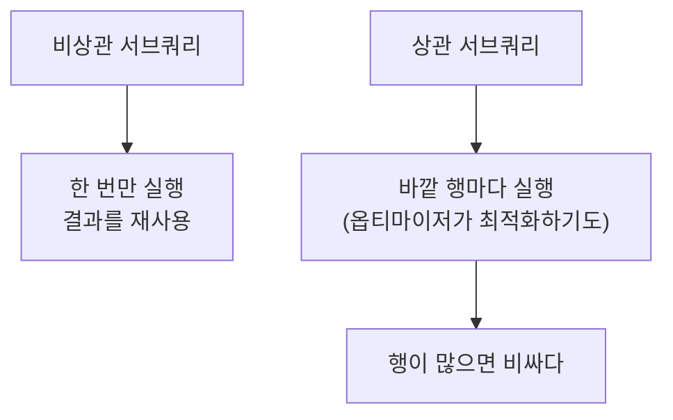

# 서브쿼리

- 서브쿼리는 **쿼리 안에 든 쿼리**다. 괄호로 감싸고, 쓰이는 자리에 따라 이름과 성질이 다르다.

## 놓이는 자리 넷

```sql
-- 1) WHERE 안 — 가장 흔함
SELECT * FROM blocks
WHERE block_id IN (SELECT block_id FROM option_keys WHERE required = 1);

-- 2) SELECT 안 (스칼라) — 값 하나만 반환해야 한다
SELECT b.block_id,
       (SELECT COUNT(*) FROM option_keys o WHERE o.block_id = b.block_id) AS opt_cnt
FROM blocks b;

-- 3) FROM 안 (파생 테이블) — 반드시 별칭이 필요하다
SELECT t.category, t.n
FROM (SELECT category, COUNT(*) AS n FROM blocks GROUP BY category) AS t
WHERE t.n >= 3;

-- 4) JOIN 대상
SELECT b.*, s.n
FROM blocks b
JOIN (SELECT block_id, COUNT(*) AS n FROM option_keys GROUP BY block_id) s
  ON s.block_id = b.block_id;
```

## 상관 서브쿼리 (correlated)

바깥 쿼리의 열을 **참조하는** 서브쿼리다.

```sql
SELECT b.block_id
FROM blocks b
WHERE EXISTS (
    SELECT 1 FROM option_keys o
    WHERE o.block_id = b.block_id      -- ← 바깥 b 를 참조
);
```



**상관 서브쿼리는 바깥 행마다 도는 게 기본**이다. 행이 많으면 [[JOIN]]이나 [[CTE와 윈도우 함수|윈도우 함수]]로 바꾸는 걸 먼저 검토한다.

## IN vs EXISTS vs JOIN

| 방식 | 언제 |
|---|---|
| `IN (서브쿼리)` | 목록이 작고 중복이 없을 때. 읽기 쉽다 |
| `EXISTS` | **있는지만** 확인하면 될 때. 첫 건에서 멈춘다 |
| `JOIN` | 상대 테이블의 **값도 필요할 때** |

```sql
-- 존재 확인만 → EXISTS
SELECT * FROM blocks b WHERE EXISTS (SELECT 1 FROM option_keys o WHERE o.block_id = b.block_id);

-- 개수도 필요 → JOIN
SELECT b.block_id, COUNT(o.id) AS n
FROM blocks b LEFT JOIN option_keys o ON o.block_id = b.block_id
GROUP BY b.block_id;
```

## `NOT IN`의 NULL 함정

```sql
SELECT * FROM blocks
WHERE block_id NOT IN (SELECT block_id FROM option_keys);   -- 위험
```

서브쿼리 결과에 `NULL`이 **하나라도** 있으면 전체가 UNKNOWN이 되어 **0건**이 나온다 ([[NULL과 3값 논리]]). 안전한 형태는 둘이다.

```sql
WHERE NOT EXISTS (SELECT 1 FROM option_keys o WHERE o.block_id = b.block_id)
-- 또는
WHERE block_id NOT IN (SELECT block_id FROM option_keys WHERE block_id IS NOT NULL)
```

## 스칼라 서브쿼리는 정말 하나여야 한다

```sql
SELECT (SELECT name FROM blocks WHERE category = 'model') FROM ...;
-- 2건 이상이면 런타임 에러: Subquery returns more than 1 row
```

`LIMIT 1`이나 집계 함수로 하나임을 보장한다.

## 서브쿼리 대신 CTE

중첩이 깊어지면 읽기가 어렵다. 같은 걸 [[CTE와 윈도우 함수|CTE]]로 펴면 위에서 아래로 읽힌다.

```sql
WITH opt_cnt AS (
    SELECT block_id, COUNT(*) AS n FROM option_keys GROUP BY block_id
)
SELECT b.block_id, o.n
FROM blocks b JOIN opt_cnt o ON o.block_id = b.block_id
WHERE o.n >= 3;
```

## 한 줄 정리

서브쿼리는 놓이는 자리로 성질이 갈리고, **존재 확인은 `EXISTS`, `NOT IN`은 NULL 때문에 피하며**, 깊어지면 CTE로 편다.

## 관련

- [[SELECT 문법]]
- [[WHERE와 조건식]]
- [[JOIN]]
- [[CTE와 윈도우 함수]]
- [[NULL과 3값 논리]]
- [[GROUP BY와 집계 함수]]
