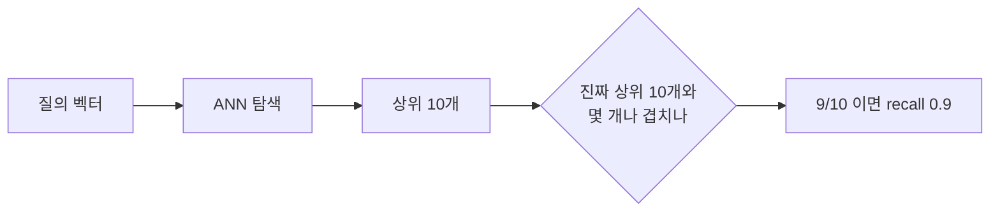

# ANN(근사 최근접 이웃)

- ANN = Approximate Nearest Neighbor. **정확한 1등 대신 거의 확실한 1등**을 훨씬 빠르게 찾는 검색 방식이다.
- [[벡터 데이터베이스]]가 빠른 이유의 전부가 여기 있다.

## 왜 근사가 필요한가

문서가 N개, 각 벡터가 1024차원이라 하자. 정확한 답은 N개 전부와 [[코사인 유사도]]를 계산해 정렬하면 나온다. 이게 **brute force**, 즉 벡터판 [[풀 스캔(Full Scan)]]이다.

| N | 곱셈 횟수 (1024차원) |
|---|---|
| 1,000 | 약 100만 |
| 100,000 | 약 1억 |
| 1,000,000 | 약 10억 |

요청 한 건마다 이걸 하면 못 버틴다. 그래서 **정확도를 조금 포기하고 속도를 얻는다.**

## "근사"가 정확히 뜻하는 것

- 답이 **틀리는** 게 아니라 **가끔 진짜 1등을 놓친다.**
- 놓치지 않은 비율이 [[Recall과 ef 튜닝|recall]]이다.
- 그래서 벡터 검색 튜닝은 버그 수정이 아니라 **정확도와 속도를 맞바꾸는 다이얼**이다.

## 인덱스 종류

| 방식 | 원리 | 특징 |
|---|---|---|
| [[HNSW]] | 근접 그래프를 걸어감 | 가장 흔함. 정확도·속도 ↑, 메모리 ↑ |
| IVF | 클러스터로 나눠 일부만 봄 | 메모리 ↓, 대규모용 |
| PQ | 벡터를 양자화해 압축 | 메모리 ↓↓, 정확도 약간 손해 |

[[Qdrant]]는 HNSW를 쓴다.

## 한 줄 정리

ANN은 **풀 스캔을 피하려고 정확도를 확률로 바꾼 검색**이고, recall이 그 확률의 이름이다.

## 관련

- [[HNSW]]
- [[Recall과 ef 튜닝]]
- [[벡터 데이터베이스]]
- [[풀 스캔(Full Scan)]]
- [[코사인 유사도]]
