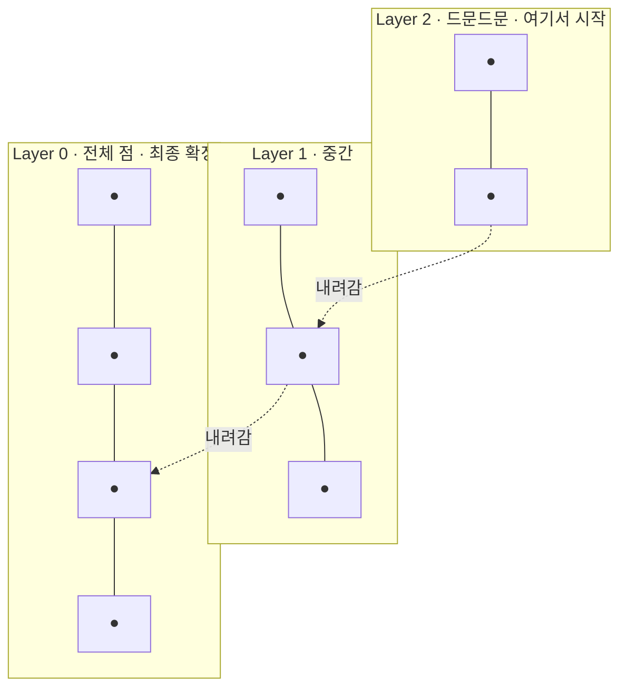

# HNSW

- HNSW = **H**ierarchical **N**avigable **S**mall **W**orld. [[Qdrant]]를 포함한 대부분의 [[벡터 데이터베이스]]가 쓰는 [[ANN(근사 최근접 이웃)]] 인덱스다.
- 이름 세 조각이 그대로 구조다.

| 조각 | 뜻 | 노트 |
|---|---|---|
| **Small World** | 이웃 연결 + 드문 지름길 그래프 | [[Small World 그래프]] |
| **Navigable** | 더 가까운 이웃으로 걸어가며 탐색 | [[Small World 그래프]] |
| **Hierarchical** | 그 그래프를 여러 층으로 쌓음 | 이 노트 |

## Hierarchical — 왜 층을 쌓나

한 층만 있으면 한 칸씩 걸어야 해서 느리다. 그래서 층을 쌓는다.

- **위층**: 점이 드문드문, 간선이 길다 → 고속도로
- **아래층**: 모든 점이 있고 간선이 짧다 → 골목길

지하철로 옆 동네까지 간 뒤 걸어서 골목을 찾는 것과 같다. 각 점이 몇 층까지 올라갈지는 확률적으로 정해진다(위로 갈수록 기하급수적으로 희박).

## 검색 한 번의 흐름

1. 최상위 층의 진입점에서 시작
2. 그 층에서 greedy로 더 가까워질 수 없을 때까지 이동
3. 한 층 내려가서 2를 반복
4. Layer 0에서 [[Recall과 ef 튜닝|ef]] 크기의 후보 목록을 유지하며 최종 top-K 확정

## 알아야 할 성질

- **[[인덱스(Index)|B-tree 인덱스와 이름만 같다.]]** B-tree는 정렬 기반 정확 탐색, HNSW는 그래프 기반 근사 탐색이다.
- **삭제가 약점이다.** 그래프에서 점을 빼면 경로가 끊긴다. 그래서 보통 tombstone 처리 후 재구축한다.
- **메모리를 많이 쓴다.** 점마다 이웃 목록을 들고 있어야 한다.

파라미터는 [[HNSW 파라미터]]에서 따로 다룬다.

## 한 줄 정리

HNSW는 **층으로 쌓은 근접 그래프를 걸어서** 전체 비교 없이 가까운 벡터를 찾는 인덱스다.

## 관련

- [[Small World 그래프]]
- [[HNSW 파라미터]]
- [[Recall과 ef 튜닝]]
- [[ANN(근사 최근접 이웃)]]
- [[Qdrant]]
- [[인덱스(Index)]]
