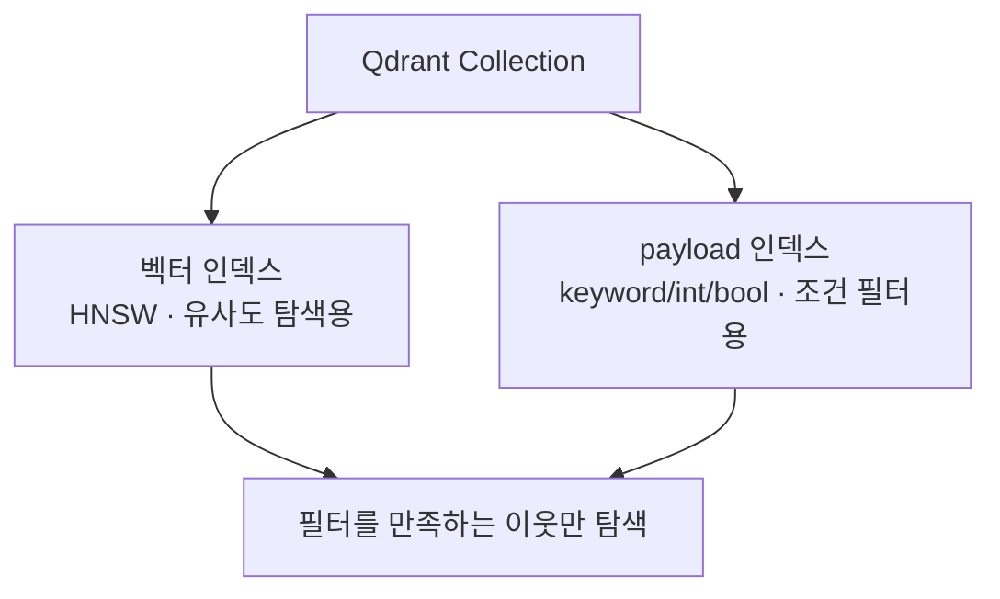

# Payload Index

- [[Qdrant Point와 Payload|payload]] 필드에 거는 **일반 [[인덱스(Index)|DB 인덱스]]** 다. 벡터 인덱스([[HNSW]])와는 완전히 별개다.
- 하나의 컬렉션이 인덱스를 **두 종류** 갖는다는 게 벡터 DB의 특징이다.



```python
client.create_payload_index(
    collection_name="bigzami_knowledge",
    field_name="category",
    field_schema=models.PayloadSchemaType.KEYWORD,
)
```

## 스키마 타입

| 타입 | 쓰는 값 |
|---|---|
| `KEYWORD` | 문자열 정확 매칭 (`category`, `block_type`) |
| `INTEGER` / `FLOAT` | 숫자, 범위 조건 |
| `BOOL` | 참·거짓 (`is_deprecated`) |
| `DATETIME` | 시각 범위 |
| `TEXT` | 부분 문자열 매칭 |

## 없으면 어떻게 되나

[[Qdrant 메타데이터 필터|필터]]가 동작은 한다. 대신 조건 확인을 위해 payload를 전부 뒤진다. [[풀 스캔(Full Scan)]]과 정확히 같은 문제이고, 증상도 같다 — **에러 없이 느려지기만 한다.**

## 판단 기준

- **필터로 자주 쓰는 필드만** 건다. 결과로 받기만 하는 필드는 필요 없다.
- [[인덱스(Index)]]와 마찬가지로 쓰기 비용과 메모리를 지불한다.
- 우리처럼 검색에 필터를 안 쓰면 payload index도 필요 없다. **필터와 payload index는 항상 같이 들어온다.**

## 한 줄 정리

Payload Index는 **벡터 인덱스와 별개로 메타데이터 조건에 거는 인덱스**이고, 필터를 쓰기 시작하면 반드시 함께 필요하다.

## 관련

- [[Qdrant 메타데이터 필터]]
- [[Qdrant Point와 Payload]]
- [[인덱스(Index)]]
- [[Pre-filtering vs Post-filtering]]
